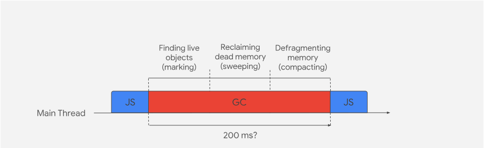
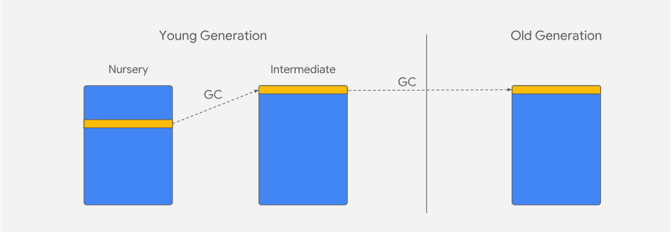
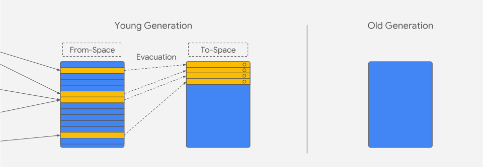
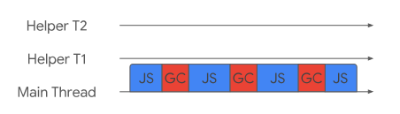

> `注：` 相比起阅读这一篇文章你更加喜欢观看本次演讲的话，那么请直接观看下面的视频；如果你更喜欢阅读，请直接跳过视频。

  <iframe width="100%" height="360px" frameborder=0 src="http://v.qq.com/iframe/player.html?vid=x0831lbmez2&tiny=0&auto=0" allowfullscreen=""></iframe>

###### `译者注：`本文部分内容根据原作者的演讲有部分增加和调整。

过去这些年 V8 的垃圾回收器发生了很多的变化，从 `stop-the-world` 回收器变成了一个更加并行，并发和增量的垃圾回收器。

为什么 JavaScript 引擎需要垃圾回收器？因为 JavaScript 大部分都是垃圾。大部分都是垃圾？！一看到这里大多数前端小伙伴估计又不开心了，难道这么多年我都是在写垃圾么？不慌，此垃圾并非彼垃圾，那么为什么要说  JavaScript 都是垃圾？
- 每次你 new 一个对象的时候都会被分配内存
- 我们所有人的电脑也好手机也好并没有无限内存
- v8 会为你自动回收垃圾

> 梦想中的垃圾回收器

> 现实中的垃圾回收器

不论什么垃圾回收器都有一些定期需要去做的任务：
- 标记活动对象（live objects）和非活动对象(dead objects)
- 回收或者重用被非活动对象占据的内存
- 合并或者整理内存（可选的）

这些任务可以按照顺序去执行或者交叉的去执行。一种方式是暂停 JavaScript 的执行，在主线程上按照顺讯去执行这些任务。这样做导致的结果就是 JavaScript 的延迟执行，以及页面渲染时 JavaScript 来不及执行导致的页面空白或者卡顿问题（jank）。这个问题在之前的两篇文章（[文章一](https://v8.dev/blog/jank-busters)，[文章二](https://v8.dev/blog/orinoco)）已经探讨过, 同时也会降低JavaScript执行的吞吐量（throughput）。

### 主垃圾回收器（Major GC）—— 全量标记和整理（Full Mark-Compact）

主垃圾回收器从整个堆（heap）中收集垃圾。

> 主垃圾回收器主要有三个阶段：标记（marking），清除（sweeping）和整理（compacting）。

#### 标记阶段（marking）
确定那些对象可以被回收是垃圾回收中重要的一步。垃圾回收器通过可访问性（reachability）来确定对象的 “活跃度”（liveness）。这意味着任何对象如果在运行时是可访问的（reachable），那么必须保证这些对象应该在内存中保留，如果对象在是不可访问的（unreachable）那么这些对象就可能被回收。

标记阶段就是找到那些对象是可访问的一个过程；垃圾回收是从一组对象的指针（objects pointers）开始的，我们将其称之为根集（root set），这其中包括了执行栈和全局对象；然后垃圾回收器会跟踪每一个指向 JavaScript 对象的指针，并将对象标记为可访问的，同时跟踪对象中属性的每一个指针并标记为可访问的，这个过程会递归的进行，直到标记到运行时的每一个可访问的对象。

#### 清除阶段（sweeping）
清除阶段就是将非活动对象占用的内存空间添加到一个叫空闲列表（free-list）的数据结构中。一旦标记完成，垃圾回收器会找到不可访问对象的内存空间，并将内存空间添加到相应的空闲列表中。空闲列表中的内存块由大小来区分，为什么这样做呢？为了方便如果以后需要分配内存，就可以快速找到大小合适的内存空间并分配给新的对象。

### 整理阶段（Compaction）
主垃圾回收器会通过一种叫做碎片启发式（fragmentation heuristic）的算法来整理内存页(译者注：不清楚“内存页”的请看[维基百科](https://en.wikipedia.org/wiki/Page_(computer_memory))或者复习操作系统原理)，你可以将整理阶段理解为老式 PC 上的磁盘整理。那么碎片启发式算发是怎么做的呢？我们将活动对象复制到当前没有被整理的其他内存页中（即被添加到空闲列表的内存页）；通过这种做法，我们就可以利用内存中高度小而分散的内存空间。

垃圾回收器复制活动对象到当前没有被整理的其他内存页中有一个潜在的缺点，就是我们要分配内存空间给很多常驻内存（ long-living）的对象时，复制这些对象会带来很高的成本。这就是为什么我们只选择整理内存中高度分散的内存页，并且对其他内存页我们只进行清除而不是也同样复制活动对象的原因。

### 分代堆布局（Generational layout）
堆在 V8 中会分为两块不同的区域，我们将其称之为代（[generations](https://v8.dev/blog/orinoco-parallel-scavenger)）；这两块区域分别称之为老生代（old generation）和新生代（young generation），新生代又进一步分为 ‘nursery’ 子代和 ‘intermediate’ 子代两块区域； 一个对象第一次分配内存时会被分配到新生代中的‘ nursery’ 子代；如果进过下一次垃圾回收这个对象还存在新生代中，这时候我们移动到 ‘intermediate’ 子代，再经过下一次垃圾回收这个对象还在新生代，这时候我们就会把这个对象移动到老生代。

> V8中堆分成两代；如果经过垃圾回收对象还存活的话会从新生代移动到老生代

在垃圾回收中有一个重要的术语：“代际假说”（The Generational Hypothesis）；代际假说表明很多对象在内存中存在的时间很短（die young）。换句话说，从垃圾回收的角度来看，很多对象一经分配内存空间随即就变成了不可访问的。这个假说不仅仅适用于 V8 或者 JavaScript，同样适用于大多数的动态语言。

V8的分代堆布局的设计主要是为了利用对象存在生命周期的这个事实；垃圾回收实质上就是整理内存和移动内存中的对象，那这就意味这我们应该多移动对象到空闲列表中的内存中去；这个看上去似乎有点违反直觉，因为在垃圾回收的时候复制对象的成本是很高的。但是根据代际假说在垃圾回收中内存活下来的对象其实并不是很多。所以如果重新分配内存给新创建的对象，这反而变成了隐式的垃圾；这就意味着我们只需花费复制存活对象的成本，并不是需要耗费成本去分配新的内存。

### 副垃圾回收器（Minor GC）—— 清道夫（Scavenger）
V8 有两个垃圾回收器，主垃圾回收器（Full Mark-Compact）从整个堆中回收垃圾，副垃圾回收器（Scavenger）从新生代中回收垃圾。主垃圾回收器可以很有效的从整个堆中回收垃圾，但是代际假说告诉我们新分配内存的对象也极有可能需要垃圾回收。

副垃圾回收器只从新生代中回收垃圾，幸存的对象总是会被分配到内存页中去。V8 为新生代内存采用了‘半空间’（semi-space）的设计，这意味着为了做疏散（译者注：移动对象）这一步骤（evacuation step），有一半的内存空间是总是空闲的。在清理时，初始的空闲区域称之为“To-Space”，复制对象过来的区域称之为“From-Space”；在最坏的情况下，如果每一个对象在清理的时候存活了下来，那我们就要复制每一个对象。

对于清理，我们会维护一个额外的根集（root set），这个根集里会存放一些从旧到新的引用。这些引用代表着
// TODO：

疏散步骤将所有的活动对象移动到连续的一块内存中，这样做的好处就是完全移除内存碎片（清理非活动对象时留下的内存碎片）；然后我们把两块内存空间互换，即把 ‘To-Space’ 变成 ‘From-Space’，反之依然。一旦垃圾回收完成，新分配的内存空间将从 ‘From-Space’ 下一个空闲内存地址开始。

> 副垃圾回收器移动活动对象到一个新的内存页

如果仅仅是凭借这一策略，我们就会很快的耗尽新生代的内存空间；为了新生代的内存空间不被耗尽，在下一次垃圾回收的时候，我们会把活动对象移动（evacuate）到老生代，而不是 ‘TO-Space’。

清理的最后一步是把移动后的对象的指针地址更新，每一个被复制对象都会留下一个转发地址（forwarding-address），用于更新指针以指向新的地址。

> 副垃圾回收器移动 ‘intermediate’ 子代的活动对象到老生代

副垃圾回收器在清理时，实际上执行三个步骤：标记，移动活动对象，和更新对象的指针；这些都是交错进行的，而不是在不通阶段。

### Orinoco

这些算法和优化在很多垃圾回收相关的文献或着具有垃圾回收机制的编程语言中都是非常常见的，但是这些先进的垃圾回收机制已经经过了漫长发展。测量垃圾回收所花费的时间的一个重要指标就是执行垃圾回收的时候主线程挂起的时间。对于传统的 ‘stop-the-world’ 的垃圾回收器来说，垃圾回收所花费的时间可以直接的简单相加。而这种垃圾回收的方式直接影响了用户体验，会直接导致页面卡顿，渲染延迟等一系列问题。

> V8垃圾回收器的LOGO

Orinoco 是 V8 垃圾回收器项目的代号，它利用最新的和最好的垃圾回收技术来降低主线程挂起的时间， 比如：并行（parallel）垃圾回收，增量（incremental）垃圾回收和并发（concurrent）垃圾回收。这里有一些术语在垃圾回收的上下文中有特定的含义，所以这是值得去详细的探讨的。

#### 并行垃圾回收（Parallel）

并行是主线程和协助线程同时执行同样的工作，但是这仍然是一种 ‘stop-the-world’ 的垃圾回收方式，但是垃圾回收所耗费的是等于总时间除以参与的线程数量（加上一些同步开销）。这是这三种技术中最简单的 JavaScript 垃圾回收方式；因为没有 JavaScript 的执行，因此只要确保同时只有一个协助线程在访问对象就好了。

> 主线程和协助线程同在一时间做同样的任务

#### 增量垃圾回收（Incremental）

增量式垃圾回收是主线程间歇性的去做少量的垃圾回收的方式。我们不会在增量式垃圾回收的时候执行整个垃圾回收的过程，只是整个垃圾回收过程中的一小部分工作。做这样的工作是极其困难的，因为 JavaScript 也在做每个增量式垃圾会收的时候执行，这意味着堆的状态已经发生了变化，这有可能会导致之前的增量回收工作完全无效。从图中可以看出并没有减少主线程暂停的时间（事实上，通常会略微增加），只会随着时间的推移而增长。但这任然是解决问题的的好方法，通过 JavaScript 间歇性的执行，同样页间歇性的去做垃圾回收工作，JavaScript 仍然可以在用户输入或者执行动画的时候得到及时的响应。

> 垃圾回收任务交错的进入主线程执行

#### 并发垃圾回收（Concurrent）

并发是主线程一直执行 JavaScript，而辅助线程在后台完全的执行垃圾回收。这种方式是这三种技术中最难的一种，JavaScript 堆里面的内容随时都有可能发生变化，从而使之前做的工作完全无效。最重要的是，现在有读/写竞争（read/write races），主线程和辅助线程极有可能在统一时间去更改同一个对象。这种方式的优势也非常明显，主线程可以完全自由的执行 JavaScript，尽管为了保证统一对象同一时间只有一个辅助线程在修改而带来的同步开销。

> 垃圾回收任务完全发生在后台，主线程可以自由的执行JavaScript

### V8里面当前使用的几种垃圾回收机制

### Scavenging 垃圾回收器

### 主垃圾回收器

### 空闲时垃圾回收器