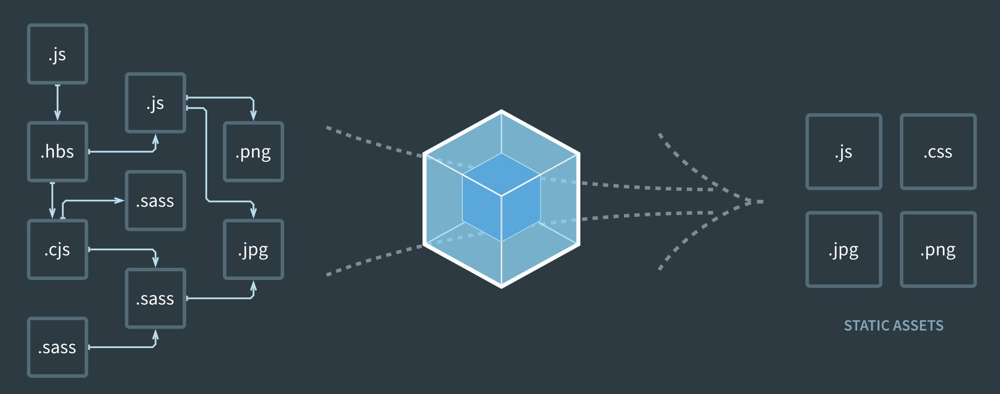

## 关于我们

在此新春来领之际，首先祝大家春节快乐（手动笔芯 ❤️）！从 2019 年 1 月 19 日 FENews 的第一条微信公众号消息的发出到 1 月 23 日的串店撸串，短短几天的时间，我们就吸引了一批志同道合有激情的优秀的小伙伴加入我们（截止发稿时间我们已经是一个 13 人的团队啦）。我们并不是完全是由什么资深大牛组成，我们是一个成长中的团队，我们是由一群热爱技术、有技术追求的年轻小伙伴组成。**FENews** 成立的初衷是一起学习交流，并把我们的学习过程和经验分享给大家。我们会定期原创或翻译前端相关的技术文章，未来我们可能由于自己理解的原因或者什么其他原因而犯错，希望大家能够纠正我们。如果你对我们感兴趣或想加入我们欢迎随时联系。

  FENews 首发阵容（由于地点和时间的原因有三位小伙伴不在图中）

## 2019 年规划

前端经过近几年的快速发展，各种框架和工具不断完善，前端的生产力得到了极大的提升。同时，像 Electron、Flutter 和 React Native 等 Native 端融合技术的发展，前端的职能边界也不断被拓宽。**FENews** 会持续关注前端技术的发展方向，下面我会简单介绍下 2019 年我们会重点关注的一些技术主题，未来可能会根据实际发展情况而有所调整。

### React / Vue / Angular

### Webpack / Rollup / Parcel

###Webpack

Webpack是打包模块化JavaScript工具，它会根据代码的内容解析模块依赖，帮助把多个模块代码打包成一个文件。借用Webpack官网图片，形象展示了Webpack的定义，如图：

Webpack优点是有良好的开发体验，有十分丰富的配置项，提供了十分强大的扩展能力。它的社区庞大活跃，能为常用场景找到plugin和loader。

Webpack缺点是它Tree Shaking不如Rollup，虽然Webpack3+已经支持Tree Shaking，但仍需要额外配置第三方插件。

### Rollup

Rollup号称下一代模块打包工具。它和Webpack很类似，但它有两个重要特性，其中一个是采用ES6的模块标准。例如可以直接使用`import`和`export`，不需要引入babel。另一点在于，能针对ES6进行Tree Shaking，去除那些定义未使用的代码。

Rollup用于打包JavaScript库比Webpack更有优势，因为其打包出来的代码体积更小、更快。它配置和使用要比Webpack简单，但社区和生态不如Webpack完善，很多场景下找不到现成的解决方案。目前大家常用Rollup来开发纯的JavaScript库。

### Parcel

Parcel也是款打包工具，它侧重点在于零配置和多核编译。Parcel 使用工作进程启用多核编译，并具有文件系统缓存，即使在重新启动后也可快速重新构建。Parcel 支持JS，CSS，HTML，文件资源等等 - 不需要安装任何插件。Parcel 使用动态 import() 语法拆分您的输出包，所以只加载初始加载时所需的内容。还有一些其他特性就不一一列举了。

Parcel解决了一些打包工具配置繁琐和编译慢的问题。有些打包工具的配置，动辄几百行，而且要为每个应用程序复制一份。另一点，现在打包工具编译很慢，具有很多文件和依赖的大型应用将花费数分钟去构建，随着时间的推移，这将会相当痛苦的事情。Parcel利用现代的多核处理能力和工作线程去并行编译你的代码，将极大的提升了构建速度。

Rollup和Parcel的出现和发展伴随着Webpack更新和迭代。拿Webpack举例，它发展这么多年，Webpack1的时候新出茅庐，2和3时有了Rollup，号称是下一代打包神器，它主要最核心的是Tree Shaking，那Webpack一看不干，不能丢了自己的地位。于是更新Tree Shaking，后来Parcel有了些升级，号称零配置，那Webpack又不干，于是又升级Webpack4，又增加了零配置，目前Webpack5向多核编译方向发力。它们各有自己的优势和应用场景。

Web工程化、工具化，始终伴随着前端的发展，2019年，我们持续关注这一块更新。

### TypeScript

### Flutter / React Native

#### Flutter

Flutter 是 Google 推出并开源的移动应用开发框架，并且支持 Google 下一代操作系统 Fuchsia，主打跨平台、高保真、高性能。开发者可以通过 Dart 语言开发 App，一套代码同时运行在 iOS 和 Android 平台。 Flutter 提供了丰富的组件、接口，开发者可以很快地为 Flutter 添加 native 扩展。同时 Flutter 还使用 Native 引擎渲染视图，这无疑能为用户提供良好的体验。

此外 Flutter 跨全平台不止是 Android 和 iOS 目标剑指所有主流平台 UI 开发、PC 桌面以及 包括正在搞的 [Hummingbird](https://medium.com/flutter-io/hummingbird-building-flutter-for-the-web-e687c2a023a8) 来实现 web 的支持。

#### React Native

React Native 是 Facebook 在 F8 大会开源的 JavaScript 框架,在 2015 年 9 月 15 日发布，可以让广大开发者使用 JavaScript 和 React 开发跨平台的移动应用。开发者可以灵活的使用 HTML 和 CSS 布局，使用 React 语法构建组件，实现 Android，iOS 两端代码的复用,核心设计理念: 既拥有 Native 的用户体验，又保留 React 的开发效率。

#### 对比

- 速度与性能：React Native 用 JavaScript 调用对应系统渲染器进行渲染展示，中间就有 JavaScript 解析到调用 Native 过程的许多中间环节，Flutter 是将 Dart 代码 AOT 编译为本地代码，其次，Flutter 使用自己的渲染引擎来绘制 UI，布局数据等由 Dart 语言直接控制，所以在布局过程中不需要像 React Native 那样要在 JavaScript 和 Native 之间通信，速度和性能上一般 Flutter 是要优于 React Native 的。

- 生态周边：Dart 生态相比移动端/前端生态远小的多，React Native 经过多年发展，其现在的社区规模或者是生态完善性都是 Flutter 近期根本无法追赶上的。

- 开发体验：React 的开发体验远比 Dart 要好，更多前端开发者更容易上手，虽然 Flutter 参照了需要 React 的设计思想，DSX 也类似 JSX, 但是如果你看过官方的例子应该看到 DSX 的代码代码很容易一层套一层，类似于回调炼狱，此外用 Flutter 你需要学习一门新语言 Dart。

### GraphQL

GraphQL 是 Facebook 于 2012 年在内部开发的数据查询语言，在 2015 年开源，旨在提供 RESTful 架构体系的替代方案。

GraphQL 的官方定义是一种用于 API 的查询语言，GraphQL 既是一种用于 API 的查询语言也是一个满足你数据查询的运行时。 GraphQL 对你的 API 中的数据提供了一套易于理解的完整描述，使得客户端能够准确地获得它需要的数据，而且没有任何冗余，也让 API 更容易地随着时间推移而演进，还能用于构建强大的开发者工具。

目前在国外有众多大厂在使用 GraphQL ，FB 自家肯定在使用，此外熟知的 github、twitter、airbnb 都有比较成熟的 GraphQL 实践。国内大厂阿里、百度、携程有在使用，阿里的 egg.js 框架也有相应的 GraphQL 插件，携程最近还发表了[从前后端分离到 GraphQL，携程如何用 Node 实现？](https://mp.weixin.qq.com/s/lFKZRtigONGuSHDL4ww9FA)

虽然 GraphQL 越来越受到更多开发者的关注，但是却没有彻底火起来，因为需要前后端一起铺开啊，此外要使用 GraphQL 对数据源进行管理，相当于要对整个服务端进行一次换血，对大体量的企业服务来说真是伤筋动骨。另一方面，实践太少，相关生产级别的分享少之又少，现在社区的中流砥柱 [Apollo](https://github.com/apollographql) 贡献了 GraphQL 前后端技术栈的各种实现，却没有中文站点。而团队在 Medium 上的博客，Youtube 上 Conference 的 Talk，都是翻译极少的。我们 FENews 立个 flag，今年会对 Apollo/GraphQL 的周边进行翻译分享，敬请期待。

### Rust / WebAssembly

Rust 是由 Mozilla 主导开发的通用、编译型编程语言。它是为大型互联网客户端和服务端而设计的，发行于 2010 年， 算是一门比较年轻的编程语言。沃特 ? 那它与前端到底又啥关系呢？

### Deno
