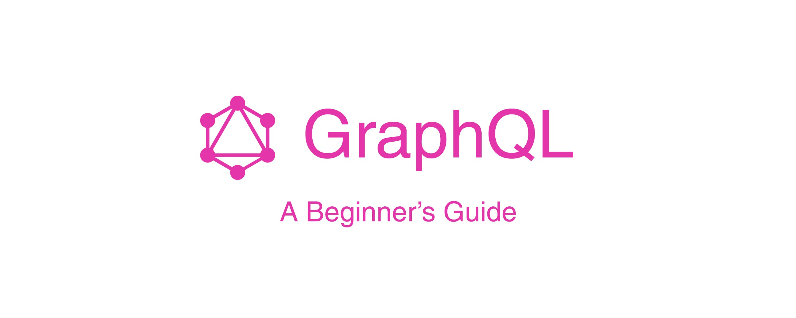
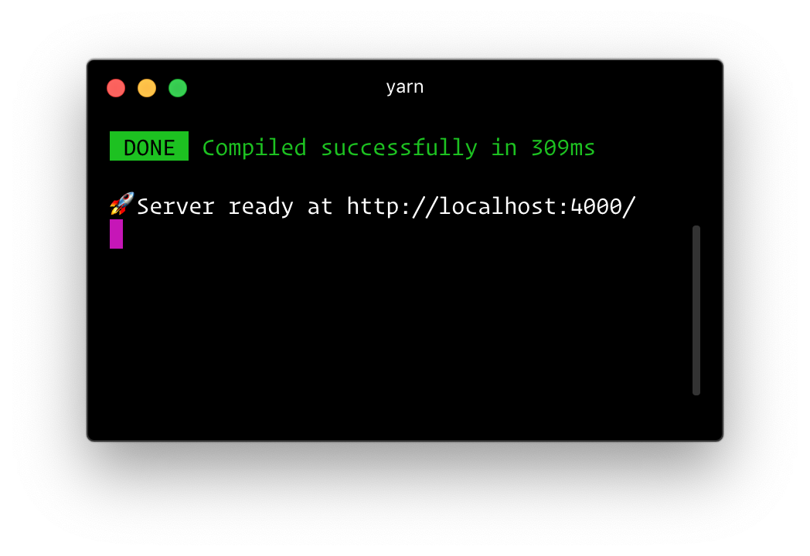
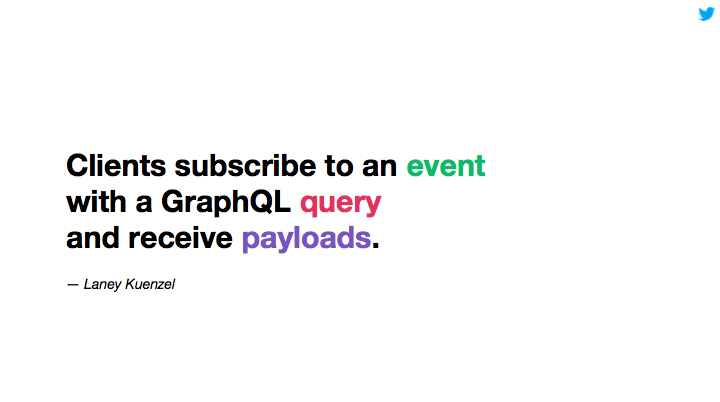

现如今最常讨论的技术之一便是 API，但是很多人并不知道什么是 API，简单的来说，API 代表应用程序编程接口（Application Programming Interface）。顾名思义，就是为开发者、用户、消费者提供数据交互的接口。

你可以将 API 视为调酒师，你向调酒师请求一杯酒，然后他为你调出你想要的酒。这看似非常简单，但是为什么会存在问题呢？

自现代网络发展以来，构建 API 并不像听起来那么难，但是学习和理解 API 却不是一件简单的事。很多开发者会使用 API 来构建某些内容，或者仅仅是使用数据。因此，API 应该尽可能简洁、直观。经过精心设计的 API 会非常易于学习和使用，同时也会很直观，所以在开始设计 API 时一定要记住这点。

一直以来我们都在使用 REST 来构建 API，随之也带来了一些问题。使用 REST 来设计构建 API 时，你将会面临以下问题：

* 你需要访问很多资源路径
* 不易于开发者学习和理解API
* 存在信息过度或不足的问题

为了解决这些问题，Facebook 创建了 GraphQL。现如今，我认为 GraphQL 是构建 API 的最佳方式，本文将会告诉你为什么我们现在需要学习 GraphQL。

通过这篇文章，你将学习到 GraphQL 的工作原理，同时我将向你展示如何使用 GraphQL创建设计良好、高效以及功能强大的 API。

在这之前你可能已经听过 GraphQL，因为有很多人和很多公司已经在使用 GraphQL。GraphQL 是开源的，因此它的社区已经变得非常强大。

那么现在，是时候开始在实践中学习 GraphQL 是如何工作的了，以及感受它的魔力啦~

### 什么是GraphQL？

[GraphQL](https://graphql.org/) 是 Facebook 开发的一种开源查询语言。它为我们提供了一种更有效的方法来设计、创建和使用我们的 API，可以说它是 REST 的替代品。

GraphQL 有很多功能，例如：
* 你可以定义你想要的数据，并获取你所需要的数据，不再像我们使用REST那样获取冗余数据。
* 它给我们提供单一的API资源路径, API升级不再需要区分版本。
* GraphQL 是强类型的，你可以在执行之前在 GraphQL 类型系统中验证查询，它可以帮助我们构建更健壮的 API。

这是一篇关于 GraphQL 为什么如此强大以及为何 GraphQL 如今获得了大量人气的基础介绍。如果你想了解更多关于 GraphQL 的信息，我建议你查看[GraphQL](https://graphql.org/) 官网并查看它。

### 开始

本文的主要目的不是学习如何配置 GraphQL 服务器，所以我们现在还没有深入研究。而本文的主要目的在于了解GraphQL在实践中的工作原理，因此我们将使用一个名为 [Graphpack](https://github.com/glennreyes/graphpack) 的服务器。

在开始我们的项目前，我们需要创建一个新的文件夹，你可以随意命名，我打算将它命名为 graphql-server。

打开终端并输入：

```js

mkdir graphql-server

```

现在，你需要在你的电脑上安装 npm 或 yarn，npm 和 yarn 是编程语言 JavaScript 的包管理器，对于 Node.js，默认包管理器是 npm。

进入你创建的文件夹，输入以下命令：

```js

npm init -y

```

如果你使用的是 yarn，则输入以下命令：

```js

yarn init 

```

npm 将会为你自动创建一个 package.json 文件，你安装的所有依赖和命令都会在这个文件中。

现在，我们需要安装我们将要使用的唯一依赖项——Graphpack。

[Graphpack](https://github.com/glennreyes/graphpack) 允许你创建零配置的 GraphQL 服务器，对于刚开始学习GraphQL 的我们来说这将帮助我们学习更多其他的内容，而不必担心复杂的服务器配置。

进入项目的根目录，在终端输入以下命令：

```js

npm install --save-dev graphpack

```

如果你使用的是 yarn，则输入以下命令：

```js
yarn add --dev graphpack
```

安装完 graphpack 之后，找到 package.json 文件中 scripts 配置项，加入如下代码：

```js
"scripts": {
    "dev": "graphpack",
    "build": "graphpack build"
}
```

我们将创建一个名为 src 的文件夹，它将成为整个服务器中唯一的文件夹。

创建完名为 src 的文件夹之后，我们接着在 src 文件夹下创建3个文件。首先创建名为schema.graphql 的文件，在这个文件中,加入如下代码：

```js

type Query {
  hello: String
}

```

schema.graphql 文件将是整个 GraphQL 的架构，如果你不懂这是什么，别担心，我稍后会进行解释。

接着在 src 文件夹中新建第二个名为 resolvers.js 的文件，加入如下代码：

```js
import { users } from "./db";

const resolvers = {
  Query: {
    hello: () => "Hello World!"
  }
};

export default resolvers;
```

resolvers.js 文件是我们将 GraphQL 操作转换为数据的指令的方式。

最后，在 src 文件夹下创建第三个文件 db.js：

```js
export let users = [
  { id: 1, name: "John Doe", email: "john@gmail.com", age: 22 },
  { id: 2, name: "Jane Doe", email: "jane@gmail.com", age: 23 }
];
```

在本教程中，我们没有使用真实的数据库，因此，db.js 文件将模拟数据库，仅用于学习的目的。

现在 src 文件夹应该如下：

```js
src
  |--db.js
  |--resolvers.js
  |--schema.graphql
```

如果你在终端运行 npm run dev 或者 yarn dev，你就会在终端看到以下输出：



现在通过本地访问 localhost:4000，这意味着我们已经准备好开始在GraphQL中编写我们的第一个查询，变更和订阅。本地运行以后你可以看到 GraphQL Playground，这是一个功能强大的 GraphQL IDE，可用于更好的开发工作流程。如果你想了解更多关于GraphQL Playground，[请点击这里](https://www.prisma.io/blog/introducing-graphql-playground-f1e0a018f05d/)

### 概要

GraphQL 有自己的语言类型，用于编写模式。这是一种称为模式定义语言（SDL）的人类可读模式语法。无论你使用何种技术，SDL 都是相同的，你可以将其用于你想要的任何语言或框架。

这种模式语言非常有用，因为它很容易就知道你的 API 将具有哪些类型，这样你可以通过正确的方式来理解它。

### 类型（Types）

类型是 GraphQL 最重要的特性之一，类型是自定义的对象，代表着 API 的外观。举个例子：如果你正在构建一个社交媒体应用程序，那么你的 API 应该具有 Posts，Users，Likes，Groups 等类型。

类型具有字段，这些字段返回特定类型的数据。例如，我们创建一个用户类型，那么这个用户类型应该具有 name， email 和 age 字段。类型字段可以是任何类型，并始终返回一种数据类型，如 Int，Float，String，Boolean，ID，对象类型列表或自定义对象类型。

现在我们开始编写我们的第一个类型，在 schema.graphql 文件用如下代码替换已存在的Query 类型：

```js

type User {
  id: ID!
  name: String!
  email: String!
  age: Int
}

```

每个用户都将拥有一个 ID，因此我们给它提供了 ID 类型。用户也会有一个 name 和eamil，所以我们给它一个 String 类型，而 age 我们给它一个Int类型，很简单吧？

那么，每行末尾的!是什么意思呢？感叹号表示字段不能为空，这意味着每个字段必须在每个查询中返回一些数据，用户 User 类型中唯一可以为空的字段是 age。

在 GraphQL 中，将处理三个主要概念：

* 查询（queries）：从服务器获取数据的方式。

* 变更（mutations）：修改服务器上的数据并获取更新的数据（创建，更新，删除）的方式。

* 订阅（subscriptions）：与服务器保持实时连接的方式。

接下来我将会向你一一解释这些概念，让我们先从查询开始吧！

### 查询（Queries）

简单的解释，GraphQL 中的查询就是你获取数据的方式。GraphQL 查询中最棒的事情之一就是可以获取到你所需的确切数据，不多也不少。这将对我们的 API 产生积极的影响——不再像使用 REST API 那样过度获取或提取不足的信息。

我们将在 GraphQL 中创建第一个类型的查询，我们所有的查询都将以此类型结束。首先，在 schema.graphql 编写一个名为 Query 的新类型：

```js

type Query {
  users: [User!]!
}

```

这很简单：users 查询将返回给我们一个或多个用户的数组，这个数组不会返回 null，因为我们给 users 加了!，这意味着 users 是一个不可为空的查询，它总是会返回数据。

但是我们也可以返回特定的用户，为此，我们将创建一个名为 user 的新查询。在我们的Query 类型中，写入以下代码：

```js
user(id: ID!): User!

```

现在我们的 Query 类型应该如下所示：

```js

type Query {
  users: [User!]!
  user(id: ID!): User!
}

```

如你所看到的，使用 GraphQL 中的查询，我们也可以传递参数。在这个例子中，我们要查询特定的用户，因此传递参数 ID。

但是，你可能会想：GraphQL 是怎么知道获取数据的具体位置的？这就是为什么我们还需要有一个 resolvers.js 文件，该文件告诉 GraphQL 它将如何以及从何处获取数据。

首先，在 resolvers.js 文件中导入刚刚创建的 db.js，这时你的 resolvers.js 文件应如下所示：

```js

import { users } from "./db";

const resolvers = {
  Query: {
    hello: () => "Hello World!"
  }
};

export default resolvers;

```

接着我们将创建第一个查询，找到 resolvers.js 文件并替换其中的 hello 函数。现在，你的查询类型应如下所示：

```js

import { users } from "./db";

const resolvers = {
  Query: {
    user: (parent, { id }, context, info) => {
      return users.find(user => user.id === id);
    },
    users: (parent, args, context, info) => {
      return users;
    }
  }
};

export default resolvers;

```

现在，我将解释一下它是如何工作的：
每个查询解析器都有四个参数，在 user 函数中，我们将 id 作为参数传递，然后返回与传递的 id 匹配的特定用户，就是这么简单。而在 users 函数中，将返回已存在的 users 数组，它将始终给我们返回所有的用户。

我们将测试我们的查询是否运行正常，访问 localhost:4000 并输入以下代码：

```js
query {
  users {
    id
    name
    email
    age
  }
}
```

这时候应该给我们返回所有的用户。

或者，如果要返回特定用户：

```js
query {
  user(id: 1) {
    id
    name
    email
    age
  }
}
```

接下来，我们将开始学习变更（**mutations**），这是 GraphQL 中最重要的功能之一。

### 变更（Mutations）

在 GraphQL 中，mutations 是你修改服务器上的数据并获取更新数据的方式，你可以把它跟 REST 中的 CUD（创建，更新，删除）一样思考。

我们将在 GraphQL 中创建我们的第一个类型变更，我们所有的变更都将以这种类型结束。在 schema.graphql 文件中编写一个名为 mutation 的新类型：

```js
type Mutation {
  createUser(id: ID!, name: String!, email: String!, age: Int): User!
  updateUser(id: ID!, name: String, email: String, age: Int): User!
  deleteUser(id: ID!): User!
}
```

正如你所见，我们将有三个变更：

createUser：我们应该传递一个 id，name，email 和 age，它将会为我们创建一个新的用户。

updateUser：我们应该传递一个 id，一个新的 name，email 或 age，它将会为我们返回一个新用户。

deleteUser：我们应该传递一个 id，它将会为我们返回一个新用户。

现在，在 resolvers.js 文件中的 Query 对象下面，创建一个新的变更对象，如下所示

```js
Mutation: {
    createUser: (parent, { id, name, email, age }, context, info) => {
      const newUser = { id, name, email, age };

      users.push(newUser);

      return newUser;
    },
    updateUser: (parent, { id, name, email, age }, context, info) => {
      let newUser = users.find(user => user.id === id);

      newUser.name = name;
      newUser.email = email;
      newUser.age = age;

      return newUser;
    },
    deleteUser: (parent, { id }, context, info) => {
      const userIndex = users.findIndex(user => user.id === id);

      if (userIndex === -1) throw new Error("User not found.");

      const deletedUsers = users.splice(userIndex, 1);

      return deletedUsers[0];
    }
  }
```

现在，resolvers.js 文件应如下所示：

```js
import { users } from "./db";

const resolvers = {
  Query: {
    user: (parent, { id }, context, info) => {
      return users.find(user => user.id === id);
    },
    users: (parent, args, context, info) => {
      return users;
    }
  },
  Mutation: {
    createUser: (parent, { id, name, email, age }, context, info) => {
      const newUser = { id, name, email, age };

      users.push(newUser);

      return newUser;
    },
    updateUser: (parent, { id, name, email, age }, context, info) => {
      let newUser = users.find(user => user.id === id);

      newUser.name = name;
      newUser.email = email;
      newUser.age = age;

      return newUser;
    },
    deleteUser: (parent, { id }, context, info) => {
      const userIndex = users.findIndex(user => user.id === id);

      if (userIndex === -1) throw new Error("User not found.");

      const deletedUsers = users.splice(userIndex, 1);

      return deletedUsers[0];
    }
  }
};

export default resolvers;
```

接着，我们将测试我们的 mutations 是否正常工作，访问 localhost:4000 并输入以下代码

```js
mutation {
  createUser(id: 3, name: "Robert", email: "robert@gmail.com", age: 21) {
    id
    name
    email
    age
  }
}
```

它将会返回给我们一个新的用户，如果你想尝试创建新的的 mutations，我建议你可以自己动手尝试一下！尝试删除你所创建的同一用户，看看它是否正常工作。

最后，我们将开始学习订阅（**subscriptions**），以及学习为什么它是如此的强大。

### 订阅（Subscriptions）

正如我之前所说，订阅（subscriptions）是你与服务器保持实时连接的方式。这意味着无论何时在服务器中发生事件，并且每当调用该事件时，服务器都会将相应的数据发送到客户端。

通过使用订阅，你可以保持你的应用在不同的用户之间得到最新的更改。



基本的订阅应该如下：

```js
subscription {
  users {
    id
    name
    email
    age
  }
}
```

你可能会说它与查询非常相似，是的，但它们的工作方式不同。当服务器中的某些内容更新时，服务器将运行订阅中指定的GraphQL查询，并将新更新的结果发送到客户端。

我们并不打算在这篇文章中使用订阅，但是如果你想了解更多关于它的信息，[请点击此处](https://hackernoon.com/from-zero-to-graphql-subscriptions-416b9e0284f3)。

### 总结

正如你所见，GraphQL 是一项非常强大的新技术。它为我们提供了构建更好的 API 的真正能力。这就是为什么我建议你现在就开始学习 GraphQL，对我来说，它最终将取代REST。

🐦[在推特上关注原作者！
](https://twitter.com/leonardomso)

⭐[在GitHub上关注原作者！
](https://github.com/leonardomso)

原文地址：[https://medium.freecodecamp.org/a-beginners-guide-to-graphql-86f849ce1bec](https://medium.freecodecamp.org/a-beginners-guide-to-graphql-86f849ce1bec)
