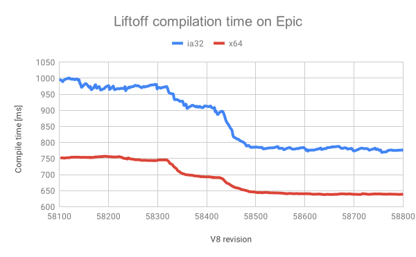

每6周，我们创建一个v8的新的分支作为[release process](https://v8.dev/docs/release-process)一部分。每个版本都是在Chrome Beta里程碑之前基于v8的git master分支。今天我们很高兴去宣布我们的新版本--[v7.3](https://chromium.googlesource.com/v8/v8.git/+log/branch-heads/7.3)，该版本在几周内与Chrome 73 Stable协同发布之前一直处于测试阶段。V8的v7.3充满了各种面向开发人员的好东西。这篇文章提供了一些亮点的预览。

### 异步堆栈跟踪(Async stack traces)
我们默认启用[`--async-stack-traces`](https://v8.dev/blog/fast-async#improved-developer-experience)。零成本的异步堆栈跟踪使得在异步代码很多的生产环境诊断问题变得更容易。因为通常会发送日志文件/服务的`error.stack`属性现在可以更深入地了解导致问题的原因。

### await更快（Faster await）
与上述`--async-stack-traces`相关，我们还默认启用`--harmony-await-optimization`，这是`--async-stack-traces`的先决条件。可以查看文章[faster async functions and promises](https://v8.dev/blog/fast-async#await-under-the-hood)了解更多细节。

### Wasm启动更快（Faster Wasm startup）
通过对Liftoff内部的优化，我们显着提高了WebAssembly的编译速度，而不会降低生成代码的质量。 对于大多数工作负载，编译时间减少了15-25％。

>[Epic ZenGarden的demo](https://s3.amazonaws.com/mozilla-games/ZenGarden/EpicZenGarden.html)中Liftoff编译时间
### JS特性
V8 v7.3带来几个新的JS特性
#### `Object.fromEntries`
`Object.entries` API并不新鲜：
```js
const object = { x: 42, y: 50 };
const entries = Object.entries(object);
// → [['x', 42], ['y', 50]]
```
不幸的是，却没有简单的方法从`entries`的结果得到原对象...
直到现在。

V8 v7.3支持`Object.fromEntries()`，它是内置的API，可执行`Object.entries`的反向操作：
```js
const result = Object.fromEntries(entries);
// → { x: 42, y: 50 }
```
JS中有了`Object.entries` 和 `Object.fromEntries`后，对Maps和原始对象中进行转换变得更容易。
#### String.prototype.matchAll
正则中`g`修饰符和`y`修饰符常见使用场景是将其用在字符串上并迭代贯穿所有匹配。新API `String.prototype.matchAll` 让这比以往任何时候都更容易，特别是对于具有捕获组的正则表达式：
```js
const string = 'Favorite GitHub repos: tc39/ecma262 v8/v8.dev';
const regex = /\b(?<owner>[a-z0-9]+)\/(?<repo>[a-z0-9\.]+)\b/g;

for (const match of string.matchAll(regex)) {
  console.log(`${match[0]} at ${match.index} with '${match.input}'`);
  console.log(`→ owner: ${match.groups.owner}`);
  console.log(`→ repo: ${match.groups.repo}`);
}

// Output:
//
// tc39/ecma262 at 23 with 'Favorite GitHub repos: tc39/ecma262 v8/v8.dev'
// → owner: tc39
// → repo: ecma262
// v8/v8.dev at 36 with 'Favorite GitHub repos: tc39/ecma262 v8/v8.dev'
// → owner: v8
// → repo: v8.dev
```
有关更多详细信息，请阅读[有关String.prototype.matchAll的Web基础知识文章](https://developers.google.com/web/updates/2019/02/string-matchall)。
#### `Atomics.notify`
`Atomics.wake`改名为`Atomics.notify`，与[最近的规范更改](https://github.com/tc39/ecma262/pull/1220)相匹配。

### V8 API

请使用`git log branch-heads/7.2..branch-heads/7.3 include/v8.h`获取API更改列表。


开发者可以使用`git checkout -b 7.3 -t branch-heads/7.3`体验V8的v7.3中的新特性。或者，您可以[订阅Chrome的Beta频道](https://www.google.com/chrome/browser/beta.html)，并尽快尝试新功能。

原文地址：[https://v8.dev/blog/v8-release-73?from=groupmessage&isappinstalled=0](https://v8.dev/blog/v8-release-73?from=groupmessage&isappinstalled=0)
