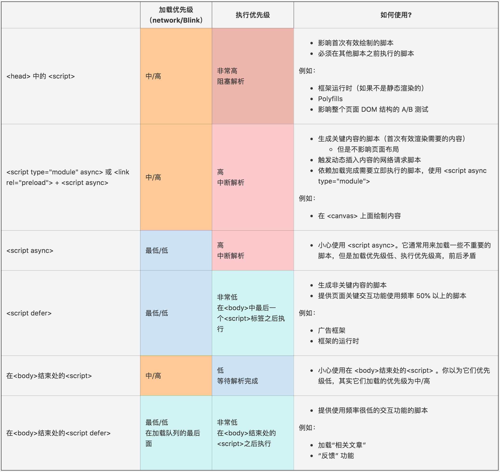
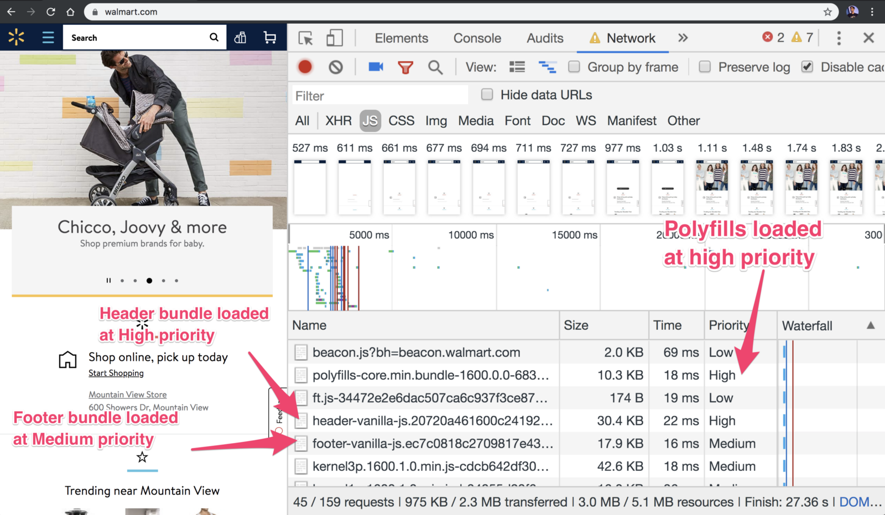

浏览器如何调度和执行脚本影响着 web 页面的的性能。`<script defer>`、`<link rel=preload>` 等技术影响着脚本的加载，知道浏览器如何解释它们，对优化 web 性能很有帮助。感谢 **Kouhei Ueno**，我们已经更新了 Chrome 脚本调度的概要。

***注意：*** 使用上面的知识需要注意，上面的加载优先级并不能保证在所有浏览器中表现都一致。理想情况下，尽可能的为大多数用户提供好的用户体验。

如果你是一个 web 开发者，你可以通过 Chrome Devtool 的 Network 面板里面的 “priority” 选项栏来观察 “加载优先级” 。右击“priority”栏目的头部，可以切换排序：

这个优先级概要表在2019年2月份都是正确的。我个人对于其他浏览器 JavaScript 加载优先级的理解同样很感兴趣。希望这篇总览能够对你有所帮助。

> 感谢 ***Kouhei***, ***Dom Faralino***, ***Pat Meenan***, ***Kenji Baheux*** 和 ***Yoav Weiss*** 帮助更好的解释 Chrome 网络栈的执行.

原文: https://medium.com/dev-channel/javascript-loading-priorities-in-chrome-57c54cfa6672