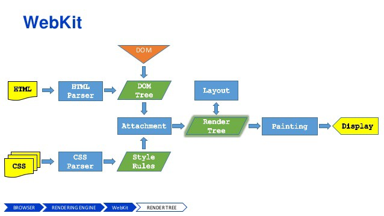

## 了解JavaScript中的重绘和回流

最近,在研究React的Virtual DOM能大幅提高页面渲染效率的原因时，发现自己对JavaScript的性能了解甚少。为了提高对重绘、回流以及JavaScript性能的认识，因此写下这篇文章。

## 在深入研究之前，需要知道浏览器的工作原理

一张图胜过千言万语。因此，让我们细看一下浏览器是如何工作的！

**嗯...那么什么是浏览器引擎(Browser engine)和渲染引擎(Rendering engine)呢？**

浏览器引擎的主要工作是处理HTML文档和其他资源，把它们转换成一个可视化交互式的web页面呈现在用户的设备上。
除了浏览器引擎之外，和它相关的另外两个常用的概念术语是：布局引擎(Layout engine)和渲染引擎。理论上，浏览器的布局和渲染(绘制)工作，可以由单独的引擎处理。然而，在实践中，它们是紧密耦合的，很少单独考虑。

## 让我们了解浏览器如何在屏幕上绘制用户界面

当你在浏览器上敲回车去请求一些链接时，向该页面发出HTTP请求，然后服务器通常提供HTML文档作为响应。（在这个过程中发生了很多[事情](https://cheapsslsecurity.com/blog/what-is-ssl-tls-handshake-understand-the-process-in-just-3-minutes/)）

* 浏览器在解析出HTML源代码后，会构造出一颗DOM树形式的数据，每个HTML标签在这个树中都有一个对应的节点，标签之间的文本块会用一个文本节点表示。而这个DOM树的根结点是documentElement`(<html>标签)`。

* 浏览器解析CSS代码，使其有意义。样式信息级联的基本规则：首先解析用户代理样式表（浏览器默认）。然后是用户样式表，它指的是网页作者的样式表，主要包括外部（引入的css文件）、导入(@import)、内联（style标签内的）的样式，最后是HTML标签的style属性中样式。

* 接下来有趣的部分是构建一颗渲染树(render tree)。渲染树有点像DOM树,但不完全一样。渲染树能够识别出样式，因此用`display:none`隐藏的div，它不会在渲染树中表示。其他的不可见元素也是如此，例如`<head>`里的所有元素。另一方面，可能有一些DOM元素在渲染树中需要用多个节点表示，例如文本节点`
`中的每一行都需要一个渲染节点。渲染树中的每个节点可以称为框或者盒子（CSS中的[盒子模型](http://www.w3.org/TR/CSS2/box.html#box-dimensions)）,每个节点都有CSS盒子属性包括`width, height, border, margin`等。

* 渲染树被构建之后，浏览器可以在屏幕上绘制出它的每个节点。

下面是浏览器在屏幕上绘制用户界面的快照：

  <iframe width="100%" height="360px" frameborder=0 src="https://medium.com/media/8f1e045b2bfe590b62c8238a1f76feb" allowfullscreen=""></iframe>

 <iframe src="https://medium.com/media/8f1e045b2bfe590b62c8238a1f76feb5" frameborder=0></iframe>

它发生在几秒内，我们甚至没有注意到这一切的发生。
浏览器是如何绘制布局，它尝试检测出根元素、兄弟元素、以及子元素作为节点来重新安排它们的布局。

Let’s take one example
举个例子

    <html>
    <head>
      <title>Repaint And Reflow</title>
    </head>
    <body>
        
      

        <strong>How's The Josh?</strong>
        <strong><b> High Sir...</b></strong>
      

      
      

        Nothing to display
      

      
      

      ...
     
    </body>
    </html>

*The DOM tree* that represents this HTML document basically has one node for each tag and one text node for each piece of text between nodes (for simplicity let’s ignore the fact that whitespace is text nodes too) :
在DOM树中HTML文档的每个标签都有一个对应的节点，节点之间的每段文本都有一个文本节点（简单来说，我们忽略的空白也是文本节点）

    documentElement (html)
        head
            title
        body
            p

                strong
                    [text node]

            p
                strong
                    b
                        [text node]    		
            div 
                [text node]
    		
            div
                img
    		
            ...

The *render tree* would be the visual part of the DOM tree. It is missing some stuff — the head and the hidden div, but it has additional nodes (aka frames, aka boxes) for the lines of text.

该渲染树是DOM树的可视部分，但是它缺少了一些东西--头部和隐藏的div，但是它有文本的附加节点（又名框架，也称为框）

    root (RenderView)
        body
            p
                line 1
    	    line 2
    	    line 3
    	    ...
    	    
    	div
    	    img
    	    
    	...

The root node of the render tree is the frame (the box) that contains all other elements. You can think of it as being the inner part of the browser window, as this is the restricted area where the page could spread. Technically WebKit calls the root node RenderView and it corresponds to the CSS [initial containing block](http://www.w3.org/TR/CSS21/visudet.html#containing-block-details), which is basically the viewport rectangle from the top of the page (0, 0) to (window.innerWidth, window.innerHeight)
渲染树的根节点是包含所有其他元素的框架（框）。也可以将其视为浏览器窗口的内部部分，这也是页面可以展开的限制区域。从技术上讲，webkit调用根节点renderview时，它对应于CSS初始包含块，也就是从页面顶部（0，0）到（window.innerwidth，window.innerheight）的视区矩形。

Figuring out what and how exactly to display on the screen involves a recursive walk down (a flow) through the render tree.
要想知道在屏幕上准确显示什么以及如何显示，需要通过渲染树进行递归向下遍历（一个流）。

## Repaint and Reflow
回流和重绘

There’s always at least one initial page layout together with a paint (unless, of course you prefer your pages blank :)). After that, changing the input information which was used to construct the render tree may result in one or both of these:
在页面渲染的时候至少有一个初始页面布局和绘制，之后当更改构造渲染树的输入信息时可能至少会导致以下一种情况：

 1. parts of the render tree (or the whole tree) will need to be revalidated and the node dimensions recalculated. This is called a **reflow**, or layout, or layouting. Note that there’s at least one reflow — the initial layout of the page
 部分渲染树（或整个树）需要重新验证，并重新计算节点尺寸。我们把这称为回流、布局，这里需要注意下，页面至少有一个回流--页面的初始布局。

 2. parts of the screen will need to be updated, either because of changes in geometric properties of a node or because of stylistic change, such as changing the background color. This screen update is called a **repaint**, or a redraw.
 由于部分节点的几何属性发生了变化或者时样式发生了更改，比如更改了背景色，所以屏幕的有些部分需要更新，我们将此称之为重绘。

Repaints and reflows can be expensive, they can hurt the user experience, and make the UI appear sluggish
重绘和回流的代价时很大的，它们可能会影响用户体验，让UI界面迟缓。

**Repaint**
重绘
As the name suggests repaint is nothing but the repainting element on the screen as the skin of element change which affects the visibility of an element but do not affects layout.
顾名思义，重绘只是屏幕上的重绘元素，因为元素的外观会发生变化，这会影响元素的可见性，但不会影响布局。

Example.
1. Changing visibility of an element.
1.改变元素的可见性
2. Changing outline of the element.
2.改变元素的外形轮廓
3. Changing background.
3.改变元素背景
Would trigger a repaint.
会触发重绘

According to Opera, the repaint is an expensive operation as it forces the browser to verify/check visibility of all other dom nodes.
Opera也说过，重绘是一项昂贵的操作，因为它强制浏览器去验证、检查所有其他dom节点的可见性。

**Reflow
**Reflow means re-calculating the positions and geometries of elements in the document, for the purpose of re-rendering part or all of the document. Because reflow is a user-blocking operation in the browser, it is useful for developers to understand how to improve reflow time and also to understand the effects of various document properties (DOM depth, CSS rule efficiency, different types of style changes) on reflow time. Sometimes reflowing a single element in the document may require reflowing its parent elements and also any elements which follow it.
回流是指重新计算文档中元素的位置和几何形状，以重新呈现部分或全部文档。由于回流是浏览器中的用户阻塞操作，因此对于开发人员来说，了解如何提高回流时间以及了解各种文档属性（DOM深度、CSS规则效率、不同类型的样式更改）对回流时间的影响就显得非常有必要了。有时，在文档中回流单个元素可能需要回流其父元素以及其后的任何元素。

## Virtual DOM VS Real DOM

Every time the DOM changes browser need to recalculate the CSS, do layout and repaint web page. This is what takes time in real dom.

每次DOM更改浏览器需要重新计算CSS时，都要进行布局并重新绘制网页。这是真实dom所花费的时间。

To minimize this time Ember use key/value observation technique and Angular uses dirty checking. Using this technique they can only update changed dom node or the node which are marked as dirty in case of Angular.

为了最小化这个时间，Ember使用键值队观察技术，Angular使用脏检查。使用这个技术能仅仅在dom节点改变时做出更新。或者在Angular中把这个节点标记为脏的，再去更新。

If this was not the case then you are not able to see new email as soon as it comes while writing a new email in Gmail.

如果情况不是这样的话，当你在Gmail中写了一个新的邮件，不能立即看到。

But, browser are becoming smart enough nowadays they are trying to shorten the time it takes to repaint the screen. The biggest thing that can be done is to minimize and batch the DOM changes that make repaints.

但是，浏览器正在变的越来越聪明，它们尝试缩短重绘时间。当重绘时，最重要的事情是最小化和批处理dom的更改。

The strategy of reducing and baching DOM changes taken to another level of abstraction is the idea behind React’s Virtual DOM.

React的虚拟DOM背后的理念是将dom的更改减少，并缓存到另一个抽象层次的策略。

## What makes React’s virtual DOM so fast?
##是什么让React的虚拟dom如此块？

React doesn’t really do anything new. It’s just a strategic move. What it does is It stores a replica of real DOM in memory. When you modify the DOM, it first applies these changes to the in-memory DOM. Then, using it’s diffing algorithm, figures out what has really changed.

React并没有真正做一些新的事情。这只是一个战略举措。它的作用是将真实dom的副本存储到内存中。当你修改dom时，首先将这些更改应用到内存中dom。然后使用diff，找出真正改变。

Finally, it batches the changes and call applies them on real-dom in one go. Thus, minimizing the re-flow and re-paint.

最后，它批量更改并应用这些到真实dom中。因此，最大化减少回流和重绘。

Interested in reading more on that? Well, that’s a topic for another post?

*If you like it, please leave a comment below — it encourages me to write more.
If you didn’t like it, still drop a comment — explaining how can we improve.*

📝 Read this story later in [Journal](https://usejournal.com/?utm_source=medium.com&utm_medium=noteworthy_blog&utm_campaign=guest_post_read_later_text).

🗞 Wake up every Sunday morning to the week’s most noteworthy Tech stories, opinions, and news waiting in your inbox: [Get the noteworthy newsletter >](https://usejournal.com/newsletter/?utm_source=medium.com&utm_medium=noteworthy_blog&utm_campaign=guest_post_text)
