JavaScript 的异步处理一直被认为不够快。更糟糕的是，调试实时的 JavaScript 应用程序，特别是 Node.js 服务器，并非易事，特别是涉及到异步编程时。幸运的是，这个现象正在被改变。这篇文章将介绍我们是如何在 V8 （有一些其他的 JavaScript 引擎也一样） 中优化异步函数和 promise 的，还有我们如何提升异步代码的调试体验。

*⚠️ 相对于阅读文章，如果你更喜欢看演讲视频的话，可以直接观看下面的视频。否则，请跳过视频并继续阅读。*

<div style="text-align: center">
  <iframe width="100%" height="360px" frameborder=0 src="https://v.qq.com/iframe/player.html?vid=n0843i7j2rq&tiny=0&auto=0" allowfullscreen="true"></iframe>
</div>

## 异步编程的新方法
### 从回调到 promise 再到异步函数

在 promise 成为 JavaScript 的一部分之前，基于回调的 API 是很常用的异步代码，特别是在 Node.js 中。这里有个栗子：

```javascript
function handler(done) {
  validateParams((error) => {
    if (error) return done(error);
    dbQuery((error, dbResults) => {
      if (error) return done(error);
      serviceCall(dbResults, (error, serviceResults) => {
        console.log(result);
        done(error, serviceResults);
      });
    });
  });
}
```
 
 这种使用深层回调嵌套的方式被称作“回调地狱”，因为它降低了代码的可阅读性和可维护性。

 幸运的是，现在 promise 已经成为了 JavaScript 语言的一部分。上面的代码有了更加优雅和可维护性的写法：

```javascript
function handler() {
  return validateParams()
    .then(dbQuery)
    .then(serviceCall)
    .then(result => {
      console.log(result);
      return result;
    });
}
```

再后来，JavaScript 支持了异步函数。上面的异步代码，现在可以写的像同步代码一样了：

```javascript
async function handler() {
  await validateParams();
  const dbResults = await dbQuery();
  const results = await serviceCall(dbResults);
  console.log(results);
  return results;
}
```

使用了异步函数之后，代码变得更加简洁，代码的控制流程和数据流更加容易理解，尽管代码仍然是异步执行。（谨记，JavaScript 执行仍然发生在单线程中，这意味着异步函数并不会创建自己的物理线程。）

### 从事件监听的回调到异步迭代（async iteration）

[ReadableStreams](https://nodejs.org/api/stream.html#stream_readable_streams) 是另一个在 Node.js 中常见的异步编程范例。栗子如下：

```javascript
const http = require('http');

http.createServer((req, res) => {
  let body = '';
  req.setEncoding('utf8');
  req.on('data', (chunk) => {
    body += chunk;
  });
  req.on('end', () => {
    res.write(body);
    res.end();
  });
}).listen(1337);
```

这段代码有点难理解：传入的数据只能在回调内以 chunk 的形式被处理，而且流的结束信号只能在回调内接收到。这很容易产生 bug ， 如果你没有意识到函数的立即结束并在回调内处理。

幸运的是，在 ES2018 中有一个很酷的叫做[异步迭代](http://2ality.com/2016/10/asynchronous-iteration.html)的新特性可以简化这段代码：

```javascript
const http = require('http');

http.createServer(async (req, res) => {
  try {
    let body = '';
    req.setEncoding('utf8');
    for await (const chunk of req) {
      body += chunk;
    }
    res.write(body);
    res.end();
  } catch {
    res.statusCode = 500;
    res.end();
  }
}).listen(1337);
```

我们现在可以把所有的处理异步请求的逻辑放到一个单独的 `async` 函数中，而不是分散在 ***data*** 和 ***end*** 两个不同回调函数中，并使用 `for await...of` 循环来异步迭代 chunk 。我们也可以使用 `try-catch` 语句快避免 `unhandledRejection` 问题。

你已经可以在生产环境使用这些新特性了！***Node.js 8（V8 v6.8/Chrome 68）*** 开始支持 `async` 函数，异步迭代和生成器在 ***Node.js 10 (v8 6.8/Chrome 68)*** 开始支持！

## 异步性能提升

从 V8 v5.5（Chrome 55 & Node.js 7） 到 V8 v6.8（Chrome 68 & Node.js 10）， 我们已经设法显著提升了异步代码的性能。现在开发者已经可以安全的使用这些新的编程范例，而不需要担心性能。

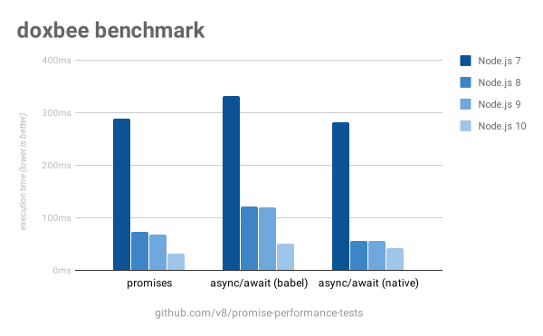

上图是重度使用 promise 的代码的 [doxbee](https://github.com/v8/promise-performance-tests/blob/master/lib/doxbee-async.js) 基准测试结果。注意柱状体的高代表执行时间，所以越低代表性能越好。

并行测试的结果更让人兴奋，特别是 `Promise.all()` 的性能。

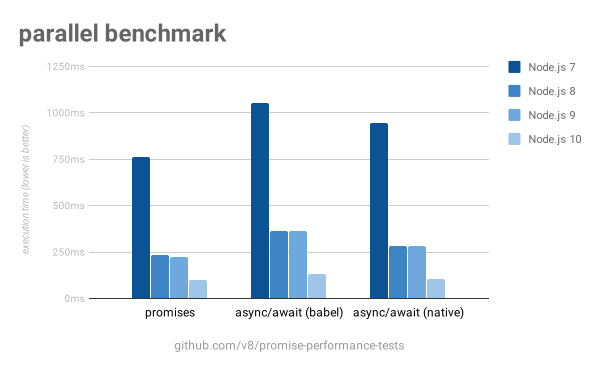

我们设法将 `Promise.all` 的性能提升了 8 倍。

然而，上面的基准测试是人为的微基准测试。V8 团队对于如何优化[实际情况下的用户代码性能](https://v8.dev/blog/real-world-performance)更感兴趣。

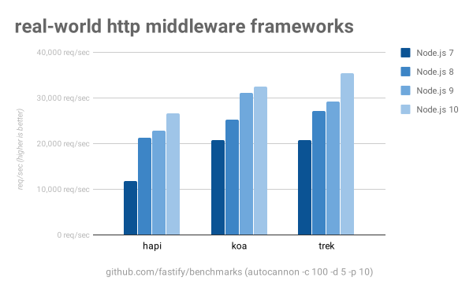

上面的图标展示了一些重度使用 `promise` 和 `async` 函数的主流的 HTTP 中间件框架的性能测试结果。注意，和之前的图标不同，这图中柱状体展示的是每秒的请求数，所以越高代表性能越好。这些框架从 Node.js 7（V8 v5.5）到 Node.js 10（v8 v6.8），性能都有显著提升。

这些性能的提升是由于三个关键技术实现的结果：

1. [TurboFan](https://v8.dev/docs/turbofan)，一个新的优化编译器 🎉
2. [Orinoco]()，一个新的垃圾回收器 🚛
3. 一个 Node.js 8 中导致 `await` 跳过 microtick 的 bug 修复 🐛 

我们在 Node.js 8 中使用 [TurboFan](https://v8.dev/blog/launching-ignition-and-turbofan) 极大的提升了性能。

我们同时也正在实现一个新的垃圾回收器，可以脱离主线程执行垃圾回收工作，因此可以可以显著提升请求处理性能。

最后同样重要的是，顺手解决了一个 Node.js 8 的 bug 导致了性能的提升，这个 bug 导致 `await` 在一些情况下跳过 microticks 。这个 bug 开始于无意识的违反规范行为，但后来却给了我们提供了优化的灵感。让我们来解释下这个缺陷的行为：

```javascript
const p = Promise.resolve();

(async () => {
  await p; console.log('after:await');
})();

p.then(() => console.log('tick:a'))
 .then(() => console.log('tick:b'));
```

上面的程序创建了一个 ***fulfilled*** 状态的 Promise：***p*** ，然后使用 `await` 获取它的结果，并且链接了两个处理程序。你认为 `console.log` 会以什么样的顺序执行？

因为 ***p*** 处于 ***fulfilled*** 状态，你可能会认为是先打印 ***'after:await'*** 然后才是两个 ***'tick'***。事实上，在 Node.js 8 中是会得到这样的顺序：

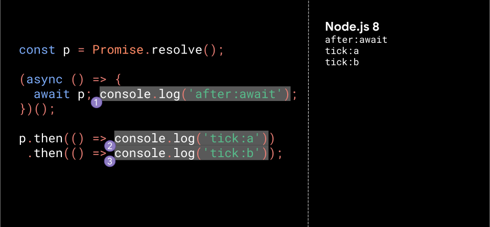
<p style="text-align: center"><small>Node.js 8 中 await 的 bug</small></p>

尽管这个执行顺序看起来很直观，但是根据规范它是错误的。Node.js 10 中实现了正确的行为——先执行链式处理程序，然后才继续执行异步函数。

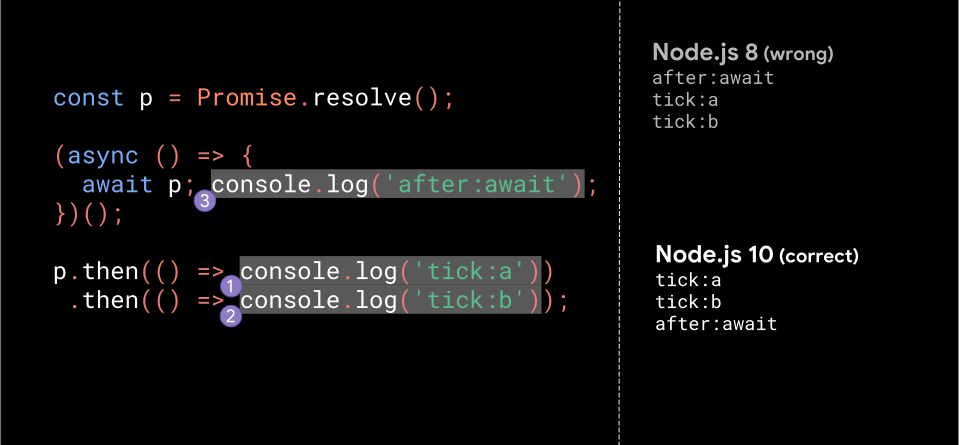
<p style="text-align: center"><small>Node.js 10 不再有 await 的 bug</small></p>

这个正确的行为不能立即明显的被辩证，这让很多 JavaScript 开发者感到惊讶，所以我们有必要解释下。在开始进入到 ***promise*** 和 ***async*** 函数之前，我们先来看一些基础。

### 任务（Tasks）和微任务（microtasks）

从高层级看，JavaScript 中有 ***task*** 和 ***microtask***。task 处理 I/O 事件和定时器，并且每次只执行一个。microtask 实现了延迟执行 `async/await` 和 promise，在每次 task 执行结束后执行。在每次执行权返回给事件循环（event loop）之前 microtask 队列都会被执行到空为止。

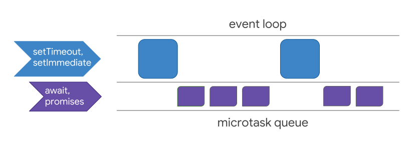
<p style="text-align: center"><small>microtask 和 task 的不同</small></p>

想了解更多细节可以看 ***Jake Archibald*** 这篇关于 [浏览器中 tasks、 microtasks、 queues 以及 schedules](https://jakearchibald.com/2015/tasks-microtasks-queues-and-schedules/) 的解释。浏览器中的任务模型和 Node.js 中很相似。

### 异步函数

根据 MDN 的解释，异步函数是一个使用隐式 promise 执行异步操作的并返回其结果的函数。异步函数的目的是为了让异步代码看起来像同步代码一样，从而简化复杂的异步处理逻辑。

看下一个简单的异步函数：

```javascript
async function computeAnswer() {
  return 42;
}
```

当它被调用后返回一个 promise ，你可以像其他 promise 一样获取它的值。

```javascript
const p = computeAnswer();
// → Promise

p.then(console.log);
// prints 42 on the next turn
```

你仅可以在下次 microtasks 执行的时候获取到 `Promise: p`  的值。换句话说，上面的代码等价于以值（42）为参数调用 `Promise.resolve` ：

```javascript
function computeAnswer() {
  return Promise.resolve(42);
}
```

异步函数真正的力量来自 `await` 表达式，它会使方法执行暂停直到 promise 被 resolve ，并恢复执行。`await` 的返回值就是 promise 被`fulfilled` 的值。这儿是个展示栗子：

```javascript
async function fetchStatus(url) {
  const response = await fetch(url);
  return response.status;
}
```

`fetchStatus` 执行在 await 处暂停，当 `fetch` 返回的 promise 被 fulfill 时，恢复执行。这或多或少等同于链接一个处理程序到 `fetch` 返回的 promise 上。

```javascript
function fetchStatus(url) {
  return fetch(url).then(response => response.status);
}
```

这个处理程序包含跟在 await 后面的代码。

通常来说你需要传递一个 `Promise` 给 `await`，但是实际上你可以传递任何 JavaScript 值。如果 `await` 后面跟的表达式的值不是一个 promise ，它将被转换成一个 promise 。这意味着如果你开心你可以 `await 42` ：

```javascript
async function foo() {
  const v = await 42;
  return v;
}

const p = foo();
// → Promise

p.then(console.log);
// prints `42` eventually
```

更有趣的是，对于任何 “thenable” 的对象（也就是说，任何带有 `then` 方法的对象，即使不是一个真正的 promise ） `await` 都可以工作。所以你可以实现一些有趣的事情，比如：一个可以测量实际 sleep 时间的异步 sleep 功能：

```javascript
class Sleep {
  constructor(timeout) {
    this.timeout = timeout;
  }
  then(resolve, reject) {
    const startTime = Date.now();
    setTimeout(() => resolve(Date.now() - startTime),
               this.timeout);
  }
}

(async () => {
  const actualTime = await new Sleep(1000);
  console.log(actualTime);
})();
```

跟随着这个[规范文档](https://tc39.github.io/ecma262/#await)，让我们来揭开 V8 中 await 实现的神秘面纱。这个是一个简单的异步函数 `foo`：

```javascript
async function foo(v) {
  const w = await v;
  return w;
}
```

当函数 `foo` 被调用时，参数 `v` 将被封装到一个 promise 里，并且在这个 promise 被 resolve 之前异步函数暂停执行。一旦 promise 被 resolve，函数的执行恢复， `w` 被赋值为 fulfilled 的 promise 的值。这个值将会作为异步函数的返回值。

### 揭开 `await` 的神秘面纱

首先，V8 将这个函数标记成可恢复的（resumable），这意味着执行可以被暂停和恢复（在 `await` 的位置）。然后，创建一个做为你调用异步函数时返回的 promise —— `implicit_promise`，最终解析为异步函数的值。


<p style="text-align: center"><small>一个简单的异步函数和 V8 转换后的代码比较</small></p>

有趣的是：真实的 `await` 。传给 `await` 的第一个值被封装成一个 promise 。然后，暂停异步函数的执行，并为这个 promise 添加处理程序以便稍后 promise 被 `fulfilled` 的时候恢复异步函数执行，最终返回 `implicit_promise` 给调用者。一旦 promise 被置为 `fulfilled` ，异步函数恢复执行，异步函数内部获取到 `promise` 的值并赋值给 `w` 做为 resolve `implicit_promise` 的值。

简而言之，`await v` 的初始化可以概括如下：
1. 将传给 `await` 的值 `v` 封装成一个 promise
1. 为恢复执行异步函数添加处理程序
1. 暂停执行异步函数并返回 `implicit_promise` 给调用者

让我们来一步步的看下这些操作。假设 `await` 后面跟的已经是一个 `fulfilled` 状态且值为 `42` 的 promise 。然后，引擎创建一个新的 promise ，并且对 await 后面的 promise 执行 resolve 操作。这样做使得这些 promise 链延迟到下一轮（微任务）执行，这个操作在规范中称为 [PromiseResolveThenableJob](https://tc39.github.io/ecma262/#sec-promiseresolvethenablejob) 。

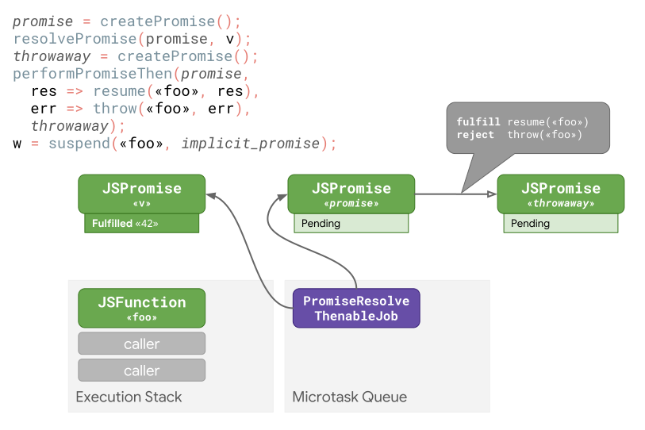

接着引擎创建另外一个叫做 `throwaway` 的 `promise` 。它被叫做 `throwaway` 因为没有其他程序链接到它，它只在引擎内部运行。这个 `throwaway` promise 会和一些适当的用来恢复异步函数执行的处理程序一起被链接到 `promise` 对象。`performPromiseThen` 操作的执行效果本质上和 [Promise.prototype.then()](https://developer.mozilla.org/en-US/docs/Web/JavaScript/Reference/Global_Objects/Promise/then) 是一样的。最终，异步函数的执行被暂停，执行控制权交还给调用者。

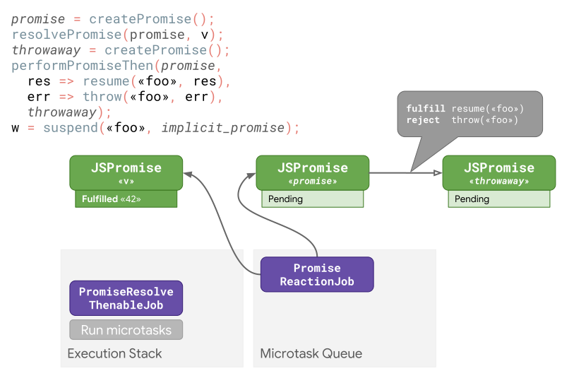

执行继续在调用者中进行直到调用栈（call stack）为空。紧接着引擎开始执行 `microtask` ，首先它会执行之前已经排进计划的任务 [PromiseResolveThenableJob](https://tc39.github.io/ecma262/#sec-promiseresolvethenablejob) ——它将一个新的微任务 [PromiseReactionJob](https://tc39.github.io/ecma262/#sec-promisereactionjob) 加到 Microtask 队列，用来将 `promise` 链接到传递给 `await` 的值。然后引擎继续处理微任务队列，因为在继续主事件循环之前微任务队列必须被清空。


接下来是执行 [PromiseReactionJob](https://tc39.github.io/ecma262/#sec-promisereactionjob) ，它使用我们正在 `awaiting` 的值（这个例子中是 42）来完成 `promise` ，并且将响应程序（当 promise 被 resolve/ reject 时的处理程序）绑定到 `throwaway` 。现在还有最后一个微任务等待处理，V8 会继续循环执行微任务。


现在，第二个 `PromiseReactionJob` 将处理方案传递给 `throwaway` ，并恢复执行异步函数，最后返回 `await` 的执行结果：42。

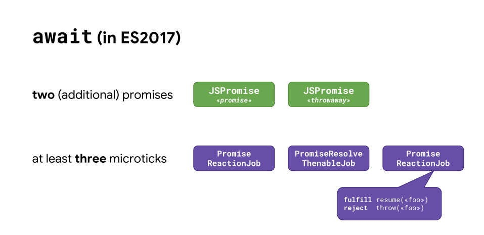
<p style="text-align: center"><small>await 的开销</small></p>

总的来说，引擎会为每个 `await` 创建两个额外的 promise（即使 await 后面跟的已经是一个 promise ）和至少三个微任务。OMG，你能想到一个 `await` 表达式会产生那么多开销吗？！


让我们看下这些开销来自哪儿。第一行代码是封装一个 promise 。第二行代码立即使用 `await` 表达式的返回值 `v` 来 resolve 上一步封装的 promise 。这两行代码产生了一个额外的 `promise` 和 三个微任务中的两个。如果 `v` 已经是一个 `promise`（`await` 后面通常跟的都是 promise）这些操作是很昂贵的不必要的性能开销。在非常见情况下，例如 `await 42`，引擎仍然需要将 42 封装到一个 promise 中。 

于是乎，现在规范中有一个叫做 [promiseResolve](https://tc39.github.io/ecma262/#sec-promise-resolve) 的操作仅在需要的时候执行封装 promise 的操作 ：

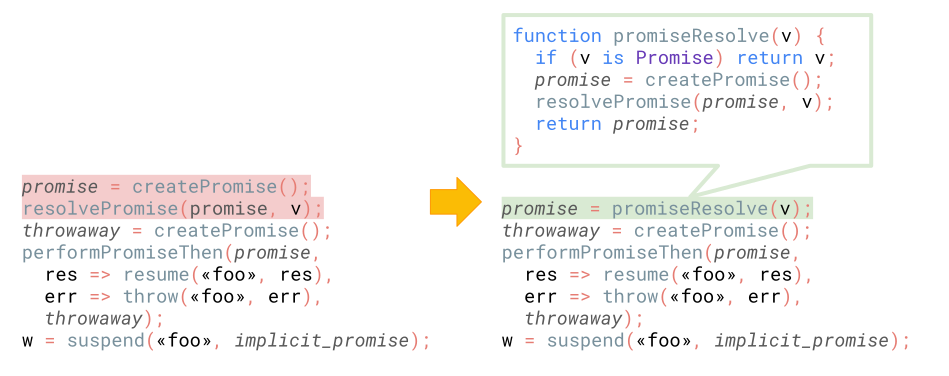

这个操作仍然是返回一个 promise ，但它只在需要的时候才会将跟在 `await` 后面的值封装到一个 promise 。通过这种方式在大多数情况（传给 `await` 的已经是 promise ）下可以节省一个额外的 promise 和两个微任务。这个优化已经在 [V8 v7.2](https://v8.dev/blog/v8-release-72#async%2Fawait) 默认开启。在 V8 v7.1 中可以通过使用 `--harmony-await-optimization` 开启。 同时，我们已经将这个优化提交给 [ECMAScript 规范](https://github.com/tc39/ecma262/pull/1250) 。一旦我们确定它与 web 兼容就会合并。

让我们一步一步来看下，这个针对 `await` 的优化是怎么执行的：

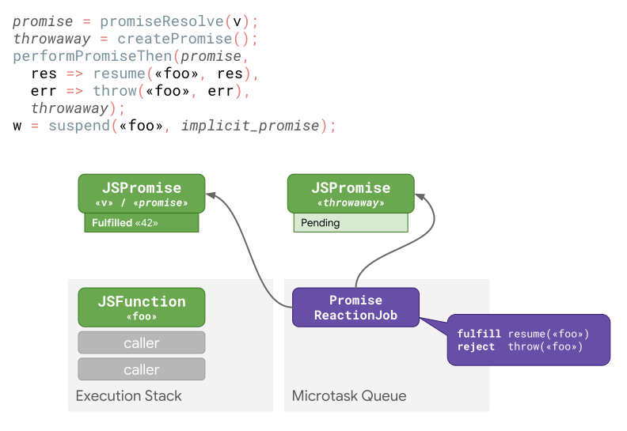

我们再次假设 `await` 操作后面跟的是一个完成状态（fulfilled）值为 42 的 promise 。感谢 `promiseResolve` 的魔力，现在 `promise` 只是引用了和 `v` 同一个 promise ，所以这一步不需要额外的开销。接着引擎和之前一样会创建一个叫做 `throwaway` 的 promise ，同时安排 `PromiseReactionJob` 到微任务队列以便在下一次执行微任务队列的时候恢复异步函数执行，暂停异步函数执行并把执行权交还给调用者。

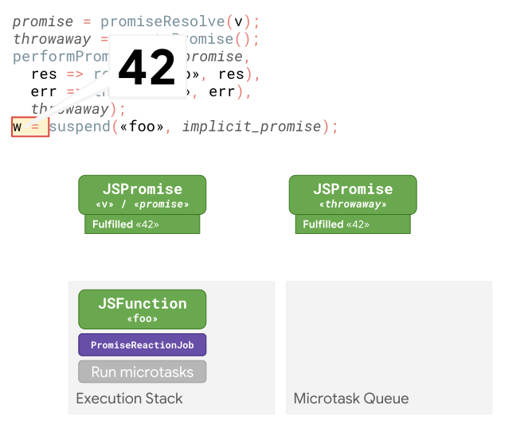

最终所有的 JavaScript 执行完成，引擎开始执行微任务，所以会执行 `PromiseReactionJob` 。这个任务将 `promise` 的结果传给 `throwaway`，并恢复异步函数执行，获取 `await` 操作的结果：42 。

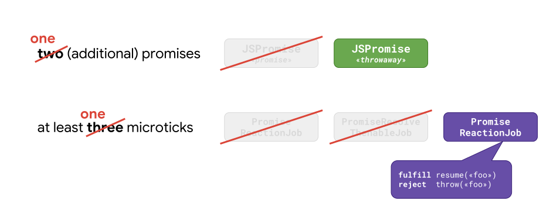
<p style="text-align: center"><small>减轻 await 的开销</small></p>

这个优化避免了为 `await` 后面的表达式创建不必要的 promise ，将至少三个 microtick 变成一个 microtick 。这个行为和 `Node.js 8` 中的那个 bug 的行为相似，除了它现在不再是一个 bug 外，他现在是一个标准的优化！

它看起来仍然是错误的因为引擎必须创建一个 `throwaway` 的 promise ，尽管它只在引擎内部使用。其实，`throwaway` promise 的存在只是为了满足规范中的 `performPromiseThen` 操作内部的 API 约束。


最近 ECMAScript 规范[编辑性更改](https://github.com/tc39/ecma262/issues/694)解决了这个问题。大多数时间，引擎不需要再为 `await` 创建 `throwaway` 的 promise 。


<p style="text-align: center"><small>await 优化前后代码比较</small></p>

比较 `await` 在 Node.js 10 中的实现代码和优化后的代码（可能添加到 Node.js 12） 性能变化如下：

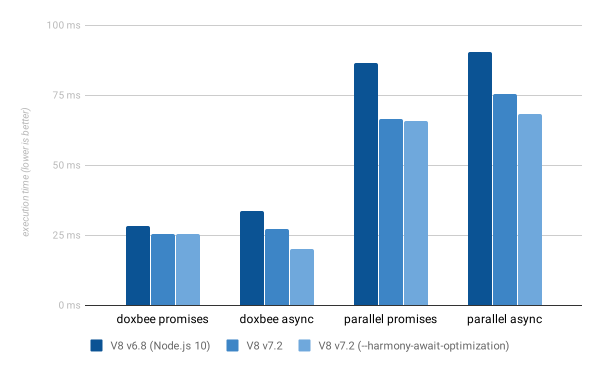

`async/await` 性能优于手写 promise 。关键的一点是我们通过修补显著提升了异步函数的性能，不仅仅在 V8 中如此，所有的 JavaScript 都如此。

## 提升开发体验

相对于性能，JavaScript 开发者也很关心调试和修复问题的能力，这些在异步代码中往往没那么容易。***Chrome DevTools*** 异步栈跟踪，也就是说他不仅可以追踪目前的同步调用栈也支持异步调用栈：

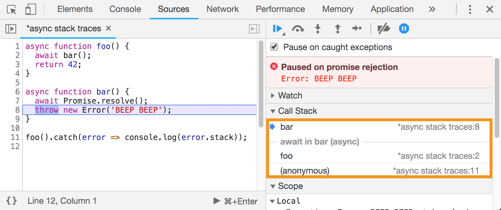

这是一个在本地开发时非常有用的功能。然而，一旦你的应用部署上线，这个方法就帮不到你了。在事故发生后的调试中，你只能看到 `Error#stack` 输出的日志文件，它不能告诉你关于异步部分代码发生了什么。

我们最近正在做 [零开销异步调用栈追踪](https://bit.ly/v8-zero-cost-async-stack-traces)，它将添加异步函数的调用信息到 `Error#stack` 的属性。“零开销”听起来很令人兴奋，真的能做到吗？在 Chrome 开发者工具的的功能开销很大的情况下，它如何做到零开销？举个栗子，`foo` 异步调用了 `bar`，`bar` 在 `await` 表达式之后抛出一个异常：

```javascript
async function foo() {
  await bar();
  return 42;
}

async function bar() {
  await Promise.resolve();
  throw new Error('BEEP BEEP');
}

foo().catch(error => console.log(error.stack));
```

在 Node.js 8 或 Node.js 10 中执行这段代码，将得到如下结果：

```bash
$ node index.js
Error: BEEP BEEP
    at bar (index.js:8:9)
    at process._tickCallback (internal/process/next_tick.js:68:7)
    at Function.Module.runMain (internal/modules/cjs/loader.js:745:11)
    at startup (internal/bootstrap/node.js:266:19)
    at bootstrapNodeJSCore (internal/bootstrap/node.js:595:3)
```

注意，尽管这个错误是对 `foo()` 的调用导致的，但 `foo` 却不在堆栈跟踪中。这给开发者排查事故问题带来了难度，无论你的代码是部署在 web 应用中还是云容器中。

有趣的是，当 `bar` 结束后，引擎知道从那里继续执行： 就是 `foo` 函数里的 `await` 语句后。巧合的是，那里正好是 `foo` 被暂停的地方。引擎可以使用这些信息来改造异步调用栈的追踪信息，也就是 `await` 定位。通过这个变化，输出信息变成：

```bash
$ node --async-stack-traces index.js
Error: BEEP BEEP
    at bar (index.js:8:9)
    at process._tickCallback (internal/process/next_tick.js:68:7)
    at Function.Module.runMain (internal/modules/cjs/loader.js:745:11)
    at startup (internal/bootstrap/node.js:266:19)
    at bootstrapNodeJSCore (internal/bootstrap/node.js:595:3)
    at async foo (index.js:2:3)
```

在调用栈的追踪中，最顶层的函数出现在最前面，紧接着是剩余的异步追踪，然后是在 `foo` 函数中对 `bar` 的异步调用。这个变化已经在 V8 中实现，通过一个新的标识 `--async-stack-traces` 来使用(V8 v7.3 已经默认开启 `--async-stack-traces`)。

然而，如果你拿这个和 Chrome 开发者工具里面的异步调用栈追踪相比，你会发现 `foo` 的调用站点不在异步调用栈的追踪信息中。正如前面提到的，这个方法是利用了 `await` 操作恢复和暂停执行位置相同的事实，但是常规情况下的 `Promise#then` 或 `Promise#catch` 的调用不是这样的。想了解更多，可以看 ***Mathias Bynens*** 关于[《为什么 await 打败了 Promise#then》](https://mathiasbynens.be/notes/async-stack-traces) 的解释。

## 总结
我们通过以下两个有效的优化手段使异步函数变得更快：
- 两个额外 `microtick` 的移除
- `throwaway` 这个 promise 的移除

在这个的基础上我们通过***零开销的异步调用追踪***提升了开发体验，它即支持异步函数中的 `await` 也支持 `Promise.all()`。

我们还有一些好的优化建议给 JavaScript 开发者：
- 喜欢使用异步函数和 `await` 胜过手写 promise 代码
- 坚持使用 JavaScript 引擎是现实的原生 promise ，以便从优化中受益，也就是避免 `await` 操作的两个 microtask


原文地址：[https://v8.dev/blog/fast-async](https://v8.dev/blog/fast-async)