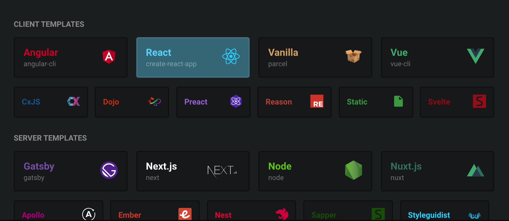
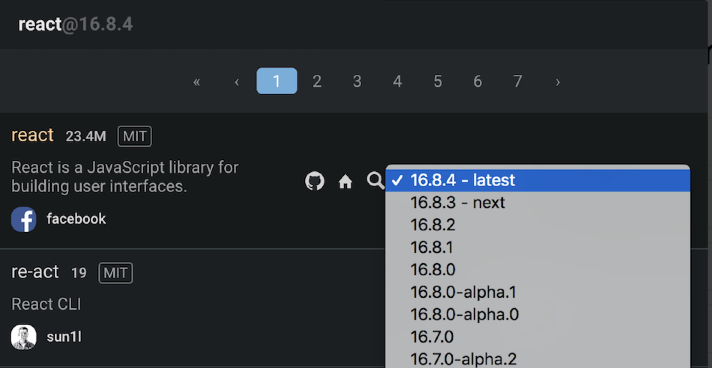

React Hooks 是一个闪亮的新[提案](https://www.youtube.com/watch?v=dpw9EHDh2bM&t=54s)，将优化 90% 的 React 代码。 根据 [Dan Abramov](https://overreacted.io/) 的说法，[Hooks](https://reactjs.org/docs/hooks-intro.html) 是 React 的未来。

这听起来不错，但什么是 Hooks，它们将如何帮助我编写更好的代码？ 很高兴你这么问。

Hooks 允许你访问函数组件中的状态和生命周期方法。 如果前面这句话对你来说很陌生，那么你应该[在这里](https://medium.freecodecamp.org/the-react-handbook-b71c27b0a795#b70b)更新关于 React 的记忆。

React 团队说，它将帮助你编写没有有状态组件包袱的干净的代码。 在使用 Hooks 实现了一个准系统表单之后，我同意了他们的观点。

让我们首先在有状态组件中写一个简单的表单，我们将使用 Hooks 重写该表单，你可以决定更喜欢哪种。

### 设置

访问 [codesandbox.io](https://codesandbox.io/)，创建一个帐户，登录，并创建一个新的 sandbox ，当创建 sandbox 时选择 React。



现在 sandbox 打开了，我们必须确保使用支持 Hooks 的 React 版本。因为Hooks现在在 React v16.8的公开稳定版本。

查看 sandbox 左侧的文件编辑器，然后:

- 点击依赖项 ‘Dependencies’
- 查看 ‘react’ 和‘react-dom’ 的版本是否低于 16.8，低于则点击更新到最新版本



### 代码

现在我们已经完成了设置，是时候编写一些代码了。 跳到你创建的 sandbox ，创建一个名为 Form.jsx 的新文件，并粘贴下面的代码:
```js
import React, { Component } from "react";
class Form extends Component {
  constructor(props) {
    super(props);
    this.state = {
      firstName: "",
      lastName: "",
      email: "",
      password: "",
    };
    this.handleInputChange = this.handleInputChange.bind(this);
  }
  handleInputChange(event) {
    this.setState({
      [event.target.name]: event.target.value
    });
  }
  render() {
    const { firstName, lastName, email, password } = this.state;
    return (
      <form>
        <input
          value={firstName}
          onChange={this.handleInputChange}
          placeholder="First name"
          type="text"
          name="firstName"
          required
        />
        <input
          value={lastName}
          onChange={this.handleInputChange}
          placeholder="Last name"
          type="text"
          name="lastName"
          required
        />
        <input
          value={email}
          onChange={this.handleInputChange}
          placeholder="Email address"
          type="email"
          name="email"
          required
        />
        <input
          value={password}
          onChange={this.handleInputChange}
          placeholder="Password"
          type="password"
          name="password"
          required
        />
        <button type="submit">Submit</button>
      </form>
    );
  }
}
export default Form;
```

现在打开 index.js，用下面的代码替换内容:
```js
import React from "react";
import ReactDOM from "react-dom";
import Form from "./Form.jsx";
import "./styles.css";
function App() {
  return (
    <div className="App">
      <h1>A Simple Form in React</h1>
      <Form />
    </div>
  );
 }
const rootElement = document.getElementById("root");
ReactDOM.render(<App />, rootElement);
```

测试表单，看看是否一切正常。 这就是在 React 中实现受控表单的"老派"方式。

注意设置状态所需的样板文件的数量，以及在每次输入更改时更新状态的方法。


让我们使用 React Hooks (终于到了!)编写相同的表单 ，但是首先，删除 Form.jsx 中所有代码，让我们重新开始。


首先在文件顶部添加以下行:
```js
import React, { useState } from 'react';
```

所以这里引入了一个陌生的方法，叫做 `useState`。 它是什么，我们如何使用它？

嗯，`useState` 是 React Hook 允许我们访问和操作组件中的状态。 这意味着我们不必像以前那样 `extend Component` 。

这是来到 React API 的几个新的 Hooks 之一，它可以帮助我们编写更清晰的代码。 现在让我们使用它。
```js
import React, { useState } from "react";
import "./styles.css";
function Form() {
  const [firstName, setFirstName] = useState("");
  const [lastName, setLastName] = useState("");
  const [email, setEmail] = useState("");
  const [password, setPassword] = useState("");
  return (
    <form>
      <input
        value={firstName}
        onChange={e => setFirstName(e.target.value)}
        placeholder="First name"
        type="text"
        name="firstName"
        required
      />
      <input
        value={lastName}
        onChange={e => setLastName(e.target.value)}
        placeholder="Last name"
        type="text"
        name="lastName"
        required
      />
      <input
        value={email}
        onChange={e => setEmail(e.target.value)}
        placeholder="Email address"
        type="email"
        name="email"
        required
      />
      <input
        value={password}
        onChange={e => setPassword(e.target.value)}
        placeholder="Password"
        type="password"
        name="password"
        required
      />
      <button type="submit">Submit</button>
    </form>
  );
}
export default Form;
```

我们已经创建了函数组件，但是还有一些不熟悉的代码需要解释，特别是组件顶部的四个声明。

虽然这一部分代码起初看起来很奇怪，但是它很容易理解。 我们不再声明一个名为 `state` 的对象来保存组件的状态。 相反，我们现在将 `state` 划分为多个声明。

如果我们想以熟悉的`extends React.Component`的方式来声明一个名为 `firstName` 的状态变量，我们通常会在构造函数中声明它，然后通过写入`this.state.firstName` 来访问它。

但是使用 `useState`，我们可以初始化两个名为 `firstName` 和 `setFirstName` 的变量，让它们的值通过 `useState()` 返回。

为什么我们还要声明 `setFirstName` 呢？

因为这是一个函数组件，所以我们没有 `setState` 来帮助我们修改状态变量的值。 我们只有 `setFirstName`，它的唯一目的就是在每次调用它时更新 `firstName`。

所以当你看到:
```js
const [firstName, setFirstName] = useState("")
```
我们基本上是声明一个状态变量和一个函数，以允许我们稍后修改状态变量。 `useState` 调用中的空字符串是 `firstName` 的初始值，可以设置为任何需要的值。 现在我们将它设置为空字符串。

注意，你可以随心所欲地为 `setFirstName` 函数命名。 然而，有一个约定，在我们要修改的状态变量的名称之前附加‘set’。

现在我们知道了如何在函数组件中创建状态变量以及如何更新它。 下面让我们继续解释代码的其余部分。

在第一个输入标记中，我们将其值设置为在组件顶部声明的状态变量。 至于 `onChange` 处理程序，我们将它设置为一个[箭头函数](https://developer.mozilla.org/en-US/docs/Web/JavaScript/Reference/Functions/Arrow_functions)，为我们更新状态变量的函数。

我们在以前的类组件中有一个名为 `handleInputChange` 的方法，现在有一个匿名函数为我们更新状态。

通过尝试在表单中输入文本来检查一切是否正常工作。 如果一切正常，恭喜你，你刚刚使用了一个 React Hook。 如果没有，那么再看一遍本教程，确保你没有跳过任何说明。

添加你认为合适好看的样式。


详见链接[https://codesandbox.io/s/pp3rp9lqzj?from-embed](https://codesandbox.io/s/pp3rp9lqzj?from-embed)


### 反思

更新: 一些人可能对在 `onClick` 处理程序中使用内联函数的想法感到震惊。 我给 Dan Abramov 发了一条推特，他回复了 [Hooks 文档的这一部分](https://reactjs.org/docs/hooks-intro.html)，解释了为什么在 Hooks 中使用内联函数并不是一件坏事。

通过检查我们的新代码并将其与旧代码进行比较，很明显 `React Hooks` 可以帮助我们编写更好的代码。

将类组件和函数组件并排进行比较，可以清楚地看到，函数组件更容易推理，使用更少的代码，而且通常看起来更整洁。

如果你喜欢 `React Hooks`，你可以通过浏览官方文档并尝试使用它们重新实现一些项目来了解更多。

也就是说，我想听听你的想法。 你认为 `Hooks` 是 `React` 的未来，还是你觉得他们只是不必要的噱头？ 请在下面留下评论。

本文首发于 [The Andela Way](https://medium.com/the-andela-way/how-to-get-started-with-react-hooks-controlled-forms-9b47e9fb8c8d)。


原文地址：[https://medium.freecodecamp.org/how-to-get-started-with-react-hooks-controlled-forms-826c99943b92](https://medium.freecodecamp.org/how-to-get-started-with-react-hooks-controlled-forms-826c99943b92)