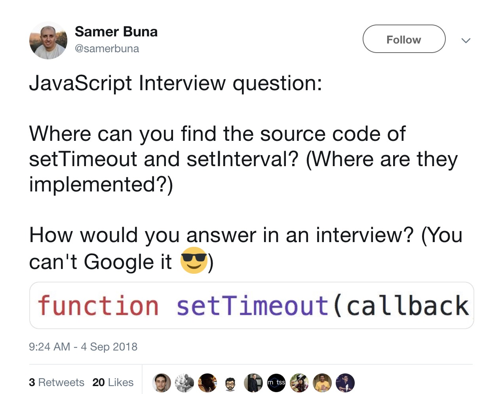
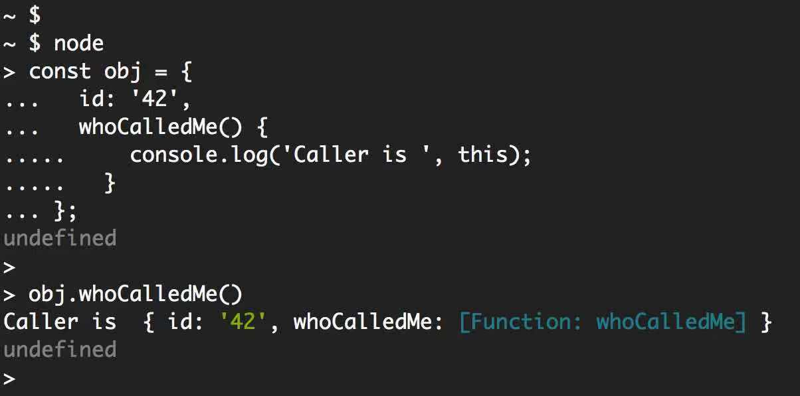

几周之前，我在推特上发了这个面试题:



**\* **在开始之前，先在你脑海中回答这个问题** \***

推特上大约一半的回答都是错误的。答案并不是 V8（或者虚拟机）！！虽然“JavaScript计时器” 很出名，但是 `setTimeout` 和 `setInterval` 函数并不是 ECMAScript 规范或者任何 JavaScript 引擎实现。定时器函数功能由浏览器实现，它们的实现在不同浏览器之间会有所不同，定时器也由 Node.Js 运行时本身实现。

在浏览器中，主计时器函数是 `Window` 接口的一部分，它具有一些其他函数和对象。 该接口使其所有元素在主 JavaScript 全局可用。 这就是您可以直接在浏览器控制台中执行 `setTimeout` 的原因。

在 Node 中，计时器是`global`对象的一部分，其行为类似于浏览器的 `Window` 接口。 你可以在此处查看 Node 中的计时器源代码[here](https://github.com/nodejs/node/blob/master/lib/timers.js)。

有些人可能认为这是一个糟糕的面试问题，为什么要知道这个问题呢？！作为一名 JavaScript 开发人员，我认为你应该知道这一点，因为如果你不这样做，那可能表明你并不完全理解 V8（和其他虚拟机）如何与浏览器和 Node 交互。

让我们举几个关于计时器功能的例子和挑战，准备好了吗？

更新：这篇文章现在是我的“Complete Introduction to Node.js”的一部分。
您可以在此处阅读更新版本。[here](https://jscomplete.com/learn/)

#### 延迟函数的执行

定时器函数是高阶函数，可用于延迟或重复执行其他函数（它们作为第一个参数接收）。

这是一个关于延迟的例子:

```js
// example1.js
setTimeout(() => {
    console.log("Hello after 4 seconds");
}, 4 * 1000);
```

此示例使用 `setTimeout` 将问候消息的打印延迟 4 秒。 `setTimeout` 的第二个参数是延迟（以 ms 为单位）。 这就是为什么我将 4 乘以 1000 使其成为 4 秒

`setTimeout` 的第一个参数是执行将被延迟的函数。

如果使用 `node` 命令执行 `example1.js` 文件，Node 将暂停 4 秒钟，然后它将打印问候语消息（并在此之后退出）。

请注意，`setTimeout` 的第一个参数只是一个函数引用。 它不必像 `example1.js` 那样是内联函数。 这是不使用内联函数的相同示例：

```js
const func = () => {
    console.log("Hello after 4 seconds");
};
setTimeout(func, 4 * 1000);
```

#### 传递参数

如果使用 `setTimeout` 延迟其执行的函数接受任何参数，我们可以使用 `setTimeout` 本身的剩余参数（在我们了解到目前为止的 2 参数之后）将参数值中继到延迟函数。

```js
// For: func(arg1, arg2, arg3, ...)
// We can use: setTimeout(func, delay, arg1, arg2, arg3, ...)
```

下面是一个例子：

```js
// example2.js
const rocks = who => {
    console.log(who + " rocks");
};
setTimeout(rocks, 2 * 1000, "Node.js");
```

上面的 `rock` 函数延迟了 2 秒，接受了一个 `who` 参数，并且 `setTimeout` 调用将值“Node.js”作为参数传递给 rock。

使用 `node` 命令执行 `example2.js` 将在 2 秒后打印出“Node.js rocks”。

#### 定时器挑战＃1

使用您到目前为止学到的有关 `setTimeout` 的知识，在相应的延迟后打印以下 2 条消息。

-   4 秒后打印消息“4 秒后你好”
-   8 秒后打印消息“8 秒后你好”。

##### 条件：

您只能在解决方案中定义一个函数，其中包括内联函数。 这意味着多个 `setTimeout` 调用必须使用完全相同的函数。

##### 解答

以下是我如何解决这一挑战：

```js
const theOneFunc = delay => {
    console.log("Hello after " + delay + " seconds");
};
setTimeout(theOneFunc, 4 * 1000, 4);
setTimeout(theOneFunc, 8 * 1000, 8);
```

我让 `theOneFunc` 收到一个延迟参数，并在打印的消息中使用了该 `delay` 参数的值。 这样，该函数可以根据我们传递给它的任何延迟值打印不同的消息。

然后我在两个 `setTimeout` 调用中使用了 `theOneFunc` ，一个在 4 秒后触发，另一个在 8 秒后触发。 这两个 `setTimeout` 调用也通过第三个参数来表示 `theOneFunc` 的延迟参数。

使用 `node` 命令执行 `solution1.js` 文件将打印出我们挑战的要求，4 秒后的第一条消息和 8 秒后的第二条消息。

#### 重复执行一个函数

如果我要求您每隔 4 秒打印一条消息怎么办？

虽然您可以将 `setTimeout` 放在循环中，但定时器 API 也提供了 `setInterval` 函数，这将完成永远执行某些操作的要求。

这是`setInterval`的一个例子：

```js
// example3.js
setInterval(() => console.log("Hello every 3 seconds"), 3000);
```

#### 结束定时器

因为调用计时器函数是一个调度操作，所以在执行之前也可以取消该调度操作。

对 `setTimeout` 的调用返回一个计时器“ID”，您可以使用带有 `clearTimeout` 调用的计时器 ID 来取消该计时器。 这是一个例子：

```JS
// example4.js
const timerId = setTimeout(
  () => console.log('You will not see this one!'),
  0
);
clearTimeout(timerId);
```

这个简单的计时器应该在 0 毫秒后立即启动，但它并没有按照我们预期的那样，因为我们已经捕获 `timerId` 值并在使用 `clearTimeout` 调用后立即取消它。

当我们通过 `node` 命令去执行 `example4.js`,Node 将不会打印任何信息并且退出进程。

顺便说一句，在 Node.js 中，还有另一种方法可以使用`0` ms 进行 `setTimeout`。 Node.js 计时器 API 有另一个名为 setImmediate 的函数，它与一个 `0`ms 的 `setTimeout` 基本相同，但我们不必在那里指定延迟：

```js
setImmediate(() => console.log("I am equivalent to setTimeout with 0 ms"));
```

`setImmediate` 函数不是在所有的浏览器都是可用的
[here](https://developer.mozilla.org/en-US/docs/Web/API/Window/setImmediate),不要在客户端的代码中使用这个_。

就像 `clearTimeout` 一样，还有一个 `clearInterval` 函数，它对 `setInerval` 调用执行相同的操作，并且还有一个 `clearImmediate` 也调用同样的操作。

#### 定时器延迟不是固定的

在前面的例子中，您是否注意到在 `0` ms 之后执行 `setTimeout `的操作并不意味着立即执行它（在 `setTimeout` 内部），而是在脚本中的所有其他操作之后立即执行它（包括 `clearTimeout` 调用）？

让我用一个例子清楚地说明这一点。 这是一个简单的 `setTimeout` 调用，应该在半秒后触发，但它不会：

```js
// example5.js
setTimeout(() => console.log("Hello after 0.5 seconds. MAYBE!"), 500);
for (let i = 0; i < 1e10; i++) {
    // Block Things Synchronously
}
```

在此示例中定义计时器之后，我们使用 big `for`循环同步阻止运行。 `1e10 `是10的十次方，所以循环是一个 10 亿个循环（基本上模拟繁忙的 CPU）。 当此循环正在滴答时，节点无法执行任何操作。

这当然在实际是很糟糕的，但它会帮助你理解 setTimeout 延迟不是一个保证的东西，而是一个最小的事情。 500 ms 表示最小延迟为 500 ms。 实际上，脚本将花费更长的时间来打印其问候语。 它必须等待阻塞循环才能完成

#### 定时器挑战＃2

编写脚本每秒打印消息“**Hello World**”，但只打印 5 次。 5 次后，脚本应打印消息“_完成_”并让 Node 进程退出。

**约束**：您不能对此挑战使用 `setTimeout` 调用。
**提示**：你需要一个计数器。

##### 解答

下面是我的解决方案：

```js
let counter = 0;
const intervalId = setInterval(() => {
    console.log("Hello World");
    counter += 1;
    if (counter === 5) {
        console.log("Done");
        clearInterval(intervalId);
    }
}, 1000);
```

我初始化 `counter` 为 `0` ，然后启动一个 setInterval 调用并捕获了它的 id。

延迟函数将会打印消息并每次递增计数器。 在延迟函数内，if 语句将检查我们现在是否处于 `5` 次。 如果是这样，它将打印“Done”并使用捕获的 `intervalId` 常量清除间隔。 间隔延迟为 `1000` 毫秒

#### 究竟谁“调用”延迟函数？

当您在常规函数中使用 JavaScript this 关键字时，如下所示：

```js
function whoCalledMe() {
    console.log("Caller is", this);
}
```

函数内部`this`关键字的值表示函数的调用者。如果在 Node REPL 中定义上面的函数，则调用者将是 `global` 对象。 如果在浏览器控制台中定义函数，则调用者将是 `window` 对象。

让我们定义一个函数作为一个对象的属性，为了更清晰的理解 `this`

```js
const obj = {
    id: "42",
    whoCalledMe() {
        console.log("Caller is", this);
    }
};
// The function reference is now: obj.whoCallMe
```

现在当您直接通过其引用去调用 obj.whoCallMe 函数时，调用者将是 obj 对象（由其 id 标识）：



现在问题是，如果我们将 `obj.whoCallMe` 的引用传递给 `setTimetout` 调用，调用者会是什么？

```js
// What will this print??
setTimeout(obj.whoCalledMe, 0);
```

#### 谁才是真正的调用者？

答案是：根据执行计时器功能的位置而有所不同。 在这个例子中，你无法直接判断谁是调用者。因为定时器实现是将你的函数唤醒。 如果您在 Node REPL 中测试它，您将获得一个 `Timetout` 对象作为调用者：


请注意，这只在您在常规函数中使用 JavaScript 的 `this` 关键字时才有意义。 如果您使用箭头功能，则根本不需要担心调用者。

#### 定时器挑战＃3

编写脚本以连续打印具有不同延迟的消息“Hello World”。 以 1 秒的延迟开始，然后每次将延迟增加 1 秒。 第二次将延迟 2 秒。 第三次将延迟 3 秒，依此类推。

在打印的消息中包含延迟。 预期输出看起来像：

```js
Hello World. 1
Hello World. 2
Hello World. 3
...
```

**约束**：您只能使用 const 来定义。 你不能使用 let 或 var。

##### 解答

因为延迟量是此挑战中的变量，所以我们不能在这里使用 `setInterval`，但我们可以在递归调用中使用 `setTimeout` 手动创建间隔执行。 使用 `setTimeout` 的第一个执行函数将创建另一个计时器，依此类推。

另外，因为我们不能使用 let / var ，所以我们不能有一个计数器来增加每个递归调用的延迟，但我们可以使用递归函数参数在递归调用期间递增。

这是解决这一挑战的一种可能方法：

```js
const greeting = delay =>
    setTimeout(() => {
        console.log("Hello World. " + delay);
        greeting(delay + 1);
    }, delay * 1000);
greeting(1);
```

#### 定时器挑战＃4

编写一个脚本以连续打印消息“Hello World”，其具有与 挑战＃3 相同的变化延迟概念，但这次是每个主延迟间隔的 5 个消息组。 从前 5 个消息的延迟 100ms 开始，接下来的 5 个消息延迟 200ms，然后是 300ms，依此类推。

以下是脚本的行为方式：

-   在 100ms 点，脚本将开始打印“Hello World”，并以 100ms 的间隔进行 5 次。 第一条消息将显示为 100 毫秒，第二条消息将显示为 200 毫秒，依此类推。
-   在前 5 条消息之后，脚本应将主延迟增加到 200ms。 因此，第 6 条消息将以 500 毫秒+ 200 毫秒（700 毫秒）打印，第 7 条消息将以 900 毫秒打印，第 8 条消息将以 1100 毫秒打印，依此类推。
-   在 10 条消息之后，脚本应将主延迟增加到 300 毫秒。 所以第 11 条消息应该以 500ms + 1000ms + 300ms（18000ms）打印。 第 12 条消息应打印在 21000ms，依此类推。
-   按照这个模式无限执行下去。

在打印的消息中包含延迟。 预期的输出看起来像这样（没有注释）：

```js
Hello World. 100  // At 100ms
Hello World. 100  // At 200ms
Hello World. 100  // At 300ms
Hello World. 100  // At 400ms
Hello World. 100  // At 500ms
Hello World. 200  // At 700ms
Hello World. 200  // At 900ms
Hello World. 200  // At 1100ms
```

**约束**：您只能使用 `setInterval` 调用（而不是 `setTimeout`），并且只能使用 `一个if` 语句。

##### 解答

因为我们只能使用 `setInterval` 调用，所以我们还需要递归，以增加下一个 `setInterval` 调用的延迟。 另外，我们需要一个 if 语句来控制只有在 5 次调用该递归函数之后才能执行此操作。

这是一个可能的解决方案：

```js
let lastIntervalId,
    counter = 5;
const greeting = delay => {
    if (counter === 5) {
        clearInterval(lastIntervalId);
        lastIntervalId = setInterval(() => {
            console.log("Hello World. ", delay);
            greeting(delay + 100);
        }, delay);
        counter = 0;
    }
    counter += 1;
};
greeting(100);
```

如果您刚刚开始学习 Node.js，我最近出版了[first-steps course at Pluralsight](https://jscomplete.com/c/nodejs-getting-started)，请查看：


[https://jscomplete.com/c/nodejs-getting-started](https://jscomplete.com/c/nodejs-getting-started)
