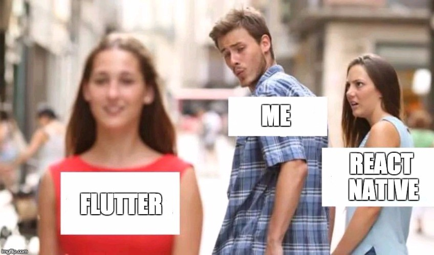
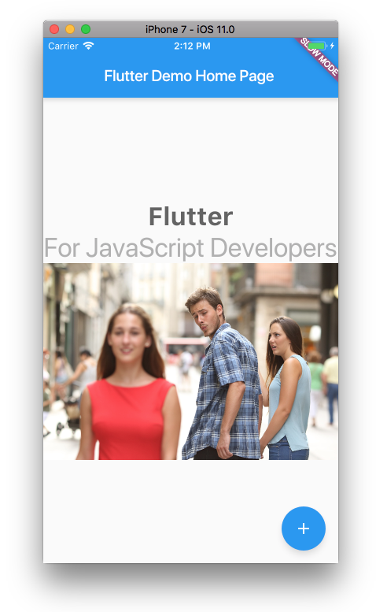
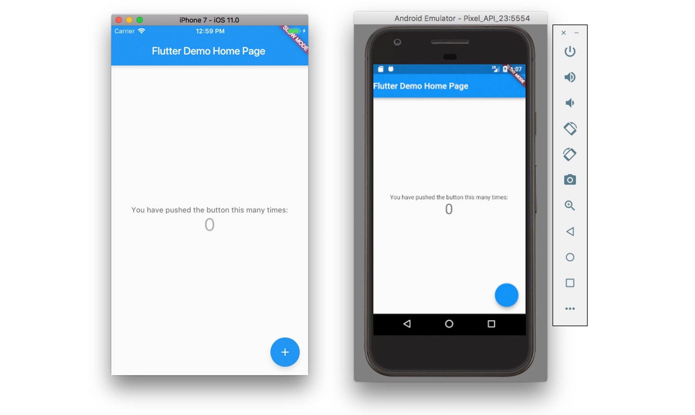
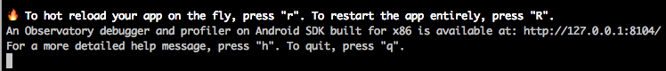

[Flutter](https://flutter.io/) 是一款跨平台的移动应用 SDK，可通过同一套代码构建高性能，高保真的 iOS 和 Android 应用。

[文档中提到 (https://flutter.io/technical-overview/):](https://flutter.io/technical-overview/)

> Flutter 包括一个 **react 风格**的框架 , 一个 2D 渲染引擎, 现成的组件, 和开发者工具。


希望这篇文章能够为大多数 JavaScript 开发者提供快速简便的介绍，并且我会尝试使用 Flutter / Dart 和 [Pub](https://pub.dartlang.org/) 包来类比 JS 和 npm 生态系统。

> 如果你有兴趣了解 Flutter 教程、库、公告和社区更新的最新信息，我建议你关注订阅我们的公众号 FENEWS。

我在 [React Native 欧洲](https://react-native.eu/) 的演讲 [《React Native — Cross Platform & Beyond》](https://www.youtube.com/watch?v=pFtvv0rJgPw) 中，讨论并演示了 React 生态系统中的一些不同技术， 包括 [React Native Web](https://github.com/necolas/react-native-web), [React Primitives](https://github.com/lelandrichardson/react-primitives) 和 [ReactXP](https://microsoft.github.io/reactxp/), 并且我也有机会讨论 [Weex](https://weex.incubator.apache.org/) 和 [Flutter](https://flutter.io/)。

在我过去几年看过的所有前端技术中，我在尝试了 Flutter 后最为兴奋。在这篇文章中，我将讨论为什么它令我如此激动，并介绍如何尽快开始使用它。

### 如果你了解我，那么我知道你在想什么...



我是一名有着超过两年半经验的 React 与 React Native 开发者。我仍然非常看好 React / React Native，并且知道许多大公司正在大规模使用它们，但我总是喜欢看到其他想法或者寻找其他方法来实现类似的目标，无论是去学习或者改变我目前的技术栈。

## Flutter

> 我可以做个概括：Flutter 令人惊叹, 我认为它在不久的将来是一个可行的选择。

在使用了几周 Flutter SDK 之后，我正在使用它构建我的第一个应用程序，到目前为止我真的很享受这个过程。

在我开始介绍如何使用 Flutter 之前，我将首先回顾一下我对 SDK 的优缺点的看法。



## 优点:  

- 核心团队维护的内置 UI 库(Material，Cupertino)  

- Dart＆Flutter 团队紧密合作，优化移动 Dart VM，专门满足 Flutter 的需求  

- 文档超级棒 😍

- 强大的 CLI

- 我可以顺利轻松地启动和运行，而不会遇到很多障碍/错误

- 调试体验很好，开箱即用的热重新加载以及[一系列关于调试技术的文档 (https://flutter.io/debugging/)](https://flutter.io/debugging/)

- 核心团队构建和维护的非常可靠的导航库

- Dart 语言已有 6 年历史并且已经成熟。虽然 Dart 是一种基于类的面向对象编程语言，但如果你进入函数式编程，Dart 确实拥有一等公民的函数并支持许多函数式编程结构。

- 对我来说比我预想的更容易理解

- Dart 是一种开箱即用的强类型语言，无需任何附加配置(比如: TypeScript / Flow)

- 如果你使用过 React，那么你可能会习惯类似的状态机制 (即生命周期方法和 setState)

## 缺点

- 你需要学习 Dart (这很简单，相信我)

- 仍在测试中(目前已经发布正式版)

- 只针对 iOS 和 Android (目前也可用于 Web)

- 插件生态系统还很稚嫩，截至 2017 年 9 月只有 70 多个软件包用于 Flutter [https://pub.dartlang.org/flutter](https://pub.dartlang.org/flutter)

- 布局 / 样式需要学习全新的范例 / API

- 要学习不同的项目配置 (`pubspec.yaml` vs `package.json`)

## 入门及其它观点

- 我正在使用 VS Code 作为我的编辑器，使用 [Dart Code 扩展](https://marketplace.visualstudio.com/items?itemName=DanTup.dart-code)，它可以提供非常好的开发体验。Flutter 文档强烈建议使用 IntelliJ IDE(https://www.jetbrains.com/idea/)，它有一些内置的支持，如热/动态加载，而 VSCode 不具备这些功能。

- Flutter 有一个模块系统，或者叫[包管理系统 (https://pub.dartlang.org/)](https://pub.dartlang.org/)，它与 npm 有很多不同点。它的好坏取决于你对 npm 的看法。

- 我一开始对 Dart 一无所知，但很快就学会了。 它让我想起了 TypeScript，也和 JavaScript 有一些相似之处

- 文档中有一些非常棒的代码实验室和教程，它们对我有很大的帮助，我建议你查看一下: 1. [构建 UIS](https://codelabs.developers.google.com/codelabs/flutter/index.html#0) 2. [增加 Firebase](https://codelabs.developers.google.com/codelabs/flutter-firebase/index.html#0) 3. [构建布局](https://flutter.io/tutorials/layout/) 4. [添加交互](https://flutter.io/tutorials/interactive/)

### 让我们开始创建一个新的项目吧

## 安装 CLI (macOS)

如果你使用的是 Windows，请查阅[此文档 (https://flutter.io/setup/)](https://flutter.io/setup/)。
如需查看完整的 macOS 平台下的安装指南，请查看[此文档 (https://flutter.io/setup-macos/)](https://flutter.io/setup-macos/)。

首先，我们需要克隆包含 Flutter CLI 二进制文件的仓库，并将其添加到我们的路径中。我将这个仓库克隆到一个文件夹中，然后在`$ HOME / .bashrc` `/ $ HOME / .zshrc`文件中添加克隆目录路径。

1. 克隆仓库:

```bash
git clone -b stable https://github.com/flutter/flutter.git
```  

2. 添加路径:

```bash
export PATH=$HOME/bin/flutter/bin:$PATH (or whatever the path is to your installation)
```  

3. 从命令行运行 flutter doctor，以确保 flutter 路径被识别，并查看是否有任何依赖项需要安装来完成设置:

```bash
flutter doctor
```

## 安装其他依赖项

如果你想构建 iOS 应用，你必须安装 Xcode，对于构建 Android 应用，你必须安装 Android Studio。

_要了解更多关于两个平台的信息，请参阅这里的[文档 (https://flutter.io/setup-macos/#platform-setup)](https://flutter.io/setup-macos/#platform-setup)._

## 创建你的第一个 Flutter 应用程序

现在我们已经安装了 flutter CLI，我们可以创建我们的第一个应用程序。 为此，我们需要运行 flutter create 命令:

```bash
flutter create myapp
```

这将为你创建一个新的应用程序。 现在，切换到新目录，打开 iOS 模拟器或 android 模拟器，然后运行以下命令:

```bash
flutter run
```



这将在你已经打开的模拟器中启动应用程序。 如果你同时打开了 iOS 和 Android 模拟器，你可以通过模拟器来运行这个应用程序:

```bash
flutter run -d android / flutter run -d iPhone
```

也可以同时运行

```bash
flutter run -d all
```

此时你应该在控制台中看到一些关于重启 app 的信息：



## 项目结构

你正在运行的代码处于 `lib/main.dart` 文件中。

你也会注意到，我们有一个 android 文件夹和一个 iOS 文件夹，我们的本地项目就在这里。

项目的配置位于 `pubspec.yaml` 文件中，类似于 JavaScript 生态系统中的 `package.json` 文件。

现在让我们看一下 `lib / main.dart`。

在文件的顶部我们看到一个 `import` :

```dart
import 'package:flutter/material.dart';
```

这是从哪里来的？ 在 `pubspec.yaml` 文件中，你会注意到在依赖项下我们有一个单独的 `flutter` 依赖项，我们在这里引用它作为包: `package:flutter/` 。 如果我们想要添加和导入其他依赖项，我们需要将新的依赖项加入 `pubspec.yaml`，使它们作为依赖可以导入。

在这个文件中，我们还可以看到在顶部有一个名为 `main` 的函数。 在 Dart 中，[main](https://www.dartlang.org/guides/language/language-tour#the-main-function) 是一个特殊的、**必需**的顶级函数，在这个函数中应用程序开始执行。 因为 Flutter 是由 Dart 构建的，main 函数也是这个工程的主入口。

```dart
void main() {
  runApp(new MyApp());
}
```

这个函数调用 `new MyApp ()` ，它本身调用一个类等等，类似于 React app，我们有一个由其他组件组成的主组件，然后由 `ReactDOM.render` 或 `AppRegistry.registerComponent` 进行渲染。

## 组件

Flutter [技术总览 (https://flutter.io/technical-overview/) ](https://flutter.io/technical-overview/)中的一个核心原则就是：“一切皆组件”。

> Widget 是每个 Flutter 应用程序的基本构件。 每个 Widget 都是用户界面部分的不可变声明。 与其他将视图、控制器、布局和其他属性分离开来的框架不同，Flutter 有一个一致的、统一的对象模型: Widget。

在 web 术语 / JavaScript 方面，你可以将 Widget 看成与 Component 类似的东西。 Widget 通常由类内部组成，这些类中可能还有一些本地状态和方法，也可能没有。

如果你查看 `main.dart`，可以发现类似 `StatelessWidget`、`StatefulWidget`、`Center`、`Text` 的类引用。这些都是 Widget。如果想了解所有可用的 Widget，请查阅[文档 (https://docs.flutter.io/flutter/widgets/widgets-library.html)](https://docs.flutter.io/flutter/widgets/widgets-library.html)。

## 布局与样式

虽然 Dart 和大多数 Flutter 框架都非常简单，但是使用布局和样式起初开始有点难以理解。

要记住的主要事情是，不像 web 样式，甚至是 React Native 样式 View 会完成所有的布局和一些样式，Flutter 布局是由你**选择的组件的类型**和**它的布局和样式属性**的组合决定的，这通常取决于你使用的组件的类型。

例如，[Column](https://docs.flutter.io/flutter/widgets/Column-class.html) 接受一个子属性数组，而不接受任何样式属性(只接受诸如 [CrossAxisAlignment](https://docs.flutter.io/flutter/widgets/Flex/crossAxisAlignment.html) 和 [direction](https://docs.flutter.io/flutter/widgets/Flex/direction.html) 等布局属性) ，而 [Container](https://docs.flutter.io/flutter/widgets/Container-class.html) 接受布局和样式属性的组合。

甚至还有一些布局组件，比如 Padding，它仅接受 Widget，除了向 Widget 添加[边距](https://docs.flutter.io/flutter/widgets/Padding-class.html)之外不做其它任何事情。

参考这个完整的[ Widgets 目录](https://flutter.io/widgets/layout/)，可以帮助你实现你想要的布局类型，包括 Container、 Row、 Column、 Center、 GridView 等组件，所有这些组件都有自己的布局规范。

## Setstate / Lifecycle 函数

与 React 类似，Flutter 也有有状态和无状态组件或 Component 的概念。 有状态组件可以创建状态、更新状态和销毁状态，这在某种程度上类似于用 React 时可能使用的生命周期方法。

甚至也有一个名为 setState 的方法更新状态。 你可以在我们刚刚生成的项目中的 `incrementCounter` 方法中看到这个方法。

了解更多查看 [StatefulWidget](https://docs.flutter.io/flutter/widgets/StatefulWidget-class.html)、 [State](https://docs.flutter.io/flutter/widgets/State-class.html) 和 [StatelessWidget](https://docs.flutter.io/flutter/widgets/StatelessWidget-class.html)。

## 总结

作为一个跨平台应用程序开发的开发者，我会一直关注 React Native 的竞争对手。这对于那些可能因某种原因想要不同的客户来说 Flutter 是一个可行的选择。 我认为 Flutter 为我的客户解决了一些问题，比如内置的类型系统、一流的 UI 库、由核心团队维护的导航库等。

我会将 Flutter 添加到我的技术栈中，所以当我遇到 React Native 不能解决问题的情况时，我会使用 Flutter。一旦我觉得可以在生产环境使用 Flutter，我也会将我的第一个 Flutter 应用程序作为另一个选择呈现给我的客户。

> 我叫 [Nader Dabit](https://twitter.com/dabit3)，是一名 [AWS Mobile](https://aws.amazon.com/mobile/) 的开发者，开发了 [AppSync](https://aws.amazon.com/appsync/)、[Amplify](https://github.com/aws/aws-amplify) 等应用，同时也是 [React Native Training](http://reactnative.training/) 的创始人。

> 如果你喜欢 React 和 React Native，欢迎在 [Devchat.tv](http://devchat.tv/) 订阅我们的 [podcast - React Native Radio](https://devchat.tv/react-native-radio)。

> 此外，Manning Publications 已经出版了我的书 [React Native in Action](https://www.manning.com/books/react-native-in-action)，欢迎阅读。

原文地址：[https://hackernoon.com/flutter-for-javascript-developers-35515e533317](https://hackernoon.com/flutter-for-javascript-developers-35515e533317)
