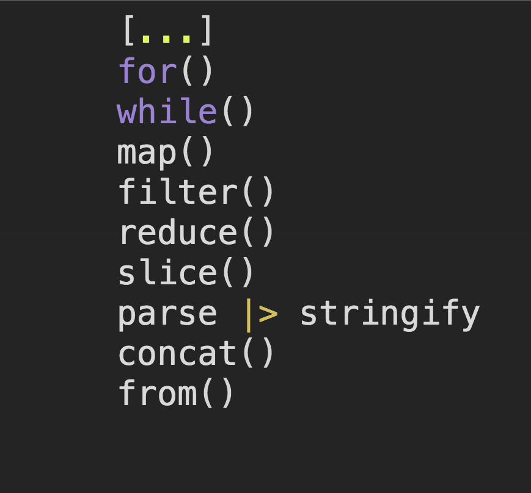

JavaScript有很多方法可以做任何事情，现在我们研究数组。

# 1.扩展运算符(浅拷贝)
自从ES6发布以来，这一直是最受欢迎的方法。 这是一个简短的语法，你会发现它在使用像React和Redux这样的库时非常有用。

```
    numbers = [1, 2, 3];
    numbersCopy = [...numbers];
```

**注意**：这不能安全地复制多维数组。 数组/对象值通过引用而不是按值复制。

这可以
```
    numbersCopy.push(4);
    console.log(numbers, numbersCopy);
    // [1, 2, 3] and [1, 2, 3, 4]
    // numbers is left alone
```

这不可以
```
    nestedNumbers = [[1], [2]];
    numbersCopy = [...nestedNumbers];
    numbersCopy[0].push(300);
    console.log(nestedNumbers, numbersCopy);
    // [[1, 300], [2]]
    // [[1, 300], [2]]
    // They've both been changed because they share references
```

# 2.for循环(浅拷贝)
由于我们的圈子中流行的函数式编程，使得这种方法最不受欢迎

```
    numbers = [1, 2, 3];
    numbersCopy = [];

    for (i = 0; i < numbers.length; i++) {
        numbersCopy[i] = numbers[i];
    }
```

**注意**：这不能安全地复制多维数组。 由于您使用的是=运算符，因此它将通过引用而不是值来分配对象/数组。

这可以
```
    numbersCopy.push(4);
    console.log(numbers, numbersCopy);
    // [1, 2, 3] and [1, 2, 3, 4]
    // numbers is left alone
```

这不可以
```
    nestedNumbers = [[1], [2]];
    numbersCopy = [];

    for (i = 0; i < nestedNumbers.length; i++) {
        numbersCopy[i] = nestedNumbers[i];
    }

    numbersCopy[0].push(300);
    console.log(nestedNumbers, numbersCopy);
    // [[1, 300], [2]]
    // [[1, 300], [2]]
    // They've both been changed because they share references
```

# 3.while循环(浅拷贝)
同for循环一样，不纯的、命令式的, blah,blah,blah...但有效！

```
    numbers = [1, 2, 3];
    numbersCopy = [];
    i = -1;

    while (++i < numbers.length) {
        numbersCopy[i] = numbers[i];
    }
```

**注意**：这也通过引用而不是按值分配对象/数组。

这可以
```
    numbersCopy.push(4);
    console.log(numbers, numbersCopy);
    // [1, 2, 3] and [1, 2, 3, 4]
    // numbers is left alone
```

这不可以
```
    nestedNumbers = [[1], [2]];
    numbersCopy = [];

    i = -1;

    while (++i < nestedNumbers.length) {
        numbersCopy[i] = nestedNumbers[i];
    }

    numbersCopy[0].push(300);
    console.log(nestedNumbers, numbersCopy);
    // [[1, 300], [2]]
    // [[1, 300], [2]]
    // They've both been changed because they share references
```

# 4.Array.map(浅拷贝)
回到现代领域，我们将找到map函数，基于数学，map是将一组转换为另一种类型的集合，同时保留结构的概念。 

这意味着Array.map每次都返回一个长度相同的数组。

要使列表中数字加倍，可以使用map带加倍函数

```
    numbers = [1, 2, 3];
    double = (x) => x * 2;

    numbers.map(double);
```

## 什么是克隆
没错，这篇文章是关于克隆数组的。 要复制数组，只需返回map调用中的元素即可。

```
    numbers = [1, 2, 3];
    numbersCopy = numbers.map((x) => x);
```

如果你想更数学一点，（x）=> x被称为身份。 它返回给出的任何参数。

map(identity) 复制一个列表.

```
    identity = (x) => x;
    numbers.map(identity);
    // [1, 2, 3]
```

**注意**：这也通过引用而不是按值分配对象/数组。

# 5.Array.filter(浅拷贝)
此函数返回一个数组，就像map一样，但它不能保证长度相同。

如果您要过滤偶数数字怎么办？

```
    [1, 2, 3].filter((x) => x % 2 === 0)
    // [2]
```

输入数组长度为3，但结果长度为1。

如果filter始终返回true，就会重复

```
    numbers = [1, 2, 3];
    numbersCopy = numbers.filter(() => true);
```

每个元素都通过测试，因此返回。

**注意**：这也通过引用而不是按值分配对象/数组。

# 6.Array.reduce(浅拷贝)
使用reduce来克隆数组感觉非常不好，因为它远比此强大，让我们开始...

```
    numbers = [1, 2, 3];

    numbersCopy = numbers.reduce((newArray, element) => {
        newArray.push(element);

        return newArray;
    }, []);
```

reduce在循环遍历列表时转换初始值。

这里的初始值是一个空数组，我们将逐步填充每个元素。 必须从要在下一次迭代中使用的函数返回该数组。

**注意**：这也通过引用而不是按值分配对象/数组。

# 7.Array.slice(浅拷贝)
slice根据您提供的开始/结束索引返回数组的副本。

如果我们想要前3个元素：

```
    [1, 2, 3, 4, 5].slice(0, 3);
    // [1, 2, 3]
    // Starts at index 0, stops at index 3
```

如果我们想要所有元素，请不要给出任何参数

```
    numbers = [1, 2, 3, 4, 5];
    numbersCopy = numbers.slice();
    // [1, 2, 3, 4, 5]
```

**注意**：这也通过引用而不是按值分配对象/数组。

# 8.JSON.parse 和 JSON.stringify (深拷贝)
JSON.stringify将对象转换为字符串

JSON.parse将字符串转换为对象

组合它们可以将对象转换为字符串，然后反转该过程以创建全新的数据结构。

**注意**：这也通过引用而不是按值分配对象/数组。

```
    nestedNumbers = [[1], [2]];
    numbersCopy = JSON.parse(
        JSON.stringify(nestedNumbers)
    );

    numbersCopy[0].push(300);
    console.log(nestedNumbers, numbersCopy);

    // [[1], [2]]
    // [[1, 300], [2]]
    // These two arrays are completely separate!
```

# 9.Array.concat(浅拷贝)
concat将数组与值或其他数组组合在一起。

```
    [1, 2, 3].concat(4); // [1, 2, 3, 4]
    [1, 2, 3].concat([4, 5]); // [1, 2, 3, 4, 5]
```

如果您不提供任何内容或空数组，则返回副本。

```
    [1, 2, 3].concat(); // [1, 2, 3]
    [1, 2, 3].concat([]); // [1, 2, 3]
```

**注意**：这也通过引用而不是按值分配对象/数组。

# 9.Array.from(浅拷贝)
这可以将任何可迭代对象转换为数组。 给数组返回一个副本。

```
    numbers = [1, 2, 3];
    numbersCopy = Array.from(numbers)
    // [1, 2, 3]
```

**注意**：这也通过引用而不是按值分配对象/数组。

# 总结
嗯，这很有趣

我试着只用一步就克隆了。 如果您采用多种方法和技术，您会发现更多方法。


原文地址: [https://medium.freecodecamp.org/how-to-clone-an-array-in-javascript-1d3183468f6a?from=singlemessage](https://medium.freecodecamp.org/how-to-clone-an-array-in-javascript-1d3183468f6a?from=singlemessage)


