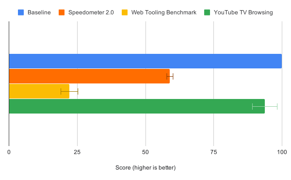

V8 v7.4 运行时不分配可执行内存的情况下，支持下执行 JavaScript 。

在 V8 默认的配置中，它严重依赖在运行时分配和改变可执行内存的的能力。例如：[TurboFan 优化编译器](https://v8.dev/blog/turbofan-jit) 及时为热 JavaScript 函数生成原生代码，还有大多数的 JS 正则表达式通过 [irregexp 引擎](https://blog.chromium.org/2009/02/irregexp-google-chromes-new-regexp.html) 编译成原生代码。在运行时创建可执行内存是使 V8 快速运行的一部分因素。

但是在一些情况下不分配可执行内存运行 V8 使很有必要的：

一些平台（例如：iOS、智能电视、游戏控制台）需要禁止非特权应用对可执行内存的写权限，在此之前使用 V8 使无法实现的，而且禁止可执行内存的写权限能够减少应用的被攻击渠道。

V8 **无 JIT** 的新模式正是为了解决这些问题。你可以启动 V8 时使用 `--jitless` 选项来开启 **无 JIT** 模式。

它是如何运行的呢？本质上，V8 基于我们已经实现的技术切换到纯解释器模式（interpreter-only mode）。所有的 JS 用户代码通过 [Ignition 解释器](https://v8.dev/blog/ignition-interpreter) 运行，正则表达式模式匹配也同样被解释执行。WebAssembly 目前还不支持，但是也有可能被解释执行。V8 内建的函数仍然被编译成原生代码，只是它们不在是 JS 托管堆(managed head)上的一部分，这要归功于我们最近的努力——[把它们嵌入到 V8 的二进制文件中](https://v8.dev/blog/embedded-builtins)。

最终，这些更改允许我们创建 V8 的堆，而不需要任何内存区域的可执行权限。

## 结果
因为 **无 JIT** 模式禁用了优化编译器，所以它伴随着性能的损失。我们来通过一些不同的基准测试来看下 V8 的性能特征变化。[Speedometer 2.0](https://v8.dev/blog/speedometer-2) 是为了展现针对典型的 Web 应用的测试结果。[Web Tooling Benchmark](https://v8.dev/blog/web-tooling-benchmark) 包含了一个常用的 JS 开发者工具集。我们还做一个模拟 [Living Room YouTube](https://chromeperf.appspot.com/report?sid=518c637ffa0961f965afe51d06979375467b12b87e72061598763e5a36876306) 应用的浏览工作流程的基准测试。所有的测量都是在一台 x64 的 Linux 的桌面上本地运行超过 5 次。

无 JIT 模式 vs. 默认的 V8 模式. V8 默认配置的标准化分值为 100

Speedometer 2.0 的测试结果表明，在无 JIT 模式下，V8 的性能损失了大约 40%。粗略估算，有一半原因是因为禁用了优化编译器。另一半是由正则表达式解释器引起的，该解释器最初用作调试辅助工具，将来会进行性能改进。

Web Tooling Benchmark 倾向于在 TurboFan 优化代码上花更多时间，因此在无 JIT 模式下，它的测试结果显示更大的性能倒退——约 80%。

最后，我们测量了一次对 Living Room YouTube 应用的模拟浏览会话过程，包含了视频回放和菜单导航的过程。这次测量，无 JIT 模式下 JS 的执行与 V8 标准配置时相差不大，大约仅慢了 6% 。这次基准测试论证了峰值优化代码性能并不总是与[实际性能](https://v8.dev/blog/real-world-performance)相关，并且在许多情况下，即使在无 JIT 模式下，嵌入器也可以保持合理的性能。

通过加载具有代表性网站集表明 V8 堆大小的中值减少了 1.7％ ，内存消耗变化轻微。

我们鼓励 V8 植入者在受限的平台或具有特别安全要求的时候，考虑使用 V8 的无 JIT 模式——在 V8 v7.4 中可用。一如既往，欢迎通过 [v8 用户讨论组](https://groups.google.com/forum/#!forum/v8-users) 提问或者反馈。

原文：https://v8.dev/blog/jitless