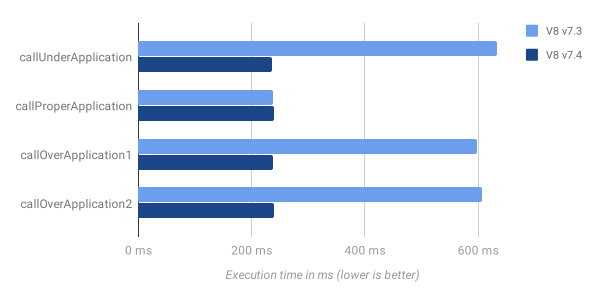
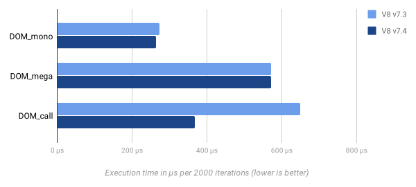
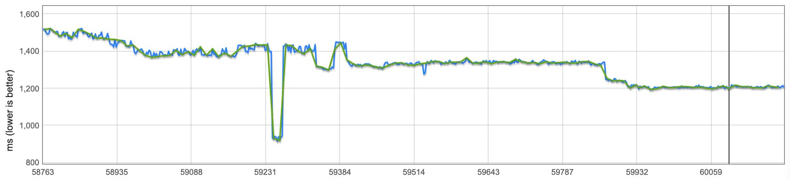
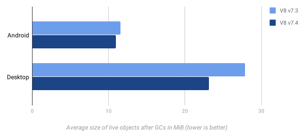

每六周，我们创建一个新的 V8 分支做为我们发布进程的一部分。每一个版本都是在一个新的 Chrome Beta 版本之前从 V8 的 master 分支切出来。今天我们宣布发布最新的 V8 v7.4 分支，在对应的 Chrome 74 Stable 版本发布前的几周，它都将做为 Beta 版本存在。

## V8 无 JIT 模式（JIT-less V8）
V8 现在支持执行 JavaScript 而无需在运行时分配可执行内存。要深入了解这个特性，可以阅读之前的文章： [V8 v7.4 支持无 JIT 模式](https://fenews.org/posts/V8-JIT-less-mode/)


## 发布 WebAssembly 多线程（WebAssembly Threads/Atomics）
WebAssembly 多线程在非 Android 系统中已经启用。包含了我们之前在 v7.0 版本中所实验/预览的功能。Web 基础知识文章里有一篇介绍[如何使用 WebAssembly Atomics](https://developers.google.com/web/updates/2018/10/wasm-threads) 的文章。

这个特性解锁了通过 WebAssembly 对用户机器的多核使用能力，从而在 Web 端实现新的、重计算的使用场景。

## 性能方面
### 参数不匹配的函数调用性能优化
在 JavaScript 中，使用太少或太多参数调用函数（即传递少于或多于声明的形式参数）都是有效的。 前者称为缺少投入（under-application），后者称为过度投入（over-application）。 如果缺少投入，则剩余的形式参数将被赋值为 `undefined`，而在过度投入的情况下，将忽略多余的参数。

然后，JavaScript 函数仍然可以通过 `arguments`、`rest parameters`、`Function.prototype.arguments` 属性（非严格模式下）获取实际传入的参数。导致 JavaScript 引擎必须提供一种方法来获取实际的参数。在 V8 中这个方法是通过**参数适配**来实现，它在缺少/过度投入时提供实际传入的参数。不幸的是，参数适配带来了性能的消耗，而且这种情况在现代的前端或中间件框架中很常见（例如：很多 API 使用可选参数或参数列表变量）。


在一些场景中引擎知道参数适配是不需要的，因为实际参数是不可观察的，换句话说，当被调用者是严格模式或者被调用函数中既没有使用 `arguments` 也没有使用 `rest parameters`。这种情况下，V8 完全可以跳过参数适配，从而将函数调用性能开销降低高达 60% 。


<p style="text-align: center; font-size: 12px"> 通过<a src="https://gist.github.com/bmeurer/4916fc2b983acc9ee1d33f5ee1ada1d3#file-bench-call-overhead-js">微基准测试</a>得到的跳过参数适配后性能影响</p>

结果显示，即使在参数不匹配的情况下（假设被调用者没有观察实际传参），也不再有性能开销。详情请看[设计文档](https://bit.ly/v8-faster-calls-with-arguments-mismatch) 。

## 提升原生访问器性能

Angular 团队发现在 Chrome 中直接通过各自的 `get` 函数调用原生访问器（例如：DOM 属性访问器）明显慢于**单态**（monomorphic）属性访问，甚至也慢于**复态**（megamorphic）属性访问（译者注：单态和复态指的是编译器内联缓存优化过程中调用站点的状态，可参考：[Inline caching](https://en.wikipedia.org/wiki/Inline_caching#Monomorphic_inline_caching) ）。这是因为在 V8 中使用慢速路径（slow-path）通过 `Function＃call()` 调用 DOM 访问器，而不是已经存在属性访问的快速路径（fast-path）。



我们设法提升了原生访问器的调用性能，使之显著快于**复态**属性访问。想要了解更多，请阅读[V8 issue #8820](https://bugs.chromium.org/p/v8/issues/detail?id=8820)。

### 解析器性能

在 Chrome 中，大量的脚本在下载完成后在工作线程中被“流式解析”（“streaming”-parsed）。这次的发布我们定位并修了在源流中使用的自定义 UTF-8 解码的性能问题，导致流式解析性能平均提升了 8% 。

我们在 V8 的预解析器中发现了一个额外问题，它通常在工作线程上出现：对属性名被执行了不必要的去重。移除这个去重，流式解析器的性能又提升了 10.5% 。同时也提升了未编码成二进制流的脚本在主线程中的解析时间，例如：一些小的脚本片段或内联脚本。


<p style="text-align: center; font-size: 12px">上图中曲线的每次下降表示流式解析器一次性能提升</p>

## 内存
### 字节码清理（Bytecode flushing）
从 JavaScript 源码编译成的字节码占据了一大块 V8 的堆空间，包含相关的元数据，大约有 15% 。有很多函数都只在初始化时执行，或者在编译后很少被使用。

为了减少 V8 的内存负担，我们实现了在垃圾回收时从函数中清理已编译的字节码的功能，如果它们最近没有被执行过。为了实现这一点，我们跟踪函数字节码的年龄，在垃圾收集期间递增年龄，并在执行函数时将其重置为零。 任何超过老化阈值的字节码都符合下一次垃圾回收的条件，并且如果将来再次执行该函数，该函数将重置为惰性地重新编译其字节码。

我们的字节码清理实验显示，它显著的节约了用户 Chrome 的内存，在没有降低性能或显著增加编译 JavaScript 代码的 CPU 占中时间的情况下，减少了 5% 至 15% 的 V8 堆内存占用。



### 字节码死基本块消除（Bytecode dead basic block elimination）
**Ignition**字节码编译器试图避免生成死代码，例如：在 `return` 或 `break` 语句后面的代码。

```js
return;
deadCall(); // skipped
```

然而，以前这个清理只会适时地发生在语句列表中存在终止语句，因此它没有考虑其他优化，例如：已知为值为 `true` 的条件。

```js
if (2.2) return;
deadCall(); // not skipped
```

我们尝试在 V8 v7.3 中解决这个问题，但仍然停留在每个语句的级别。在控制流程变得更加复杂时，它仍然无法工作。例如：

```js
do {
  if (2.2) return;
  break;
} while (true);
deadCall(); // not skipped
```

上面的 `deadCall()` 将位于新基本块的开头，该基本块在每个语句级别上可作为循环中 `break` 语句的可到达目标。

在 V8 v7.4 中，如果没有 `Jump` 字节码（Ignition 主控制流原语）引用它们，我们允许整个基本块变成四代码块。在上面栗子中，`break` 语句不会被执行，这意味着循环没有 `break` 语句。所以，以 `deadCall()` 开头的基本块没有引用跳转，因此也被认为是死代码块。虽然我们不期望这对用户的代码产生很大的影响，但是这对于简化各种语法糖的去糖（desugarings）特别有用，例如：生成器、`for-of` 和 `try-catch`，特别是移除了一类 bug ，通过它们的实现基本块可以部分“复活”复杂语句。

## JavaScript 语言特性
### 类的私有字段

V8 v7.2 添加了公共类字段语法支持。类的字段通过避免仅仅为了实例属性而需要定义构造函数来简化类的语法。从 V8 v7.4 开始，您可以通过在前面添加一个`＃`前缀来将字段标记为私有。

```js
class IncreasingCounter {
  #count = 0;
  get value() {
    console.log('Getting the current value!');
    return this.#count;
  }
  increment() {
    this.#count++;
  }
}
```

不像公共字段，私有字段在类外面不能被访问：

```js
const counter = new IncreasingCounter();
counter.#count;
// → SyntaxError
counter.#count = 42;
// → SyntaxError
```

更多细节，请阅读我们的[关于类的公共字段和私有字段的 Web 基础文章](https://developers.google.com/web/updates/2018/12/class-fields)。

### `Intl.Locale`

JavaScript 应用通常使用 `en-US` 或 `de-CH` 等字符串来标识语言环境。`Intl.Locale` 提供了一种更强大的机制来处理语言环境，并且可以轻松提取特定于语言环境的首选项，例如：语言、日历、编号系统和小时循环等。

```js
const locale = new Intl.Locale('es-419-u-hc-h12', {
  calendar: 'gregory'
});
locale.language;
// → 'es'
locale.calendar;
// → 'gregory'
locale.hourCycle;
// → 'h12'
locale.region;
// → '419'
locale.toString();
// → 'es-419-u-ca-gregory-hc-h12'
```

## V8 API 

使用 `git log branch-heads/7.3..branch-heads/7.4 include/v8.h` 来获取 API 变化的列表。

开发者可以通过 `git checkout -b 7.4 -t branch-heads/7.4` 切到 V8 v7.4的活跃分支体验这些新特性。或者，你可以[订阅 Chrome 的 Beta 频道](https://www.google.com/chrome/beta/)，可尽早尝试新功能。


原文：https://v8.dev/blog/v8-release-74