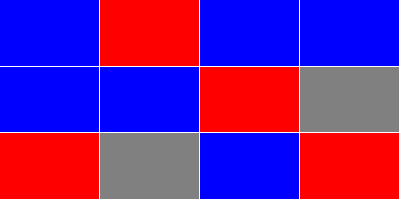

把困难的问题分解成小块

我想看看别人对软件工程的看法，于是开始在 YouTube 上疯狂观看 TechLead。在接下来的几天里，我为他在谷歌工作时提出的一个面试问题想出了各种各样的解决方案。

### 这段[视频](https://www.youtube.com/watch?v=IWvbPIYQPFM&feature=youtu.be)让我兴奋不已

模拟谷歌面试(软件工程师)

TechLead 提出了一个他在<strong>谷歌 100 多次面试中提出的问题</strong>。这让我好奇地想出了一个使用 RxJS 的解决方案。这篇文章将重温传统的方法。

这个问题的真正目的是从受访者那里获得信息。 他们在编码之前会提出正确的问题吗？ 这个解决方案是否符合项目的指导方针？ 他甚至指出，如果你得到了正确的答案，这根本不重要。 他想知道你是如何思考的，以及你是否能够理解问题。

他谈到了几个解决方案，一个是递归(受堆栈大小限制) ，另一个是迭代(受内存大小限制)。 我们将会调查这两个以及其他！

### TechLead 的问题

在他的问题中，他要求我们采取这个项目的网格，并计算出颜色都相同的连续块的最大数。


当我听到他的问题，看到图片，我想"哦，天哪，我已经做了一些 2D 图像建模来解决这个问题"。 听起来在面试中几乎不可能回答。

但是在他解释了更多之后，事实并非如此。 你正在处理已经捕获的数据，而不是解析图像。 我现在意识到，这个图像实际上是用词不当。

### 数据建模

在编写任何代码之前，都需要定义数据模型。 我再怎么强调这个也不过分。 在编写任何高级的代码之前，首先要弄清楚你正在处理的是什么，收集业务需求。

在我们的案例中，TechLead 为我们定义了很多这样的需求:

- 有色正方形或者我们称之为"节点"的概念
- 在我们的数据集中有 10K 个节点
- 节点被组织成列和行(2D)
- 列和行的数量可能是不均匀的
- 节点有颜色和表示邻接的一些方法

我们还可以从我们的数据中得到更多的信息:

- 没有两个节点会重叠
- 节点永远不会与它们自己相邻
- 一个节点永远不会有重复的邻接
- 位于边和角上的节点将分别缺少一个或两个邻接

我们不知道的:

- 行与列的比率
- 可能的颜色数量
- 只有一种颜色的可能性
- 颜色的粗略分布

作为一个开发人员，你的水平越高，你知道要问的问题就越多。 这也不是经验的问题。 虽然经验有所帮助，但是如果你不能挑出未知的东西，它也不会让你变得更好。

我不指望大多数人能够挑出这些未知的东西。 直到我开始在脑子里运算这个算法之前，我也不知道所有的算法。 未知的事物需要时间去理解。 需要与专业人士进行大量的反复讨论，才能找到所有的缺陷。

看看他的照片，似乎分布是随机的。 他只用了三种颜色，没有说别的，所以我们也会这样。 我们也会假设所有的颜色都是一样的。

因为它可能会毁掉我们的算法，所以我假设我们使用的是一个 100x100 的网格。 这样，我们就不必处理 1 行和 10K 列的奇怪情况。

在一个典型的环境中，我会在数据发现的最初几个小时内问所有这些问题。 这才是 TechLead 真正关心的。 你是要从随机的解决方案开始，还是要找出问题所在？

你将在数据模型中犯错误。 我知道我在第一次写这篇文章的时候就是这样做的，但是如果你提前计划，这些问题将更容易处理。 因为这个原因，我只重写了代码的一小部分。

### 创建数据模型

我们需要知道数据是如何进入的，以及我们想要以何种格式处理它。

由于我们没有处理数据的系统，所以我们需要自己想出一个可视化的方法。

我们数据的基本组成部分:

Color 颜色
ID
X
Y

我们为什么需要 ID？ 因为我们可能不止一次遇到同样的问题。 我们想要防止无限循环，所以我们需要标记我们在这些情况下所处的位置。

此外，通常会为这样的数据分配某种类型的 ID、hash 或其他值。 这是一个唯一标识符节点，所以我们有一些方法来识别这个特定的节点。 如果我们想知道最大的连续块，我们需要知道该块中有哪些节点。

因为他在网格中构造了数据，所以我假设我们可以用 x 和 y 值将数据找回来。 仅仅使用这些属性，我就能够生成一些 HTML 来确保我们生成的东西看起来像他给我们的那样。

这是通过绝对定位完成的，就像他的例子一样:


它甚至适用于更大的数据集:


他是生成节点的代码:

```js
const generateNodes = ({ numberOfColumns, numberOfRows }) =>
  Array(numberOfColumns * numberOfRows)
    .fill()
    .map((item, index) => ({
      colorId: Math.floor(Math.random() * 3),
      id: index,
      x: index % numberOfColumns,
      y: Math.floor(index / numberOfColumns),
    }));
```

我们取出我们的列和行，从条目数中创建一个 1D 数组，然后根据这些数据生成节点。

我用的是 `colorId`，而不是`color`。 首先，因为它更清晰随机化。 其次，我们通常需要自己查找颜色值。

虽然他从来没有明确说过，但他只使用了 3 种颜色的值。 我把我们的数据集也限制为 3 种颜色。 只要知道它可能是几百种颜色，最终的算法不需要改变。

作为一个简单的例子，这里有一个 2x2 的节点列表:

```js
[
  { colorId: 2, id: 0, x: 0, y: 0 },
  { colorId: 1, id: 1, x: 1, y: 0 },
  { colorId: 0, id: 2, x: 0, y: 1 },
  { colorId: 1, id: 3, x: 1, y: 1 },
];
```

### 数据处理

无论我们使用哪种方法，我们都想知道每个节点的邻接。 X 和 y 的值不会削减它。

所以给定 x 和 y，我们需要找出如何找到相邻的 x 和 y 值。 这很简单。 我们只需求出 x 和 y 上的正负 1 节点。

我为这部分逻辑写了一个辅助函数:

```js
const getNodeAtLocation = ({ nodes, x: requiredX, y: requiredY }) =>
  (nodes.find(({ x, y }) => x === requiredX && y === requiredY) || {}).id;
```

我们生成节点的方法，实际上有一种数学方法，可以计算出相邻节点的 id。 然而，我假设节点将以随机的顺序进入我们的系统。

我通过二次遍历所有节点来添加邻接:

```js
const addAdjacencies = nodes =>
  nodes
    .map(({ colorId, id, x, y }) => ({
      color: colors[colorId],
      eastId: getNodeAtLocation({
        nodes,
        x: x + 1,
        y,
      }),
      id,
      northId: getNodeAtLocation({
        nodes,
        x,
        y: y - 1,
      }),
      southId: getNodeAtLocation({
        nodes,
        x,
        y: y + 1,
      }),
      westId: getNodeAtLocation({
        nodes,
        x: x - 1,
        y,
      }),
    }))
    .map(({ color, id, eastId, northId, southId, westId }) => ({
      adjacentIds: [eastId, northId, southId, westId].filter(adjacentId => adjacentId !== undefined),
      color,
      id,
    }));
```

我避免了在这个预处理器代码中进行任何不必要的优化。 它不会影响我们最终的性能统计，只会帮助简化我们的算法。

我继续前进，并改变了颜色变成一种颜色。 对于我们的算法来说，这是完全不必要的，但我想让它更容易可视化。

我们为每组相邻的 x 和 y 值调用 `getNodeAtLocation`，并找到我们的 `northId`、 `eastId`、 `southId` 和 `westyd`。 我们不会传递我们的 x 和 y 值，因为它们不再被需要了。

在获得基数 id 之后，我们将它们转换为单个邻接字符数组，该数组仅包含那些具有值的数组。 这样，如果我们有角和边，我们就不用担心检查这些 id 是否为空。 它还允许我们循环一个数组，而不是在算法中手动记录每个基数 id。

下面是另一个 2x2 的例子，使用一组新的通过`addAdjacencies`运行的节点:

```js
[
  { adjacentIds: [1, 2], color: 'red', id: 0 },
  { adjacentIds: [3, 0], color: 'grey', id: 1 },
  { adjacentIds: [3, 0], color: 'blue', id: 2 },
  { adjacentIds: [1, 2], color: 'blue', id: 3 },
];
```

### 预处理优化

我想大大简化本文中的算法，所以我添加了另一个优化过程。 此操作将删除与当前节点颜色不匹配的相邻 id。

在重写了我们的 `addAdjacencies` 函数之后，下面是我们现在拥有的:

```js
const addAdjacencies = nodes =>
  nodes
    .map(({ colorId, id, x, y }) => ({
      adjacentIds: nodes
        .filter(
          ({ x: adjacentX, y: adjacentY }) =>
            (adjacentX === x + 1 && adjacentY === y) ||
            (adjacentX === x - 1 && adjacentY === y) ||
            (adjacentX === x && adjacentY === y + 1) ||
            (adjacentX === x && adjacentY === y - 1)
        )
        .filter(({ colorId: adjacentColorId }) => adjacentColorId === colorId)
        .map(({ id }) => id),
      color: colors[colorId],
      id,
    }))
    .filter(({ adjacentIds }) => adjacentIds.length > 0);
```

在添加更多功能的同时，我精简了 `addAdjacencies` 。

通过删除颜色不匹配的节点，我们的算法可以 100% 确定 `adjacentIds` 属性中的任何 id 是连续的节点。

最后，我删除了所有不具有相同颜色邻接的节点。 这进一步简化了我们的算法，我们将所有的节点缩小到我们关心的节点。

### 错误的方式ー递归

TechLead 说我们不能递归地使用这个算法，因为我们会遇到堆栈溢出。

虽然他在一定程度上是正确的，但是有一些方法可以缓解这个问题。 迭代或使用尾递归。 我们会看到这个迭代的例子，但是 JavaScript 不再将尾递归作为一个本地语言特性。

虽然我们仍然可以在 JavaScript 中模拟尾递归，但是我们将保持这个简单，并创建一个典型的递归函数。

在我们编写代码之前，我们需要弄清楚我们的算法。 对于递归，可以使用深度优先搜索。 不要担心不知道计算机科学术语。 一位同事在我向他展示我想出的不同解决方案时说了这句话。

#### 算法

我们将从一个节点开始，尽可能地向前走，直到达到一个终点。 然后我们将回来并采用下一个分支路径，直到我们扫描了整个连续的块。

这是其中的一部分。 我们还必须记录我们去过哪里，以及最大的连续块的长度。

我所做的就是把我们的功能分成两部分。 其中一个将保存最大的列表和之前扫描的 id，同时至少循环一次每个节点。 另一个将从未扫描的根节点开始并进行深度优先遍历。

下面是这些函数的样子:

```js
const getContiguousIds = ({ contiguousIds = [], node, nodes }) =>
  node.adjacentIds.reduce(
    (contiguousIds, adjacentId) =>
      contiguousIds.includes(adjacentId)
        ? contiguousIds
        : getContiguousIds({
            contiguousIds,
            node: nodes.find(({ id }) => id === adjacentId),
            nodes,
          }),
    contiguousIds.concat(node.id)
  );
```

```js
const getLargestContiguousNodes = nodes =>
  nodes.reduce(
    (prevState, node) => {
      if (prevState.scannedIds.includes(node.id)) {
        return prevState;
      }

      const contiguousIds = getContiguousIds({
        node,
        nodes,
      });

      const { largestContiguousIds, scannedIds } = prevState;

      return {
        largestContiguousIds: contiguousIds.length > largestContiguousIds.length ? contiguousIds : largestContiguousIds,
        scannedIds: scannedIds.concat(contiguousIds),
      };
    },
    {
      largestContiguousIds: [],
      scannedIds: [],
    }
  ).largestContiguousIds;
```

很疯狂，对吧？ 我甚至反对显示代码，因为它变得如此粗糙。

为了瘦身，让我们一步一步来。

#### 递归函数

`getContiguousIds` 是我们的递归函数。 对每个节点调用一次。 每次返回时，都会得到一个更新的连续节点列表。

这个函数中只有一个条件: 我们的节点已经在列表中了吗？ 如果没有，请再次调用 `getContiguousIds` 。 当它返回时，我们将得到一个更新的连续节点列表，这些节点将返回到我们的 reducer，并用作下一个 `adjacentId` 的状态。

你可能想知道我们要在哪里为 `contiguousIds` 添加值。 当我们将当前节点 `concat` 到 `contiguousIds` 时，就会发生这种情况。 每次进一步递归时，我们都要确保在循环它的 `adjacentIds` 之前，将当前节点添加到`contiguousIds` 列表中。

总是添加当前节点可以确保我们不会无限递归。

#### 循环

这个函数的后半部分也将遍历每个节点一次。

我们在递归函数周围有 reducer。 这个检查我们的代码是否被扫描过。 如果是这样，继续循环，直到我们找到一个没有的节点，或者直到我们脱离循环。

如果我们的节点还没有被扫描，那么调用 `getContiguousIds` 并等待它完成。 这是同步的，但是需要一些时间。

一旦它返回一个 `contiguousIds` 列表，就可以在 `largestContiguousIds` 列表中检查它们。 如果大一些，就存储这个值。

同时，我们将把这些 `contiguousIds` 添加到 `scannedIds` 列表中，以标记我们所到过的地方。

当你看到这一切都被安排好的时候，其实很简单。

#### 执行

即使是 10K 条目，它也没有遇到堆栈溢出问题，只有 3 种随机颜色。 如果我改变一切使用一个单一的颜色，我可能会遇到堆栈溢出。 这是因为我们的递归函数要经过 10K 的递归。

### 顺序迭代

由于内存比函数调用堆栈大，我的下一个想法是在一个循环中完成整个过程。

我们将跟踪一个节点列表的列表。 我们将继续添加它们，并将它们连接在一起，直到我们脱离这个循环。

这个方法要求我们将所有可能的节点列表保存在内存中，直到我们完成这个循环。 在递归示例中，我们只在内存中保留最大的列表。

```js
const getLargestContiguousNodes = nodes =>
  nodes
    .reduce(
      (contiguousIdsList, { adjacentIds, id }) => {
        const linkedContiguousIds = contiguousIdsList.reduce(
          (linkedContiguousIds, contiguousIds) =>
            contiguousIds.has(id) ? linkedContiguousIds.add(contiguousIds) : linkedContiguousIds,
          new Set()
        );

        return linkedContiguousIds.size > 0
          ? contiguousIdsList
              .filter(contiguousIds => !linkedContiguousIds.has(contiguousIds))
              .concat(
                Array.from(linkedContiguousIds).reduce(
                  (linkedContiguousIds, contiguousIds) => new Set([...linkedContiguousIds, ...contiguousIds]),
                  new Set(adjacentIds)
                )
              )
          : contiguousIdsList.concat(new Set([...adjacentIds, id]));
      },
      [new Set()]
    )
    .reduce((largestContiguousIds = [], contiguousIds) =>
      contiguousIds.size > largestContiguousIds.size ? contiguousIds : largestContiguousIds
    );
```

又是一个疯狂的方法。 让我们从头开始。 每个节点循环一次。 但是现在我们必须检查我们的 id 是否在节点列表的列表 `subsidousidlist` 中。

如果它不在任何 `contiguousIds` 列表中，我们将添加它和它的 `adjacentIds`。 这样，在循环的同时，其他的东西会链接到它。

如果我们的节点位于其中一个列表中，那么它可能位于其中不少列表中。 我们希望将所有这些链接在一起，并从 `contiguousIdsList` 中删除未链接的。

就是这样。

在我们得到一个节点列表之后，然后我们检查哪一个是最大的，然后我们就完成了。

#### 执行

与递归版本不同的是，这个版本在所有 10K 项目都是相同颜色时完成。

除此之外，它的速度相当慢，比我原先预期的要慢得多。 我忘了在性能评估中循环列表，这显然对性能有影响。

### 随机迭代

我想采用递归方法背后的方法并迭代地应用它。

我花了一个晚上的大部分时间试图记住如何动态地更改循环中的索引，然后我记住 `while(true)`。 我已经很久没有写过传统的循环了，我已经完全忘记它了。

现在我已经拿到了武器，我准备进攻。 由于我花了很多时间试图加快可观测版本的速度(稍后将详细介绍) ，我决定采用懒惰和老派的方法对数据进行变异。

这个算法的目标是只对每个节点命中一次，并且只存储最大的连续块:

```js
const getLargestContiguousNodes = nodes => {
  let contiguousIds = [];
  let largestContiguousIds = [];
  let queuedIds = [];
  let remainingNodesIndex = 0;

  let remainingNodes = nodes.slice();

  while (remainingNodesIndex < remainingNodes.length) {
    const [node] = remainingNodes.splice(remainingNodesIndex, 1);

    const { adjacentIds, id } = node;

    contiguousIds.push(id);

    if (adjacentIds.length > 0) {
      queuedIds.push(...adjacentIds);
    }

    if (queuedIds.length > 0) {
      do {
        const queuedId = queuedIds.shift();

        remainingNodesIndex = remainingNodes.findIndex(({ id }) => id === queuedId);
      } while (queuedIds.length > 0 && remainingNodesIndex === -1);
    }

    if (queuedIds.length === 0 && remainingNodesIndex === -1) {
      if (contiguousIds.length > largestContiguousIds.length) {
        largestContiguousIds = contiguousIds;
      }

      contiguousIds = [];
      remainingNodesIndex = 0;

      if (remainingNodes.length === 0) {
        break;
      }
    }
  }

  return largestContiguousIds;
};

module.exports = getLargestContiguousNodesIterative2;
```

尽管我像大多数人一样写了这篇文章，但它是迄今为止最难读的。 我甚至不能告诉你它发生了什么，除非我自己从头到尾地检查一遍。

我们没有添加之前扫描的 id 列表，而是从 `remainingNodes` 数组中拼接出值。

懒一点！ 我不会建议你自己做这个，但是我已经到了创建这些样本的极限，想要尝试一些不同的东西。

#### 分解

我把它分成了 3 个部分，中间用 `if` 块隔开。

让我们从中间部分开始。 我们正在检查 `queuedIds`。 如果我们有一些，我们做另一个循环通过排队的项目，看看他们是否在我们的 `remainingNodes`。

在第三部分，它取决于第二部分的结果。 如果我们没有任何 `queuedIds`，并且 `remainingNodesIndex` 为-1，那么我们就完成了该节点列表，并且我们需要从一个新的根节点开始。 新的根节点总是在索引 0 处，因为我们正在拼接 `remainingNodes`。

回到循环的顶部，我可以使用 `while(true)`，但是我需要一个出路，以防万一。 这在调试时很有帮助，因为无限循环可能是一个很难解决的问题。

然后，我们将节点连接起来。 我们将它添加到 `contiguousIds`列表中，并将 `adjacentIds`添加到队列中。

#### 执行

最终的结果几乎和递归版本一样快。 当所有节点都是相同的颜色时，它是所有算法中最快的。

### 特定于数据的优化

#### 分组相似的颜色

因为我们知道蓝色只有和蓝色混在一起，所以我们可以将相似颜色的节点组合在一起，作为连续迭代的版本。

将它分成 3 个更小的数组降低了我们的内存占用和我们需要在列表中执行的循环数量。 尽管如此，这并不能解决所有颜色都相同的情况，所以这不能修复我们的递归版本。

这也意味着我们可以多线程操作，减少了将近三分之一的执行时间。

如果我们按顺序执行这些命令，我们只需首先运行三个命令中的最大命令。 如果最大的比另外两个大，你不需要检查它们。

#### 尽可能大的尺寸

我们可以检查每个迭代，而不是每隔一定时间检查是否有最大的列表。

如果最大集大于或等于可用节点的一半(5K 或更高) ，显然我们已经有了最大的节点。

使用随机迭代版本，我们可以找到迄今为止最大的列表大小，并查看剩余的节点数量。 如果规模小于最大的，我们已经有了最大的。

#### 使用递归

虽然递归有其局限性，但我们仍然可以使用它。 我们所要做的就是检查剩余节点的数量。 如果它低于堆栈限制，我们可以切换到更快的递归版本。 虽然有风险，但是随着循环的进一步深入，它肯定会提高执行时间。

#### 使用'for'Loop

因为我们知道我们的最大项目计数，将 `reduce` 函数切换到传统的 `for` 循环有一个小的好处。

不管是什么原因，与 For 循环相比，`Array.prototype`方法非常慢。

#### 使用尾部递归

同样，在这篇文章中我没有详细介绍可观察的版本，我认为尾递归需要一篇自己的文章。

这是一个很大的话题，需要解释很多东西，但是尽管它允许递归版本运行，但是它可能不会像你期望的那样比 `while` 循环更快。

### RxJS:可维护性与性能

有很多方法可以重写这些函数，让你更容易理解和维护它们。 我想出的主要解决方案是使用 Redux-Observable 风格的 RxJS，而没有 Redux。

这实际上是我对这篇文章的挑战。 我想用常规方式编写代码，然后使用 RxJS 对数据进行流处理，看看我能把它推进到什么程度。

我在 RxJS 中制作了 3 个版本，并采取了一些自由来加快执行时间。 与我的 transducer 文章不同，即使我增加了行和列，所有三个方法都会变慢。

那个星期的每个晚上，我都在构思可能的解决方案，并对每一寸代码进行梳理。 我甚至会躺在地上，闭上眼睛思考。 每一次，我都能想出更好的点子，但总是遇到 JavaScript 速度的限制。

我本可以做一系列的优化，但代价是代码的可读性。 我不想要那个(至少现在还在用)。

我终于找到了一个可以观察到的解决方案——现在是最快的——只用了一半的时间。 这是整体上最好的进步。

唯一一次我可以用观察器击败内存繁重的连续迭代是当每个节点都是相同的颜色的时候。 那是唯一一次。 从技术上讲，这也打败了递归方法，因为在这种情况下，它会堆栈溢出。

在解决了如何使用 RxJS 流数据的工作之后，我意识到对于这篇文章来说太多了。 期待将来的文章详细介绍这些代码示例。

如果你想早点看到代码，你可以在 GitHub: [https://github.com/Sawtaytoes/JavaScript-Performance-Interview-Question](https://github.com/Sawtaytoes/JavaScript-Performance-Interview-Question)上看到

### 最终统计数据

一般来说，最大的连续块平均在 30-80 个节点之间。

以下是我的数据:

```md
## 随机颜色

| Time      | Method                        |
| --------- | ----------------------------- |
| 229.481ms | Recursive 递归                |
| 272.303ms | Iterative Random 迭代随机     |
| 323.011ms | Iterative Sequential 迭代顺序 |
| 391.582ms | Redux-Observable Concurrent   |
| 686.198ms | Redux-Observable Random       |
| 807.839ms | Redux-Observable Sequential   |

## One Color

| Time       | Method                        |
| ---------- | ----------------------------- |
| 1061.028ms | Iterative Random 迭代随机     |
| 1462.143ms | Redux-Observable Random       |
| 1840.668ms | Redux-Observable Sequential   |
| 2541.227ms | Iterative Sequential 迭代随机 |
```

无论我运行多少次测试，每个方法的相对位置都是相同的。

当所有节点的颜色都相同时，Redux-Observable Concurrent 方法就会失效。 我尝试了很多方法来加快速度，但都没有效果: / 。

### 游戏开发

在我的职业生涯中，我遇到过两次这种代码。 那是在一个小得多的规模，在 Lua，发生在我为游戏公司 Pulsen 工作的时候。

有一次，我正在绘制一幅世界地图。 它有一个预定义的节点列表，我实时处理了这个列表。 这使得击[左]、[右]、[上]和[下]可以在世界地图上移动你，即使角度稍微偏离。

我还为具有 x 和 y 值的未知项列表编写了一个节点生成器。 听起来很熟悉吧？ 我还必须将网格集中在屏幕上。 不过，在 HTML 中做到这一点要比在游戏引擎中容易得多。 尽管如此，将一堆绝对定位的 div 置于中心也不容易。

在这两个解决方案中，实时执行时间都不是什么大问题，因为在加载游戏时我进行了大量的预处理。

我想强调的是，TechLead 的问题可能是你在职业生涯中遇到的问题; 也许吧，但是在典型的 JavaScript 应用程序中，速度成为一个因素的情况很少见。

基于 TechLeads 的其他视频，他在谷歌使用 Java。我假设他采访的职位关心执行速度。 他们可能有一大堆处理大量数据的工作任务，所以像这样的解决方案可能是必要的。

But then, it could’ve been a job working on HTML and CSS, and he was just trolling the interviewee; who knows!

但是，这也可能是一份处理 HTML 和 CSS 的工作， 谁知道呢！

### 总结

正如你看到的最后的统计数据，最糟糕的代码几乎是最快的，完成了我们所有的要求。 祝你好运！

根据我自己的经验，我花了更长的时间来开发非 RxJS 版本。 我认为这是因为更快的版本需要整体思考。 可观察性允许你在小范围思考。

这是一个非常有趣和令人沮丧的问题。 一开始看起来真的很困难，但是在把它分成几部分之后，所有的部分都一起来了:)。

更多阅读
