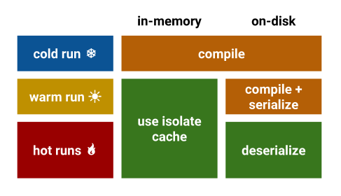
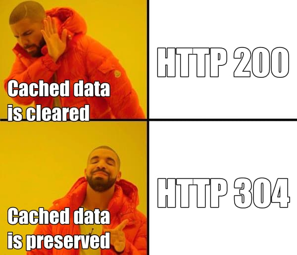
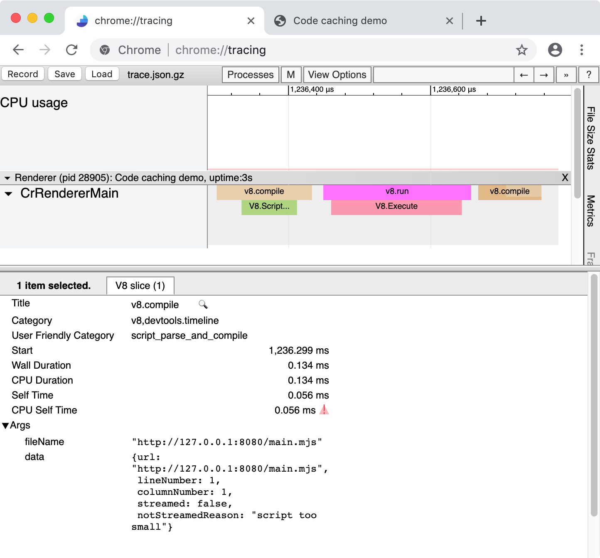
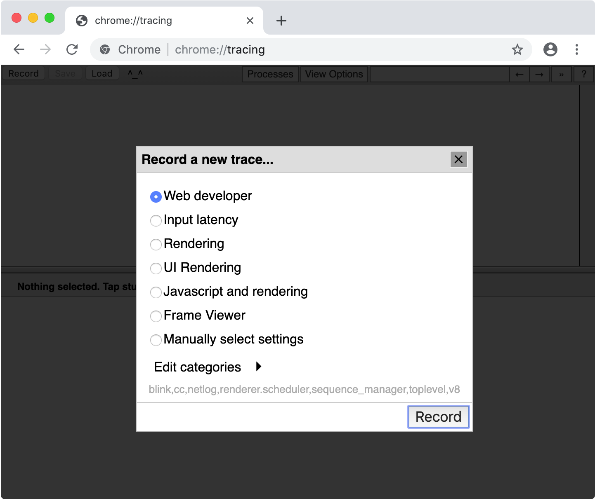
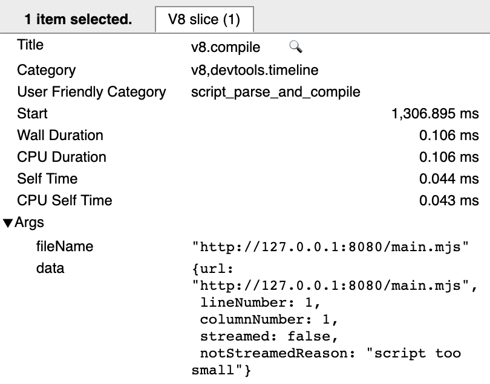
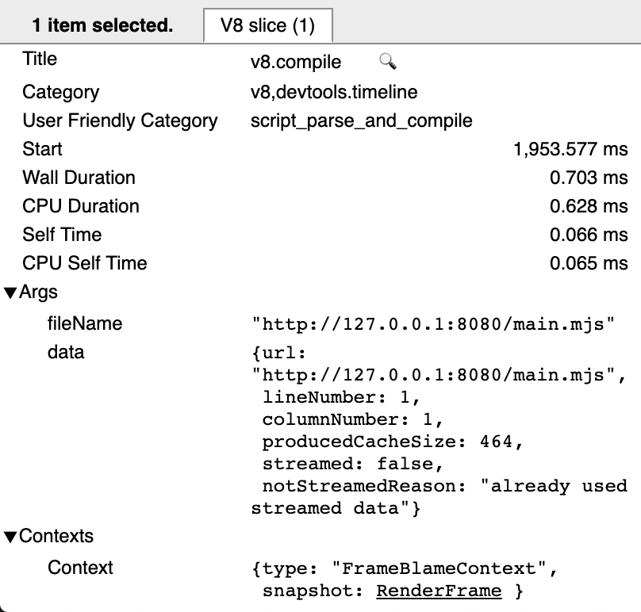
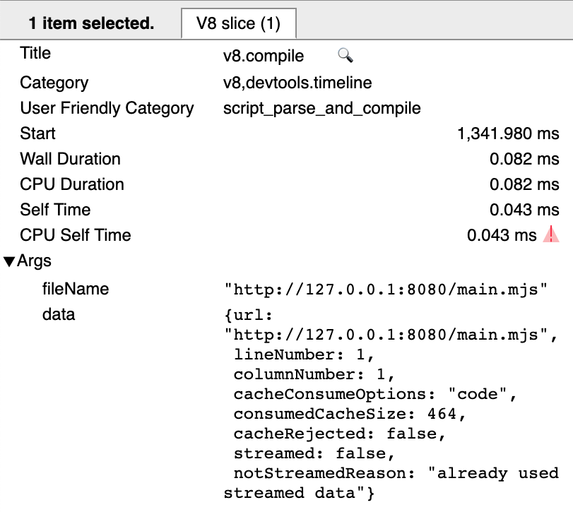

Code caching (also known as bytecode caching) is an important optimization in browsers. It reduces the start-up time of commonly visited websites by caching the result of parsing + compilation. Most popular browsers implement some form of code caching, and Chrome is no exception. Indeed, we’ve written and talked about how Chrome and V8 cache compiled code in the past.

In this blog post, we offer a few pieces of advice for JS developers who want to make the best use of code caching to improve the startup of their websites. This advice focuses on the implementation of caching in Chrome/V8, but most of it is likely transferable to other browsers’ code caching implementations too.

代码缓存（也被称为字节码缓存）是浏览器的一个重要优化。它通过缓存解析+编译后的结果来提升高频访问网站的启动速度。大多主流浏览器都实现了代码缓存，Chrome 也不例外。事实上，关于 Chrome 和 V8 缓存编译后代码的实现，之前我们已经写[文章](https://v8.dev/blog/code-caching)也做过[演讲](https://www.youtube.com/watch?v=YqHOUy2rYZ8)。

在这篇文章中，我们将为那些想要更好的利用代码缓存来提高网站启动速度的 JS 开发者提供一些建议。这些建议集中在 Chrome/V8 的代码缓存实现上，但是其他大多数浏览器实现原理基本也是这样的。

## 代码缓存回顾

While other blog posts and presentations offer more detail on our code caching implementation, it’s worthwhile having a quick recap of how things work. Chrome has two levels of caching for V8 compiled code (both classic scripts and module scripts): a low-cost “best effort” in-memory cache maintained by V8 (the `Isolate` cache), and a full serialized on-disk cache.

虽然其他文章和演讲已经提供代码缓存实现的详细信息，但是我们仍然要快速回顾下它是如何工作的，对于 V8 编译后的代码 Chrome 有两级缓存：一个是由 V8（Isolate缓存） 维护的低成本的“尽力而为”内存缓存和一个完整序列换的硬盘缓存。

The `Isolate` cache operates on scripts compiled in the same V8 Isolate (i.e. same process, roughly “the same website’s pages when navigating in the same tab”). It is “best-effort” in the sense that it tries to be as fast and as minimal as possible, using data already available to us, at the cost of a potentially lower hit-rate and lack of caching across processes.

`Isolate` 缓存操作发生在同一个 V8 Isolate 中编译的脚本（即同一个进程，简单来说就是“在同一个 tab 页中导航的相同页面” ）。它是“尽力而为”，因为它试图尽可能快而小地使用已经可用的数据，以牺牲潜在的低命中率和跨进程的缓存为代价。

1. When V8 compiles a script, the compiled bytecode is stored in a hashtable (on the V8 heap), keyed by the script’s source code.
2. When Chrome asks V8 to compile another script, V8 first checks if that script’s source code matches anything in this hashtable. If yes, we simply return the existing bytecode.

This cache is fast and effectively free, yet we observe it getting an 80% hit rate in the real world.

1. 当 V8 编译脚本时，编译后的脚本以源码为键被存储在一个 hashtable 中（在 V8 的堆中）。
1. 当 Chrome 要求 V8 变异其他脚本的时候，V8 首先检查脚本的源码是否能匹配 hashtable 中的值。如果是，则返回已经存在的字节码。

`Isolate` 缓存是快速且有效的，目前我们检测到在真实情况中它的命中率达到 80% 。

The on-disk code cache is managed by Chrome (specifically, by Blink), and it fills the gap that the Isolate cache cannot: sharing code caches between processes, and between multiple Chrome sessions. It takes advantage of the existing HTTP resource cache, which manages caching and expiring data received from the web.

1. When a JS file is first requested (i.e. a cold run), Chrome downloads it and gives it to V8 to compile. It also stores the file in the browser’s on-disk cache.
1. When the JS file is requested a second time (i.e. a warm run), Chrome takes the file from the browser cache and once again gives it to V8 to compile. This time, however, the compiled code is serialized, and is attached to the cached script file as metadata.
1. The third time (i.e. a hot run), Chrome takes both the file and the file’s metadata from the cache, and hands both to V8. V8 deserializes the metadata and can skip compilation.

硬盘代码缓存是由 Chrome 管理（准确来说是由 Blink ），它填充了 `Isolate` 缓存不能在多个进程或多个 Chrome 会话间共享代码缓存的空白。

综上，


<p style="text-align: center"><small>代码缓存被分为冷运行、暖运行和热运行，在内存缓存发生在暖运行，硬盘缓存发生在热运行</small></p>

Based on this description, we can give our best tips for improving your website’s use of the code caches.

基于这段描述，我们可以提供最好的建议来提高你的网站对代码缓存的利用。

### 提示 1：什么都不要做

Ideally, the best thing you as a JS developer can do to improve code caching is “nothing”. This actually means two things: passively doing nothing, and actively doing nothing.

理想情况见，做为 JS 开发者为了提高代码的缓存能做的最好的事情就是“什么也不做”。这实际上有两层含义，一是被动的不做，二是主动的不做。

Code caching is, at the end of the day, a browser implementation detail; a heuristic-based data/space trade-off performance optimization, whose implementation and heuristics can (and do!) change regularly. We, as V8 engineers, do our best to make these heuristics work for everyone in the evolving web, and over-optimising for the current code caching implementation details may cause disappointment after a few releases, when those details change. In addition, other JavaScript engines are likely to have different heuristics for their code caching implementation. So in many ways, our best advice for getting code cached is like our advice for writing JS: write clean idiomatic code, and we’ll do our best to optimise how we cache it.

代码缓存终究是浏览器实现的细节。基于启发法的数据与空间的权衡性能优化，它的实现和启发法可能定期变化。做为 V8 工程师，我们会尽我们所能使启发法适用于在不断发展的 Web 中的每一个人，而且对当前代码缓存实现细节的过度的优化可能会在一些版本发布后，当这些细节改变后引起失望。另外，其他的一些 JavaScript 引擎可能使用了不同的启发法实现代码缓存。因此从各方面来说，对于使用代码缓存我们最好的建议是：书写整洁且符合习惯的代码，而且我们会尽可能的优化它。

In addition to passively doing nothing, you should also try your best to actively do nothing. Any form of caching is inherently dependent on things not changing, thus doing nothing is the best way of allowing cached data to stay cached. There are a couple of ways you can actively do nothing.

除了被动不做什么，你应该尽可能地主动不做什么。任何形式的缓存内在都依赖于事物没有改变，因此什么都不做是允许缓存数据保持缓存的最佳方式。这儿有几个你什么都不做的方法：

**不要改变代码** 

This may be obvious, but it’s worth making explicit — whenever you ship new code, that code is not yet cached. Whenever the browser makes an HTTP request for a script URL, it can include the date of the last fetch of that URL, and if the server knows that the file hasn’t changed, it can send back a 304 Not Modified response, which keeps our code cache hot. Otherwise, a 200 OK response updates our cached resource, and clears the code cache, reverting it back to a cold run.

这也许是显而易见的事情，但是仍然值得明确说明———当你上线一份新的代码的时候，代码还没有被缓存。当浏览器通过 HTTP 请求一个脚本 URL 的时候，它包含了上次请求 URL 的时间，如果服务器知道文件没有改变，它返回 `304 Not Modified` 响应，维持我们的代码缓存热运行状态。否则，返回 `200 OK` 响应更新缓存资源，并且清除代码缓存，恢复到冷运行状态。


It’s tempting to always push your latest code changes immediately, particularly if you want to measure the impact of a certain change, but for caches it’s much better to leave code be, or at least update it as rarely as possible. Consider imposing a limit of ≤ x deployments per week, where x is the slider you can adjust to trade-off caching vs. staleness.

它总是立即推送你最新的代码更改，特使是如果你想要衡量某次更改的影响的时候，但是对于缓存来说，最好是保留代码或尽可能地减少更新。可以考虑限制每周的上线次数小于 `x`，`x` 是你调整权衡缓存与陈旧性的滑块。

**不要改变 URLs**
Code caches are (currently) associated with the URL of a script, as that makes them easy to look up without having to read the actual script contents. This means that changing the URL of a script (including any query parameters!) creates a new resource entry in our resource cache, and with it a new cold cache entry.

代码缓存与脚本的 URL 存在关联，这是为了便于检查而无需查看实际的脚本内容。这意味着改变脚本的 URL（包括改变请求查询参数） 会在我们的缓存资源中创建一个新的资源入口，并伴随着一个冷缓存入口。



Of course, this can also be used to force cache clearing, though that is also an implementation detail; we may one day decide to associate caches with the source text rather than source URL, and this advice will no longer be valid.

当然，这可以被用来强制清除缓存，尽管那也是一个实现细节。也许有一天我们会使用源文件内容关联缓存而不是源文件的 URL，那么这个建议将不在有效。

**不要改变代码执行行为** 

One of the more recent optimizations to our code caching implementation is to only serialize the compiled code after it has executed. This is to try to catch lazily compiled functions, which are only compiled during execution, not during the initial compile.

对代码缓存实现的最新优化之一是仅在编译后的代码执行后对其进行序列化。 这是为了尝试捕获延迟编译的函数，这些函数仅在执行期间编译，而不是在初始编译期间编译。

This optimization works best when each execution of the script executes the same code, or at least the same functions. This can be a problem if you e.g. have A/B tests which are dependent on a runtime decision:

当每次执行脚本执行相同的代码或至少相同的函数时，这个优化最有效。 如果你进行 A/B 测试，且测试取决于运行时决策，这样做可能会有问题。

```js
if (Math.random() > 0.5) {
  A();
} else {
  B();
}
```

In this case, only `A()` or `B()` is compiled and executed on the warm run, and entered into the code cache, yet either could be executed in subsequent runs. Instead, try to keep your execution deterministic to keep it on the cached path.

在这个例子中，仅 `A()` 或 `B()` 被编译或执行在热运行时，并进入到代码缓存，另外一个可能会在后续的代码运行中被执行。相反，保持运行时的确定性，以保持其在缓存路径上。

### 提示 2: 做一些事情

Certainly the advice to do “nothing”, whether passively or actively, is not very satisfying. So in addition to doing “nothing”, given our current heuristics and implementation, there are some things you can do. Please remember, though, that heurisics can change, this advice may change, and there is no substitute for profiling.

当然无论是被动还是主动“什么都不做”的建议都不能让人满意。因此除了“什么都不做”，鉴于我们目前的启发法和实现，你可以做一些事情。请记住，启发法和建议都可能改变，且没有一个代替分析。


**将库从使用代码中分离**
Code caching is done on a coarse, per-script basis, meaning that changes to any part of the script invalidate the cache for the entire script. If your shipping code consists of both stable and changing parts in a single script, e.g. libraries and business logic, then changes to the business logic code invalidate the cache of the library code.

代码缓存粗略的在每个脚本上完成，意味着脚本的每一部分改动都会导致整个脚本的缓存失效。如果你将稳定的部分和经常变动的部分放在一个脚本文件中，例如：库和业务逻辑，业务逻辑代码的改变会使库代码的缓存也无效。

Instead, you can split out the stable library code into a separate script, and include it separately. Then, the library code can be cached once, and stay cached when the business logic changes.

因此，你可以分离稳定的库代码到一个单独的脚本，且单独的加载它。这样库代码一旦被缓存，并在业务逻辑代码改变的时候保持缓存。

This has additional benefits if the libraries are shared across different pages on your website: since the code cache is attached to the script, the code cache for the libraries is also shared between pages.

如果你的库在你网站的不同的页面被共享，这样做还有其他的收益：由于代码缓存附加到脚本，因此库的代码换在也在页面之间共享。

**合并库文件到使用它们的代码中**

Code caching is done after each script is executed, meaning that the code cache of a script will include exactly those functions in that script that were compiled when the script finishes executing. This has several important consequences for library code:

1. The code cache won’t include functions from earlier scripts.
1. The code cache won’t include lazily compiled functions called by later scripts.

代码缓存在每个脚本执行后完成，意味着一个脚本的代码缓存包含了当脚本执行完编译后的那些函数。这对库代码有几个重要意义：
1. 代码缓存不包含早期脚本中的函数。
1. 代码缓存不包含后续脚本调用的延迟编译的函数。

In particular, if a library consists of entirely lazily compiled functions, those functions won’t be cached even if they are used later.

特别是，如果一个库完全由延迟编译的函数组成，那么即使稍后使用他们也不会缓存这些函数。

One solution to this is to merge libraries and their uses into a single script, so that the code caching “sees” which parts of the library are used. This is unfortunately the exact opposite of the advice above, because there are no silver bullets. In general, we don’t recommend merging all your scripts JS into a single large bundle; splitting it up into multiple smaller scripts tends to be more beneficial overall for reasons other than code caching (e.g. multiple network requests, streaming compilation, page interactivity, etc.).

对此一个解决方案是合并库和使用它们的代码到单个脚本中，以至于代码缓存可以“发现”库的那些部分被使用。不幸的是，这与上一条建议相违背，因为没有银弹。通常来说，我们不建议将所有 JS 脚本合并到一个大的 bundle 中，将其分成多个较小脚本往往更有利于除代码缓存之外的其他原因（如：多个网络请求、流编译、页面交互等）。

**利用 IIFE 启发法** 

Only the functions that are compiled by the time the script finishes executing count towards the code cache, so there are many kinds of function that won’t be cached despite executing at some later point. Event handlers (even `onload`), promise chains, unused library functions, and anything else that is lazily compiled without being called by the time `</script>` is seen, all stays lazy and is not cached.

只有在代码执行完成时编译的代码才会被加入到代码缓存，因此有许多类型的函数尽管稍后执行，但不会被缓存。事件处理程序（甚至是 onload）、promise 链、未使用的库函数和其他一些延迟编译而没有在执行到 `</script>` 之前被调用的，都会保持延迟而不会被执行。 

One way to force these functions to be cached is to force them to be compiled, and a common way of forcing compilation is by using IIFE heuristics. IIFEs (immediately-invoked function expressions) are a pattern where a function is called immediately after being created:

一种方法强制这些函数被缓存就是强制它们被编译，且一个常用的强制编译方法是使用 IIFE 启发法。IIFE（立即执行函数表达式）是一种创建函数后立即点用函数的模式。

```js
(function foo() {
  // …
})();
```

Since IIFEs are called immediately, most JavaScript engines try to detect them and compile them immediately, to avoid paying the cost of lazy compilation followed by full compilation. There are various heuristics to detect IIFEs early (before the function has to be parsed), the most common being a `(` before the `function` keyword.

Since this heuristic is applied early, it triggers a compile even if the function is not actually immediately invoked:

因为 IIFE 表达式会被立即调用，为了避免支付延迟编译的成本，大多数 JavaScript 引擎会尝试探测它们并立即编译，然后进行完全编译。有各种启发法可以尽早探测出 IIFE 表达式（在函数被解析之前），最常用的是通过 `function` 关键字之前的 `(`。

因为这个启发法在早期被应用，所以即使函数实际不是立即执行也会被编译：

```js
const foo = function() {
  // Lazily skipped
};
const bar = (function() {
  // Eagerly compiled
});
```

This means that functions that should be in the code cache can be forced into it by wrapping them in parentheses. This can, however, make startup time suffer if the hint is applied incorrectly, and in general this is somewhat of an abuse of heuristics, so our advice is to avoid doing this unless it is necessary.

这意味着可以通过将那些应该被缓存的函数包裹在括号里强制加入到缓存中。但是，如果不正确的使用，可能会对网页启动时间产生影响，通常来说这有点滥用启发式，因此除非真的有必要，我们不建议这么做。

**Group small files together**

Chrome has a minimum size for code caches, currently set to 1 KiB of source code. This means that smaller scripts are not cached at all, since we consider the overheads to be greater than the benefits.

If your website has many such small scripts, the overhead calculation may not apply in the same way anymore. You may want to consider merging them together so that they exceed the minimum code size, as well as benefiting from generally reducing script overheads.

**Avoid inline scripts**

Script tags whose source is inline in the HTML do not have an external source file that they are associated with, and therefore can’t be cached with the above mechanism. Chrome does try to cache inline scripts, by attaching their cache to the HTML document’s resource, but these caches then become dependent on the entire HTML document not changing, and are not shared between pages.

So, for non-trivial scripts which could benefit from code caching, avoid inlining them into the HTML, and prefer to include them as external files.

**Use service worker caches**

Service workers are a mechanism for your code to intercept network requests for resources in your page. In particular, they let you build a local cache of some of your resources, and serve the resource from cache whenever they are requested. This is particularly useful for pages that want to continue to work offline, such as PWAs.

A typical example of a site using a service worker registers the service worker in some main script file:

```js
// main.mjs
navigator.serviceWorker.register('/sw.js');
```

And the service worker adds event handlers for installation (creating a cache) and fetching (serving resources, potentially from cache).

```js
// sw.js
self.addEventListener('install', (event) => {
  async function buildCache() {
    const cache = await caches.open(cacheName);
    return cache.addAll([
      '/main.css',
      '/main.mjs',
      '/offline.html',
    ]);
  }
  event.waitUntil(buildCache());
});

self.addEventListener('fetch', (event) => {
  async function cachedFetch(event) {
    const cache = await caches.open(cacheName);
    let response = await cache.match(event.request);
    if (response) return response;
    response = await fetch(event.request);
    cache.put(event.request, response.clone());
    return response;
  }
  event.respondWith(cachedFetch(event));
});
```

These caches can include cached JS resources. However, since we expect service worker caches to be predominantly used for PWAs, we have slightly different heuristics for them compared to the normal “automatic” caching in Chrome. Firstly, they immediately create a code cache whenever the JS resource is added to the cache, meaning that the code cache is available already on second load (rather than only on third load, as is the case in the normal cache). Secondly, we generate a “full” code cache for these scripts — we no longer compile functions lazily, but instead compile everything and place it in the cache. This has the advantage of having fast and predictable performance, with no execution order dependencies, though at the cost of increased memory use. Note that this heuristic applies only to service worker caches, and not to other uses of the `Cache` API. Indeed, currently the `Cache` API does not perform code caching at all when used outside of service workers.

## Tracing

None of the above suggestions is guaranteed to speed up your web app. Unfortunately, code caching information is not currently exposed in DevTools, so the most robust way to find out which of your web app's scripts are code-cached is to use the slightly lower-level `chrome://tracing`.

`chrome://tracing` records instrumented traces of Chrome during some period of time, where the resulting trace visualization looks something like this:


<p style="text-align: center"><small>The chrome://tracing UI with a recording of a warm cache run</small></p>

Tracing records the behaviour of the entire browser, including other tabs, windows, and extensions, so it works best when done in a clean user profile, with no extensions installed, and with no other browser tabs open:

```js
# Start a new Chrome browser session with a clean user profile
google-chrome --user-data-dir="$(mktemp -d)"
```

When collecting a trace, you have to select what categories to trace. In most cases you can simply select the “Web developer” set of categories, but you can also pick categories manually. The important category for code caching is v8.



After recording a trace with the `v8` category, look for `v8.compile` slices in the trace. (Alternatively, you could enter `v8.compile` in the tracing UI’s search box.) These list the file being compiled, and some metadata about the compilation.

On a cold run of a script, there is no information about code caching — this means that the script was not involved in producing or consuming cache data.



On a warm run, there are two `v8.compile` entries per script: one for the actual compilation (as above), and one (after execution) for producing the cache. You can recognize the latter as it has `cacheProduceOptions` and `producedCacheSize` metadata fields.



On a hot run, you’ll see a `v8.compile` entry for consuming the cache, with metadata fields `cacheConsumeOptions` and `consumedCacheSize`. All sizes are expressed in bytes.



## Conclusion
For most developers, code caching should “just work”. It works best, like any cache, when things stay unchanged, and works on heuristics which can change between versions. Nevertheless, code caching does have behaviors that can be used, and limitations which can be avoided, and careful analysis using chrome://tracing can help you tweak and optimize the use of caches by your web app.

原文：https://v8.dev/blog/code-caching-for-devs