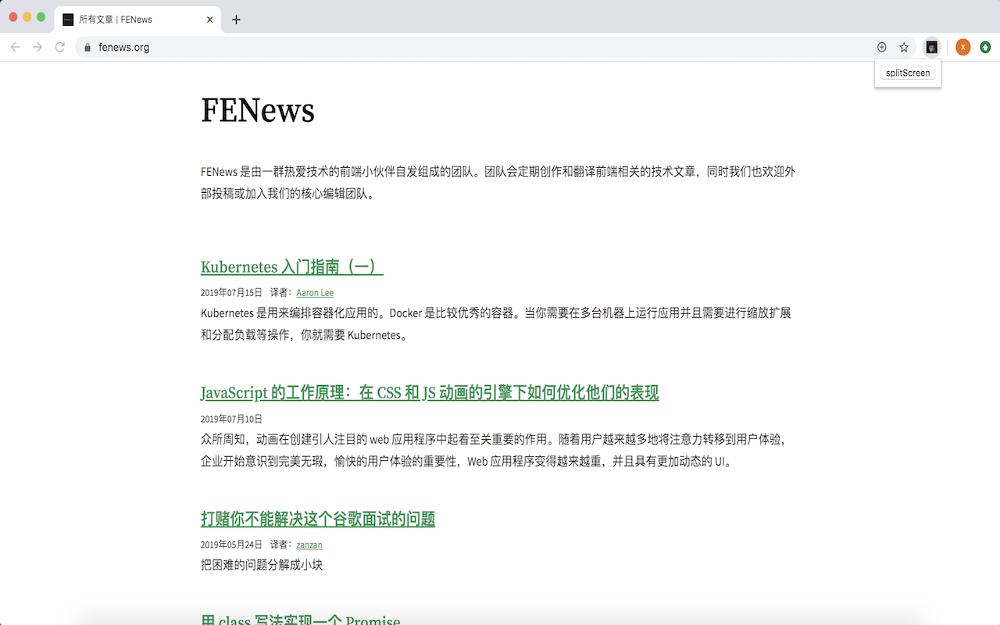

距离每周一篇文章的 flag 还有 2 天时间，写一个分屏的 chrome 插件终于被安排上日程。




原本的思路是在同一个 chrome 标签内实现，通过改变 body 的宽度+动态插入 iframe 的方式，考虑到页面刷新问题及样式的问题，此路不通。
于是衍变成新开一个窗口去实现。

首先，新建一个项目，打开 [chrome://extensions/](chrome://extensions/) 页面，打开右上角按钮开发者模式，将项目拖至此页面空白处自动安装

## 重点tips
1. manifest.json 配置，**permissions** 权限相关
2. 调试，右击插件图标-审查弹出内容-开发者工具
3. 开发者工具 Console 栏输入 chrome 可见 Chrome 平台 API


```js
//index.js
let fullWidth=1440  //默认全屏宽度
let fullHeight=900  //默认全屏高度
let newTabUrl=''    //新开的标签地址
document.querySelector("#splitScreen").addEventListener("click", ()=>{
  fullWidth=window.screen.width
  fullHeight=window.screen.height
  chrome.windows.getCurrent((win)=>{
    //更改当前窗口的大小位置
    chrome.windows.update(win.id,{
      width:fullWidth/2,
      height:fullHeight,
      top:0,
      left:0
    }, ()=>{})
  });
  // **大部分 chrome.tabs API 不需要任何权限就能使用，获取 Tab 的 url 需要在 manifest.json 里配置 "permissions": ["tabs"]**
	chrome.tabs.query({active: true,currentWindow: true, highlighted: true},
    (tabs) =>{
      newTabUrl=tabs[0].url 
      //创建新窗口	
      chrome.windows.create({
        width:fullWidth/2,
        height:fullHeight,
        top:0,
        left:fullWidth/2,
        url:newTabUrl,
    },()=>{});
  });
});
```

一个简单分屏插件完成，打包成 zip，注册开发者账号(5美元)，发布到 [https://chrome.google.com/webstore/developer/dashboard](https://chrome.google.com/webstore/developer/dashboard)。

还在审核中，要 30 天，想用的朋友们请戳 [https://github.com/zxy7/zanzan](https://github.com/zxy7/zanzan) 下载。

待完善：拖动分屏页面 ↔️ 放大缩小同步另一个页面。

参考：
1. [https://crxdoc-zh.appspot.com/extensions/tabs](https://crxdoc-zh.appspot.com/extensions/tabs)
1. [https://support.google.com/chrome/a/answer/2714278?hl=zh-Hans](https://support.google.com/chrome/a/answer/2714278?hl=zh-Hans)