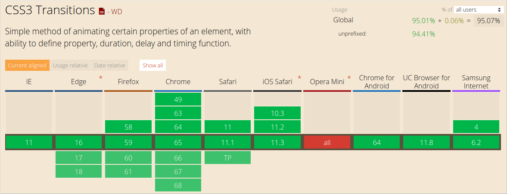
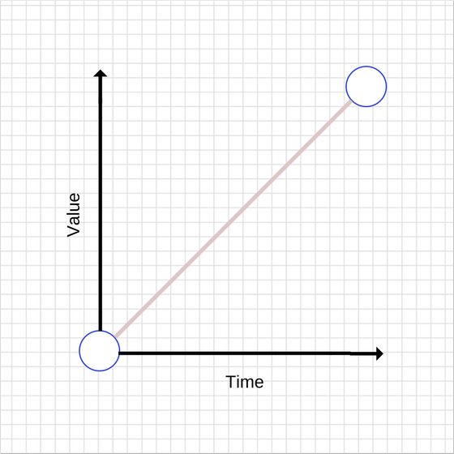
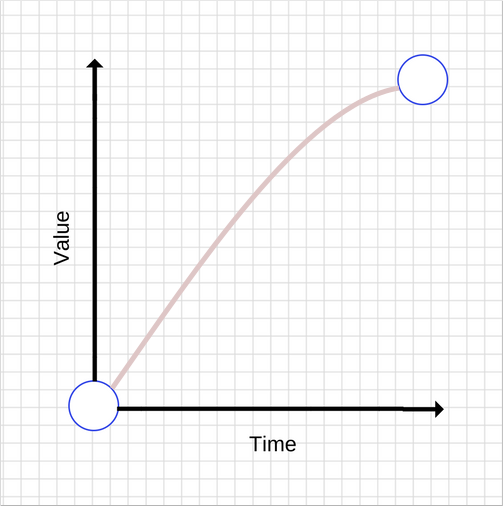
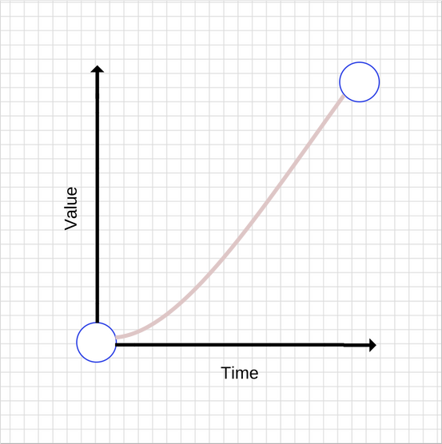
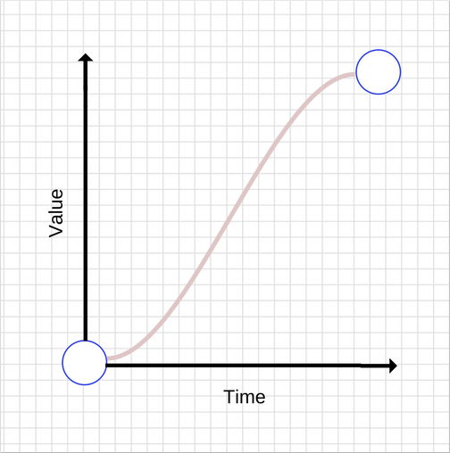
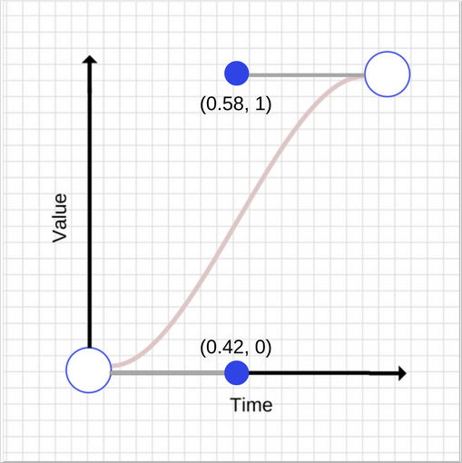
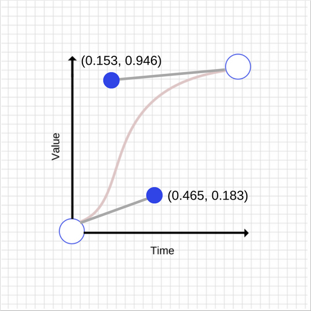
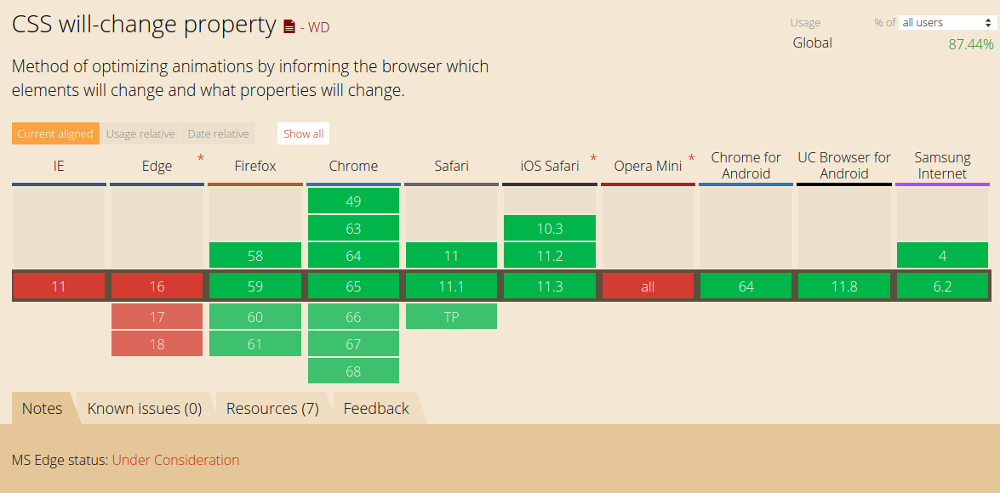

### 概要

众所周知，动画在创建引人注目的 web 应用程序中起着至关重要的作用。随着用户越来越多地将注意力转移到用户体验，企业开始意识到完美无瑕，愉快的用户体验的重要性，Web 应用程序变得越来越重，并且具有更加动态的 UI。这一切都需要更复杂的动画，以便在整个用户体验中实现更平滑的状态转换。今天，这甚至没有被认为是特别的东西。用户变得更加先进，进而期望具有高响应性和交互式的用户界面。

但是，动画界面并不一定简单明了。什么样的动画以及什么时候使用动画，动画应该有什么样的感觉，都是棘手的问题。

### JavaScript 与 CSS 动画

创建 Web 动画的两种主要方法是使用 JavaScript 和 CSS。没有绝对正确或错误的选择，这一切都取决于你想要达到的目标。

### 使用 CSS 创建动画

使用 CSS 动画是在屏幕上移动内容的最简单方法。我们将从如何在 X 和 Y 轴上移动 50px 元素的快速示例开始，这是通过使用设置为 1000 毫秒的 CSS 转换完成的。

```css
.box {
  -webkit-transform: translate(0, 0);
  -webkit-transition: -webkit-transform 1000ms;
  transform: translate(0, 0);
  transition: transform 1000ms;
}

.box.move {
  -webkit-transform: translate(50px, 50px);
  transform: translate(50px, 50px);
}
```

当 `move` 类被添加后，`transform` 属性被改变，并且 `transition` 开始。

除了 transition duration 外，还有 easing 选项，这实际上就是动画的感觉。我们将在本文后面更详细地介绍。

如果在上面的代码片段中创建了单独的 CSS 类来管理动画，则可以使用 JavaScript 来打开和关闭每个动画。

如果你有以下元素：

```js
<div class="box">Sample content.</div>
```

然后，你可以使用 JavaScript 来打开和关闭每个动画：

```js
var boxElements = document.getElementsByClassName("box"),
  boxElementsLength = boxElements.length,
  i;

for (i = 0; i < boxElementsLength; i++) {
  boxElements[i].classList.add("move");
}
```

上面的代码片段获取包含具有 `box` 类的所有元素，并添加 `move` 类以触发动画。这样做可以为你的应用提供良好的平衡。你可以专注于使用 JavaScrip t 管理状态，只需在目标元素上设置适当的类，让浏览器来处理动画。如果沿着这条路线前进，你可以在元素上监听 `transitionend` 事件，但前提是你可以放弃对旧版 Internet Explorer 的支持：



在 transition 结束时监听 `transitioned` 事件，如下所示：

```js
var boxElement = document.querySelector(".box"); // Get the first element which has the box class.
boxElement.addEventListener("transitionend", onTransitionEnd, false);

function onTransitionEnd() {
  // Handle the transition finishing.
}
```

除了使用 CSS transition 之外，你还可以使用 CSS animation，这使你可以更好地控制单个动画关键帧，持续时间和迭代。

我们来看一个例子：

```css
/**
 * This is a simplified version without
 * vendor prefixes. With them included
 * (which you will need), things get far
 * more verbose!
 */
.box {
  /* Choose the animation */
  animation-name: movingBox;

  /* The animation’s duration */
  animation-duration: 2300ms;

  /* The number of times we want
      the animation to run */
  animation-iteration-count: infinite;

  /* Causes the animation to reverse
      on every odd iteration */
  animation-direction: alternate;
}

@keyframes movingBox {
  0% {
    transform: translate(0, 0);
    opacity: 0.4;
  }

  25% {
    opacity: 0.9;
  }

  50% {
    transform: translate(150px, 200px);
    opacity: 0.2;
  }

  100% {
    transform: translate(40px, 30px);
    opacity: 0.8;
  }
}
```

[演示地址](https://sessionstack.github.io/blog/demos/keyframes/)

使用 CSS 动画，你可以独立于目标元素定义动画本身，并使用 animation-name 属性选择所需的动画。

CSS 动画仍然在某种程度上以供应商为前缀，在 Safari，Safari Mobile 和 Android 中使用 -webkit。 Chrome，Opera，Internet Explorer 和 Firefox 都没有前缀。许多工具可以帮助你创建所需 CSS 的前缀版本，允许你在源文件中编写未加前缀的版本。

### 使用 JavaScript 动画

与使用 CSS 过渡或动画相比，使用 JavaScript 创建动画更复杂，但它通常为开发人员提供了更多的动力。

JavaScript 动画作为代码的一部分内联编写。你还可以将它们封装在其他对象中。下面是你需要使用 JavaScript 重新编写前面描述的 CSS transition 的代码：

```js
var boxElement = document.querySelector(".box");
var animation = boxElement.animate(
  [{ transform: "translate(0)" }, { transform: "translate(150px, 200px)" }],
  500
);
animation.addEventListener("finish", function() {
  boxElement.style.transform = "translate(150px, 200px)";
});
```

默认情况下，Web 动画仅修改元素的表示。如果你希望将对象保留在移动到的位置，则应在动画完成时修改其基础样式。这就是为什么我们在上面的例子中监听 finish 事件，并将 `box.style.transform` 属性设置为等于 `translate(150px,200px)`，这与我们动画执行的第二次转换相同。

使用 JavaScript 动画，你可以在每一步完全控制元素的样式。这意味着你可以放慢动画速度，暂停动画，停止它们，反转它们，并根据需要操作元素。如果你正在构建复杂的面向对象的应用程序，这尤其有用，因为你可以正确地封装你的行为。

### 什么是 Easing？

自然运动使用户对你的 web 应用感觉更舒适，从而带来更好的用户体验。当然，没有任何东西从一个点到另一个点是线性移动的。实际上，当事物在我们周围的物理世界中移动时，事物往往会加速或减速，因为我们不是在真空中，并且有不同的因素往往会影响这一点。人类的大脑是有线的，期待这种运动，所以当你在 web 应用程序时中使用动画时，你应该利用这些知识来成为自己的优势。

你需要了解的术语：

- ease in——以慢速开始加速的过渡效果。
- ease out——以快速开始然后减速的过渡效果。

这两者可以组合，例如 "ease in out"。

### Easing 关键字

CSS 过渡和动画允许你选择要使用的缓动类型，有不同的关键字会影响动画的缓和，你也可以完全自定义你的缓动。

以下是一些可以在 CSS 中用来控制缓动的关键字：

- `linear`
- `ease-in`
- `ease-out`
- `ease-in-out`

让我们浏览所有这些，看看它们的真正含义。

### 线性动画（Linear animations）

没有任何缓和的动画被称为线性 `linear`。

以下是线性过渡的图形：



随着时间的推移，value 值会增加。对于线性运动，事物往往会让人感觉不自然。一般来说，你应该避免线性运动。

以下是如何实现简单的线性动画：

```css
transition: transform 500ms linear;
```

### 减速动画（Ease-out animations）

如前所述，与线性动画相比，ease-out 会使动画更快地启动，而最后会减慢动画。它的图形如下：



一般来说，ease-out 最适合用于 UI 工作，因为快速启动可以让动画更具有响应感，而由于运动不一致，最后的减速让人感觉很自然。

有很多方法可以实现 ease-out 效果，但最简单的是在 CSS 中使用 ease-out 关键字：

```css
transition: transform 500ms ease-out;
```

### 加速动画（Ease-in animations）

加速动画与减速动画相反——加速动画开始缓慢而快速结束。它的图形如下：



与减速动画相比，加速动画可能会让人感到异常，因为它们会慢慢开始，会产生一种反应迟钝的感觉。快速结束也会产生给人一种奇怪的感觉，因为整个动画正在加速，而现实世界中的物体在突然停止时往往会减速。

要使用加速动画，与减速和线性动画类似，你可以使用其关键字：

```css
transition: transform 500ms ease-in;
```

### Ease-in-out 动画

这种动画结合了 ease-in 和 ease-out。它的图形如下：



不要使用太长的动画持续时间，因为它们会让你觉得你的 UI 没有响应。

要实现 ease-in-out 动画，你可以使用 ease-in-out CSS 关键字：

```css
transition: transform 500ms ease-in-out;
```

### 自定义缓动（Custom easing）

你可以定义自己的缓动曲线，它可以更好地控制项目动画创建的感觉。

实际上，ease-in，ease-out，linear，ease 关键字映射到预定义的[贝塞尔曲线](https://en.wikipedia.org/wiki/B%C3%A9zier_curve)，这些曲线在[CSS 转换规范](http://www.w3.org/TR/css3-transitions/)和[Web 动画规范](https://w3c.github.io/web-animations/#scaling-using-a-cubic-bezier-curve)中有详细说明。

### 贝塞尔曲线

让我们看看贝塞尔曲线的工作原理。 贝塞尔曲线需要四个值，或者更确切地说，它需要两对数字。每对描述立方贝塞尔曲线控制点的 X 和 Y 坐标。贝塞尔曲线的起点有一个坐标（0,0），结束坐标是（1,1）。你可以设置两个对号。两个控制点的 X 值必须在[0,1]范围内，并且每个控制点的 Y 值可以超过[0,1]限制，尽管规格不清楚多少。

即使每个控制点的 X 和 Y 值发生微小变化，也会给出完全不同的曲线。让我们看一下贝塞尔曲线的两个图，图中的点具有接近但不同的坐标。





如你所见，图表完全不同。第一个控制点有一个 （0.045,0.183）矢量差，而第二控制点有（-0.427，-0.054）矢量差。

第二条曲线的 CSS 如下所示：

```css
transition: transform 500ms cubic-bezier(0.465, 0.183, 0.153, 0.946);
```

前两个数字是第一个控制点的 X 和 Y 坐标，后两个数字是第二个控制点的 X 和 Y 坐标。

### 性能优化

每当你制作动画时，应该保持 60fps，否则会对用户体验产生负面影响。

与世界上其他一切事物一样，动画也不是自由的，动画一些属性比其他属性更容易。例如，动画元素的宽度和高度会更改其几何图形，并且可能导致页面上的其他元素移动或更改大小。这个过程称为布局,我们在之前的[一篇文章](https://blog.sessionstack.com/how-javascript-works-the-rendering-engine-and-tips-to-optimize-its-performance-7b95553baeda)中更详细地讨论了布局和渲染。

通常，你应该避免动画触发布局或绘制的属性。对于大多数现代浏览器，这意味着将动画限制为 `opacity` 和 `transform`。

### will-change

你可以使用 [will-change](https://dev.w3.org/csswg/css-will-change/) 来通知浏览器你打算更改元素的属性。这允许浏览器在进行更改之前将最合适的优化放在适当的位置。但是，不要过度使用 `will-change`，因为这样做会导致浏览器浪费资源，从而导致更多的性能问题。

为 transform 和 opacity 添加 will-change 看起来像这样：

```css
.box {
  will-change: transform, opacity;
}
```

will-change 在 Chrome，Firefox 和 Opera 上的支持非常又好。



### 在 JavaScript 动画和 CSS 动画之间进行选择

你可能已经明白这个问题没有正确或错误的答案，只需记住以下事项：

- 基于 CSS 的动画和本机支持的 Web 动画通常在称为“合成器线程”的线程上处理。它与浏览器的“主线程”不同，后者在其中执行样式，布局，绘画和 JavaScript。这意味着如果浏览器在主线程上运行一些消费性能的任务，这些动画可以继续运行而不会被中断。

- 在许多情况下，对`transforms`和`opacity`的更改也可以由合成器线程处理。

- 如果任何动画触发绘画，布局或两者，则需要“主线程”才能完成工作。这对于基于 CSS 和 JavaScript 的动画都是如此，布局或绘制的开销可能会使与 CSS 或 JavaScript 执行相关的任何工作相形见绌，这使得问题没有实际意义。

### 正确选择制作动画的内容

精彩的动画能为你的用户增添一层乐趣和参与度。你可以为自己喜欢的任何内容设置动画，无论是宽度，高度，位置，颜色或背景，但是你需要了解潜在的性能瓶颈。选择不当的动画可能会对用户体验产生负面影响，因此动画需要既高效又适当。适当的使用动画，动画只是为了让你的用户体验感觉更加自然，但不要过度动画。

### 使用动画来加强互动

不要随意使用动画，相反，使用策略性放置的动画来加强用户交互，避免动画不必要地中断或阻碍用户的活动。

### 避免高耗性能的动画

唯一比放置不当的动画更糟糕的是那些导致页面卡顿的东西，这种类型的动画让用户感到沮丧和不快乐。

我们在[SessionStack](https://www.sessionstack.com/?utm_source=medium&utm_medium=blog&utm_content=js-series-rendering-engine-outro)中使用动画非常容易。一般来说，我们遵循上面提到的做法，但由于 UI 的复杂性，我们还有一些场景需要利用动画。SessionStack 必须将最终用户在浏览 Web 应用程序时遇到问题时发生的所有事情重新创建为视频。为此，SessionStack 仅利用我们的库在会话期间收集的数据：用户事件，DOM 更改，网络请求，异常，调试消息等。我们的播放器经过高度优化，可以正确渲染和利用所有收集的数据，从视觉和技术角度提供最终用户浏览器及其中发生的所有事情的像素的完美模拟。

为了确保复制感觉自然，特别是对于长时间和繁重的用户会话，我们使用动画来正确指示加载或缓冲并遵循如何实现它们的最佳实践，以便我们不占用太多 CPU 时间和离开事件循环来免费呈现会话。

### 资源

- [https://developers.google.com/web/fundamentals/design-and-ux/animations/css-vs-javascript](https://developers.google.com/web/fundamentals/design-and-ux/animations/css-vs-javascript)

- [https://developers.google.com/web/fundamentals/design-and-ux/animations/](https://developers.google.com/web/fundamentals/design-and-ux/animations/)

- [https://developers.google.com/web/fundamentals/design-and-ux/animations/animations-and-performance](https://developers.google.com/web/fundamentals/design-and-ux/animations/animations-and-performance)
- 
原文链接：[https://blog.sessionstack.com/how-javascript-works-under-the-hood-of-css-and-js-animations-how-to-optimize-their-performance-db0e79586216](https://blog.sessionstack.com/how-javascript-works-under-the-hood-of-css-and-js-animations-how-to-optimize-their-performance-db0e79586216)