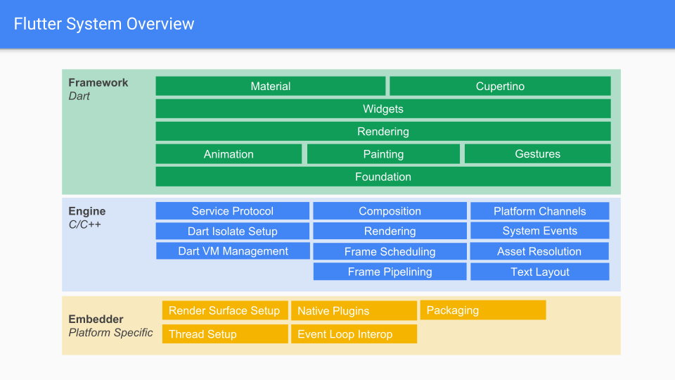

Flutter 就是[一个 Dart 框架](https://github.com/flutter/flutter)和高性能[引擎](https://github.com/flutter/engine)的结合体。

Flutter 引擎是一个用于运行高品质移动应用的可移植运行时。它实现了 Flutter 的核心库，动画和图形，文件和网络的 I/O，支持可访问性（accessibility），插件架构，以及用于开发，编译和运行 Flutter 应用程序的 Dart 运行时和开发工具。

## 架构概览

Flutter 引擎采用的核心技术有：Skia 是一个 2D 的图形渲染库，Dart，一个具有垃圾回收和面向对象语言的虚拟机，并将它们托管在一个壳（shell）中。不同的平台有不同的壳，比如，我们有 [Android](https://github.com/flutter/engine/tree/master/shell/platform/android) 和 [iOS](https://github.com/flutter/engine/tree/master/shell/platform/darwin) 的 壳（shell）。我们同样提供了嵌入式 API，这些 API 可以把 Flutter 的引擎作为一个库嵌入到其他环境（见[《自定义 Flutter 引擎嵌入环境》](https://github.com/flutter/flutter/wiki/Custom-Flutter-Engine-Embedders)）。

壳实现了特定平台的代码，比如：和 IME（屏幕上的键盘）通信，和系统的应用生命周期事件。

Dart 虚拟机实现了基础的 Dart 核心库，另外还有一个叫 `dart:ui` 的库，这个库提供了对 Skia 和壳底层的访问接口。壳可以绕过引擎，通过平台通道（Platform Channels）直接与 Dart 代码直通信。

## 线程

### 概览

Flutter 引擎不会自己创建或者管理自身的线程。相反，嵌入环境（embedder）负责给 Flutter 引擎 创建和管理线程（以及消息循环）。嵌入环境将自己管理的线程作为 task runner 提供给Flutter 引擎。除了嵌入环境管理的线程，Dart 虚拟机也有自己的线程池。不论是 Flutter 引擎还是嵌入环境都无法访问 Dart 虚拟机线程池中的线程。

###  Task Runner 配置

Flutter 引擎需要嵌入环境给4个 task runner 提供引用。Flutter 引擎并不关心这些引用是不是属于同一个 task runner，或者同一个线程是否在为多个 task runner 服务。为了获得最好性能，嵌入环境应该给每一个 task runner 创建一个专用的线程。虽然 Flutter 引擎并不关心线程在为哪一个 task runner 服务，但是 Flutter 引擎确实期望线程配置在 Flutter 引擎的整个生命周期内保持稳定。嵌入环境应该只在一个线程上执行对应 task runner 的任务（直到 Flutter 引擎被销毁）。

主要的 task runner 有：

- Platform Task Runner
- UI Task Runner
- GPU Task Runner
- IO Task Runner

### Platform Task Runner

嵌入环境线程的 task runner, 可以认为是主线程的 task runner。这个通常是 Android 的主线程 或者在 Apple 平台上的 Foundation 引用的线程。

分配给 task runner 对应线程的不论什么优先级的任务，这些任务的分配都是由嵌入环境来决定的。Flutter 引擎没有给这个线程赋予任何特殊的意义。事实上，可以使用基于不同线程的 Platform Task Runner 来启动多个 Flutter 引擎。这就是 Fuchsia 操作系统中 Flutter Content Handler 的工作原理。在每一个 Flutter 应用实例创建的过程中就会对应的创建一个 Flutter 引擎的实例，相应的也会为每一个 Flutter 引擎的实例创建对应的平台线程。

不论以什么方式和 Flutter 引擎交互，都必须在平台的线程上进行。在其他线程上和引擎交互在未优化版本中会跳过断言，并且这在发布版本中是线程不安全的。Flutter 引擎中许多组件都是线程不安全的。一旦 Flutter 引擎设置好并开始运行，只要对 Flutter 引擎的嵌入 API 都是在平台线程上进行访问的，嵌入环境就不需要发布任务到任何 task runner 去配置 Flutter 引擎。

除了作为嵌入环境启动之后与 Flutter 引擎进行交互的线程之外，task runner 还要执行正在等待的平台消息。这是非常方便的，因为访问 Platform 上的大多数 API 只有在 Platform 的主线程上是安全的。插件就不需要把自己的调用重新穿入（rethread）到主线程上。如果插件管理自己的工作线程，那么插件就要负责将响应队列返回给平台线程，然后才能把响应提交给引擎上的 Dart 代码去处理。始终在平台线程上与引擎交互的规则在这里得到保证。

### UI Task Runner

The UI task runner is where the engine executes all Dart code for the root isolate. The root isolate is a special isolate that has the necessary bindings for Flutter to function. This isolate runs the application's main Dart code. Bindings are set up on this isolate by the engine to schedule and submit frames. For each frame that Flutter has to render:

  - root isolate 必须告诉引擎需要渲染一帧。
  - 引擎会询问平台是不是在下一个 vsync 的时候通知 UI Task runner。
  - 平台会等待下一个 vsync
  - 在 vsync 中, 引擎会唤醒 Dart 代码并[执行以下操作](https://docs.flutter.io/flutter/widgets/WidgetsBinding/drawFrame.html)：
    - 更新动画插值器（interpolators）。
    - 在布局阶段重建应用程序中的 widget。
    - Lay out the newly constructed and widgets and paint them into a tree of layers that are immediately submitted to the engine. Nothing is actually rasterized here; only a description of what needs to be painted is constructed as part of the paint phase.
    - Construct or update a tree of nodes containing semantic information about widgets on screen. This is used to update platform specific accessibility components.

Apart from building frames for the engine to eventually render, the root isolate also executes all responses for platform plugin messages, timers, microtasks and asynchronous I/O (from sockets, file handles, etc.).

Since the UI thread constructs the layer tree that determines what the engine will eventually paint onto the screen, it is the source of truth for everything on the screen. Consequently, performing long operations on this thread will cause jank in Flutter applications (a few milliseconds is enough to miss the next frame!). Long operations can typically only be performed by Dart code since the engine will not schedule any native code tasks on this task runner. Because of this, this task runner (or thread) is typically referred to as the Dart thread. It is possible for the embedder to post tasks onto this task runner. This may cause jank in Flutter and embedders are advised not to do this and instead assign a dedicated thread for this task runner.

If it is unavoidable for Dart code to perform expensive work, it is advised that this code be moved into a separate Dart isolate (e.g. using the compute method). Dart code executing on a non-root isolate executes on a thread from a Dart VM managed thread pool. This cannot cause jank in a Flutter application. Terminating the root isolate will also terminate all isolates spawned by that root isolate. Also, non-root isolates are incapable of scheduling frames and do not have bindings that the Flutter framework depends on. Due to this, you cannot interact with the Flutter framework in any meaningful way on the secondary isolate. Use secondary isolates for tasks that require heavy computation.

### GPU Task Runner

The GPU task runner executes tasks that need to access the GPU on the device. The layer tree created by the Dart code on the UI task runner is client-rendering-API agnostic. That is, the same layer tree can be used to render a frame using OpenGL, Vulkan, software or really any other backend configured for Skia. Components on the GPU task runner take the layer tree and construct the appropriate GPU commands. The GPU task runner components are also responsible for setting up all the GPU resources for a particular frame. This includes talking to the platform to set up the framebuffer, managing surface lifecycle, and ensuring that textures and buffers for a particular frame are fully prepared.

Depending on how long it takes for the layer tree to be processed and the GPU to finish displaying the frame, the various components of the GPU task runner may delay scheduling of further frames on the UI thread. Typically, the UI and GPU task runners are on different threads. In such cases, the GPU thread can be in the process of submitting a frame to the GPU while the UI thread is already preparing the next frame. The pipelining mechanism makes sure that the UI thread does not schedule too much work for the GPU.

Since the GPU task runner components can introduce frame scheduling delays on the UI thread, performing too much work on the GPU thread will cause jank in Flutter applications. Typically, there is no opportunity for the user to perform custom tasks on this task runner because neither platform code nor Dart code can access this task runner. However, it is still possible for the embedder to schedule tasks on this thread. For this reason, it is recommended that embedders provide a dedicated thread for the GPU task runner per engine instance.

### IO Task Runner

All the task runners mentioned so far have pretty strong restrictions on the kinds of operations that can be performed on this. Blocking the platform task runner for an inordinate amount of time may trigger the platform's watchdog, and blocking either the UI or GPU task runners will cause jank in Flutter applications. However, there are tasks necessary for the GPU thread that require doing some very expensive work. This expensive work is performed on the IO task runner.

The main function of the IO task runner is reading compressed images from an asset store and making sure these images are ready for rendering on the GPU task runner. To make sure a texture is ready for rendering, it first has to be read as a blob of compressed data (typically PNG, JPEG, etc.) from an asset store, decompressed into a GPU friendly format and uploaded to the GPU. These operations are expensive and will cause jank if performed on the GPU task runner. Since only the GPU task runner can access the GPU, the IO task runner components set up a special context that is in the same sharegroup as the main GPU task runner context. This happens very early during engine setup and is also the reason there is a single task runner for IO tasks. In reality, the reading of the compressed bytes and decompression can happen on a thread pool. The IO task runner is special because access to the context is only safe from a specific thread. The only way to get a resource like ui.Image is via an async call; this allows the framework to talk to the IO runner so that it can asynchronously perform all the texture operations mentioned. The image can then be immediately used in a frame without the GPU thread having to do expensive work.

There is no way for user code to access this thread either via Dart or native plugins. Even the embedder is free to schedule tasks on this thread that are fairly expensive. This won’t cause jank in Flutter applications but may delay having the futures images and other resources be resolved in a timely manner. Even so, it is recommended that custom embedders set up a dedicated thread for this task runner.

## Current Platform Specific Threading Configurations

As mentioned, the engine can support multiple threading configurations, the configurations currently used by the supported platforms are:

### iOS

A dedicated thread is created for the UI, GPU and IO task runners per engine instance. All engine instances share the same platform thread and task runner.

### Android

A dedicated thread is created for the UI, GPU and IO task runners per engine instance. All engine instances share the same platform thread and task runner.

### Fuchsia

A dedicated thread is created for the UI, GPU, IO and Platform task runners per engine instance.

### Flutter Tester (used by flutter test)

The same main thread is used for the UI, GPU, IO and Platform task runners for the single instance engine supported in the process.

## Text rendering
Our text rendering stack is as follows:

- A minikin derivative we call libtxt (font selection, bidi, line breaking).
- HarfBuzz (glyph selection, shaping).
- Skia (rendering/GPU back-end), which uses FreeType for font rendering on Android and Fuchsia, and CoreGraphics for font rendering on iOS.

原文地址：[https://github.com/flutter/flutter/wiki/The-Engine-architecture](https://github.com/flutter/flutter/wiki/The-Engine-architecture)