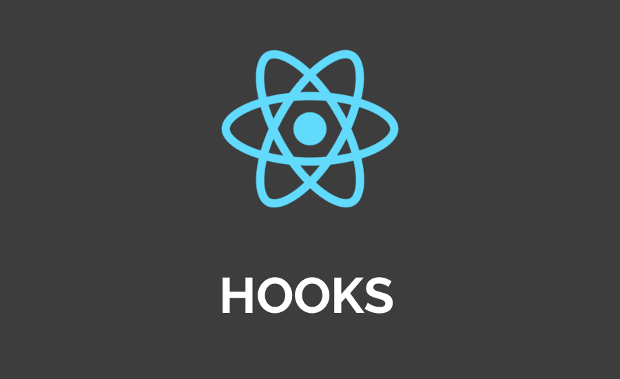
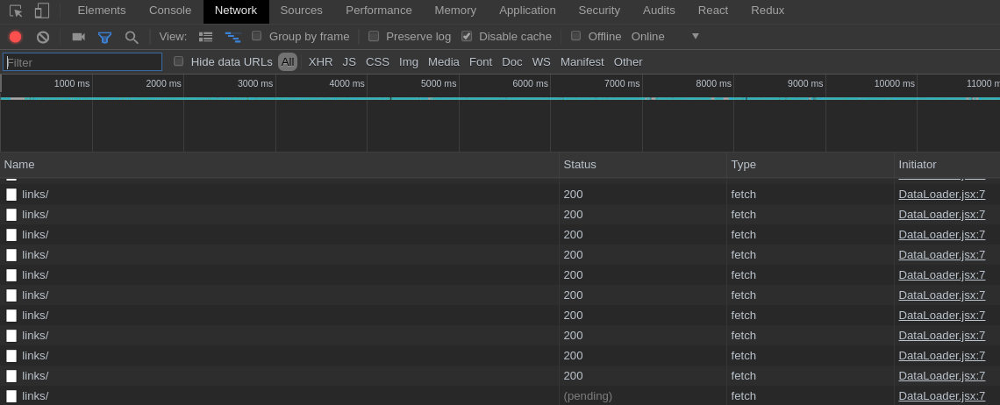
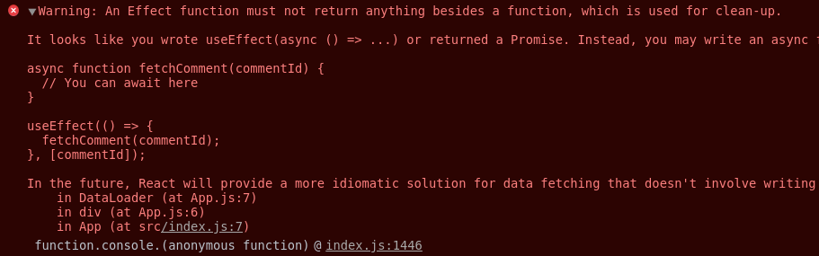

## React Hooks（2019）入门教程
本React Hooks教程，将带你学习如何使用React Hooks（new）。



### 你将学到
 - 如何使用React Hooks
 - 如何在React Class Components中实现相同的逻辑


### 起步准备
要继续学习本教程，你应该基本了解：

- ES6（箭头函数，解构，类）
- React


### 项目安装
请确保已经配置好React开发环境，并且是最新版本的Node.js，再执行：
```js 
  npx create-react-app exploring-hooks
```

### setState起步

首先让我们快速回顾一下React。

React是一个用于构建用户界面的库，其优点之一是库本身会向开发人员强加严格的数据流。还记得jQuery吗？使用jQuery，几乎不可能清晰地构建项目，更不用说如何定义UI中的数据流动，并且很难跟踪哪些功能正在改变哪个UI。

这同样适用于JavaScript：通过大量的练习和实践，有可能找到一种更好的项目结构（参考模块模式），不过还是要靠运气在各个fuctions之间追踪状态和交互（参考Redux）。

React在某种程度上缓解了这些问题：通过强制执行清晰的structure（container和function组件）和严格数据流（组件对state和props的change做出即时响应），会比以前更容易创建合理的UI逻辑。

因此，React的核心思想是，每个UI组件可以响应一个state变化。到目前为止，表达这种流程的基本形式是ES6 Class。看下面的示例，从React.Component扩展的具有内部state的ES6 Class：

```js
import React, { Component } from "react";
export default class Button extends Component {
  constructor() {
    super();
    this.state = { buttonText: "Click me, please" };
    this.handleClick = this.handleClick.bind(this);
  }
  handleClick() {
    this.setState(() => {
      return { buttonText: "Thanks, been clicked!" };
    });
  }
  render() {
    const { buttonText } = this.state;
    return <button onClick={this.handleClick}>{buttonText}</button>;
  }
}
```
从上面的代码中可以看出，当单击按钮时，组件的内部状态会被setState改变。 文本的按钮轮流响应此变化并获取更新的文本。

不使用构造函数的话，可以得到更简洁的版本：
```js
import React, { Component } from "react";
export default class Button extends Component {
  state = { buttonText: "Click me, please" };
  handleClick = () => {
    this.setState(() => {
      return { buttonText: "Thanks, been clicked!" };
    });
  };
  render() {
    const { buttonText } = this.state;
    return <button onClick={this.handleClick}>{buttonText}</button>;
  }
}
```

<!-- So，起步时有setState（以后也是），但不要急，上面的风格非常好，React中的ES6 Classes不会很快消失。 -->

上面的代码风格不错，但现在使用React Hooks可以简洁表示内部状态变化 -> 不使用ES6类来实现响应式UI。

跟我进入下一节......

### 不使用setState更新React中的state
那么现在我们要如何管理React中的内部状态，现在不再需要setState和classes了？

最重要的React Hook登场了：useState。useState是React暴露的函数，你可以在代码顶部把它import进来：
```js 
import React, { useState } from "react";
```

通过在代码中导入useState，你透出了在React组件中保存某种状态的意图。 更重要的是，React组件不再是ES6 class，它可以是一个纯粹而简单的JavaScript函数，这也是Hooks最吸引人的部分。

导入useState后，可以得到一个包含两个变量的数组：
```js 
const [buttonText, setButtonText] = useState("Click me, please");
```

上面的语法其实就是ES6解构（destructuring），变量名可以随意，不过最好还是有意义点。

传递给useState的参数是起始状态，即可以更改的数据。 useState会给你返回：
   - state的值（buttonText）
   - state的更新函数（setButtonText）

前面的例子，使用React Hooks的话会变成：
```js
import React, { useState } from "react";
export default function Button() {
  const [buttonText, setButtonText] = useState("Click me, please");
  return (
    <button onClick={() => setButtonText("Thanks, been clicked!")}>
      {buttonText}
    </button>
  );
}
```

要在onClick处理程序中调用setButtonText状态更新程序，可以使用箭头函数。 但如果你更喜欢使用常规fuction，可以：

```js
import React, { useState } from "react";
export default function Button() {
  const [buttonText, setButtonText] = useState("Click me, please");
  function handleClick() {
    return setButtonText("Thanks, been clicked!");
  }
  return <button onClick={handleClick}>{buttonText}</button>;
}
```

老实说，除了特殊需求外，我更喜欢常规函数而不是箭头函数。另一方面，程序员写的代码应该对下一个程序员友好，可读性是必要的。

好了，React hooks！本可以在这里结束这篇文章的，不过我还是想向你展示下如何使用Hooks获取数据。

前往下一节！

### 在起步时还有componentDidMount（render props）
在React中获取数据！ 你还记得componentDidMount的旧时代吗？ 你可以在componentDidMount中fetch(url)获取数据然后收工。 下面是从API获取数组并渲染成一个List的例子：

```js
import React, { Component } from "react";
export default class DataLoader extends Component {
  state = { data: [] };
  componentDidMount() {
    fetch("http://localhost:3001/links/")
      .then(response => response.json())
      .then(data =>
        this.setState(() => {
          return { data };
        })
      );
  }
  render() {
    return (
      <div>
        <ul>
          {this.state.data.map(el => (
            <li key={el.id}>{el.title}</li>
          ))}
        </ul>
      </div>
    );
  }
}
```
你可以在componentDidMount中使用async/await，不过会有一些警告。 我项目中大多数异步逻辑都存在于React组件之外。到现在为止上面的代码还有一些缺陷。

渲染列表是固定的，但使用render prop，我们可以轻松地将children作为函数传递。 重构后的component如下所示：

```js
import React, { Component } from "react";
export default class DataLoader extends Component {
  state = { data: [] };
  componentDidMount() {
    fetch("http://localhost:3001/links/")
      .then(response => response.json())
      .then(data =>
        this.setState(() => {
          return { data };
        })
      );
  }
  render() {
    return this.props.render(this.state.data);
  }
}
```

你将通过从外部传递的render prop来使用该组件：

```js
<DataLoader
  render={data => {
    return (
      <div>
        <ul>
          {data.map(el => (
            <li key={el.id}>{el.title}</li>
          ))}
        </ul>
      </div>
    );
  }}
/>
```

即使是这种模式（mixins和HOC之外更好的选择）也有其缺点。这就是（我猜）导致React开发团队提出Hooks原因：为React中的封装和逻辑复用提供更好的研发体验。

我是个没耐心的人，我想用Hooks尝试的第一件事就是获取数据。但是我怎么用Hooks来获取数据呢？组件是否仍然使用render prop模式？

让我们看看下一节！

### 使用useEffect获取数据
我认为使用React Hooks获取数据不应该与useState有太多不同。快速浏览官方文档后我有了一个想法：useEffect可能是正确的工具。

我读到：“useEffect与React类中的componentDidMount，componentDidUpdate和componentWillUnmount具有相同的用途，但统一为单个API”

很棒，不是吗？掌握了这些知识后，我重构了第一版Dataloader来使用useEffect。Dataloader组件成了一个函数，并在useEffect中调用fetch。而且，我可以使用setData（从useState中提取的update函数）代替this.setState

```js
import React, { useState, useEffect } from "react";
export default function DataLoader() {
  const [data, setData] = useState([]);
  useEffect(() => {
    fetch("http://localhost:3001/links/")
      .then(response => response.json())
      .then(data => setData(data));
  });
  return (
    <div>
      <ul>
        {data.map(el => (
          <li key={el.id}>{el.title}</li>
        ))}
      </ul>
    </div>
  );
}
```
我在想“可能会出现什么问题？”然后我运行了应用， 这是我在console中看到的：


显然是我的问题，不过我已经意识到发生了什么：

“useEffect与componentDidMount，componentDidUpdate和componentWillUnmount具有相同的用途”

componentDidUpdate！ componentDidUpdate是一个生命周期方法，每当组件获得新的props或state发生变化时运行。

这就是诀窍。 如果你像我一样调用useEffect，你会看到无限循环。 要解决这个“bug”，你需要传递一个空数组作为useEffect的第二个参数：

```js 
  useEffect(() => {
    fetch("http://localhost:3001/links/")
      .then(response => response.json())
      .then(data => setData(data));
  }, []); // << 超级重要的数据
```

我希望这些信息能够获得应有的可见性，而不是在本页末尾：使用效果钩。 但即使有这些信息，我也不会建议你使用Hooks获取数据，来重写所有React组件。 未来可能还会有更多的变化，就像Ryan Florence建议：

```
Ryan Florence
@ryanflorence

  Hooks不是React数据加载的终局。
  
  数据加载可能是app中最常见的效果。
  
  不要急于迁移到Hooks，除非你确认他已经稳定了。

  Own your churn.

— Ryan Florence (@ryanflorence) February 12, 2019
```

无论如何，useEffect替换了componentDidMount，componentDidUpdate和componentWillUnmount，我认为这对于专业开发人员和React的新手来说都是一件好事。

### 我可以使用带有React Hooks的render props吗？
当然可以！ 但这样做没有意义。 我们的DataLoader组件如下：

```js
import React, { useState, useEffect } from "react";
export default function DataLoader(props) {
  const [data, setData] = useState([]);
  useEffect(() => {
    fetch("http://localhost:3001/links/")
      .then(response => response.json())
      .then(data => setData(data));
  }, []); // << super important array
  return props.render(data)
}
```
你将通过从外部提供render prop来使用组件，就像我们在前面的示例中所做的那样。

但同样，这种重构没有意义，因为React Hooks的诞生是有原因的：在组件之间共享逻辑，我们将在下一节中看到一个例子。

### 你的首个自定义React Hooks
我们可以将我们的逻辑封装在React Hooks中，然后在我们感觉需要时导入该 Hooks，而不是HOC和渲染道具。 在我们的示例中，我们可以创建用于获取数据的自定义挂钩。

根据React文档，自定义 Hooks是一个JavaScript函数，其名称以“use”开头。 比说起来容易。 让我们创建一个useFetch挂钩：

```js
// useFetch.js
import { useState, useEffect } from "react";
export default function useFetch(url) {
  const [data, setData] = useState([]);
  useEffect(() => {
    fetch(url)
      .then(response => response.json())
      .then(data => setData(data));
  }, []);
  return data;
}
```

下面是你使用自定义Hook函数的例子：
```js
import React from "react";
import useFetch from "./useFetch";
export default function DataLoader(props) {
  const data = useFetch("http://localhost:3001/links/");
  return (
    <div>
      <ul>
        {data.map(el => (
          <li key={el.id}>{el.title}</li>
        ))}
      </ul>
    </div>
  );
}
```

这就是Hooks如此吸引人的原因：最后我们有一个很好的，标准化的，干净的方式来封装和共享逻辑。

注：我没有处理上面代码中fetch error的情况，自己动手处理试试吧！

### 我可以在useEffect中使用async/await吗？

当使用useEffect时我想在Hooks里尝试async/await。 让我们在看一眼自定义Hook：

```js
// useFetch.js
import { useState, useEffect } from "react";
export default function useFetch(url) {
  const [data, setData] = useState([]);
  useEffect(() => {
    fetch(url)
      .then(response => response.json())
      .then(data => setData(data));
  }, []);
  return data;
}
```
对于重构异步/等待你可能做的最自然的事情可能是：

```js
// useFetch.js
import { useState, useEffect } from "react";
export default function useFetch(url) {
  const [data, setData] = useState([]);
  useEffect(async () => {
    const response = await fetch(url);
    const data = await response.json();
    setData(data);
  }, []);
  return data;
}
```

有道理吗？ 然后我打开控制台，React正在冲着我尖叫：


“警告：除了清理的功能之外，effect function不能返回任何内容。”然后完整解释我做错了什么。 嗯...很好！

事实证明你不能用useEffect返回一个Promise。 JavaScript异步函数总是返回一个promise，而useEffect应该只返回另一个函数。 也就是说，如果你要在useEffect中使用setInterval定时器，你应该返回一个函数（闭包）来清除setIntervel。

因此，为了使React高兴，我们可以像这样重写我们的异步逻辑：

```js
// useFetch.js
import { useState, useEffect } from "react";
export default function useFetch(url) {
  const [data, setData] = useState([]);
  async function getData() {
    const response = await fetch(url);
    const data = await response.json();
    setData(data);
  }
  useEffect(() => {
    getData();
  }, []);
  return data;
}
```
然后你的自定义Hook就可以用了。

### 结束
React hooks是一个不错的扩充，他们于2018年10月作为RFC诞生，很快就进入了React 16.8。可以将React Hooks想象为存活在React组件之外的封装状态。

React Hooks使render props和HOC变得过时，并为共享逻辑提供了更好的开体验。使用React Hooks，你可以在React组件之间复用常见的逻辑片段。

React还附带了很多预定义的Hooks。其中最重要的是useState和useEffect。 
useState可以使用React组件中的状态，而无需借助ES6 classes。
useEffect替代了componentDidMount，componentDidUpdate和componentWillUnmount并提供了统一的API。
其他Hooks，建议阅读官方文档了解更多信息。

很容易预见React的发展方向：未来将会有三种组件形式：
   - 函数组件
   - 类组件
   - 带Hook的函数组件

我可以看到Hooks带来的诸多便利，也挺满意它们提供的API。还有，令人惊讶的是不管React如何演变，社区似乎总能找到聪明的解决方法。


### React Hooks学习资源
- React官方文档是学习Hooks的第一步

- [Build a CRUD App in React with Hooks](https://www.taniarascia.com/crud-app-in-react-with-hooks/)

- Redux：如果你还没学过，那么抓紧去学吧，它能提供很多思路上的帮助。


### 附录
有时可能不需要React来构建UI。当我不确定该项目会发展成什么样子的时候，我会创建一个不依赖任何JS库的原型项目，在这类项目中，我通常用module模式来组织代码。

即使是使用vanilla JavaScript来组织代码，也是每个JavaScript开发人员最重要的财富和能力。为了更多地了解JavaScript中的module模式，建议阅读 
  -《Mastering the module pattern 》（Todd Motto） 
  -《JavaScript design patterns》（Addy Osmani）.

另一方面，追踪UI中的状态变化确实很难。为了处理这种工作，很多库经历了由生到死。我最喜欢的是Redux，甚至可以使用vanilla JavaScript。

谢谢阅读！下次见！
### 总结

🐦[在推特上关注原作者gagliardi_vale！
](https://twitter.com/gagliardi_vale)

<!-- ⭐[在GitHub上关注原作者！
](https://github.com/leonardomso) -->

原文地址：[https://www.valentinog.com/blog/hooks/](https://www.valentinog.com/blog/hooks/)
