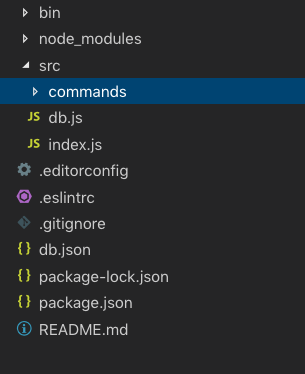
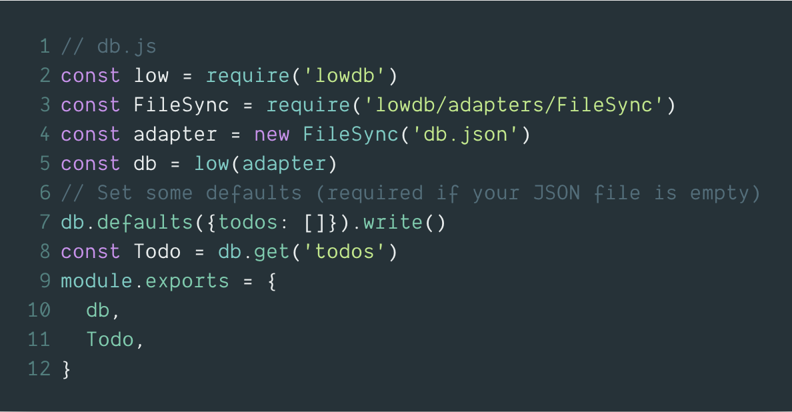
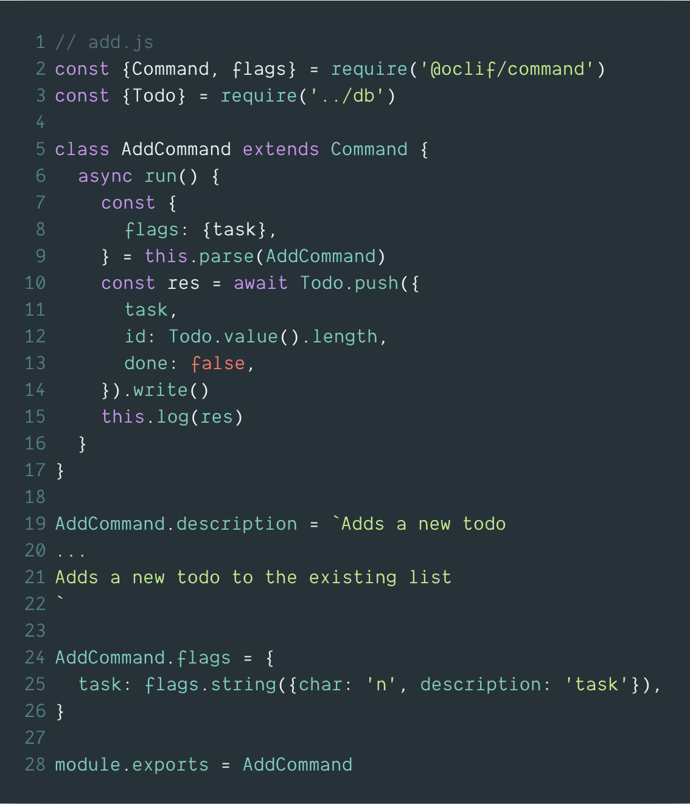
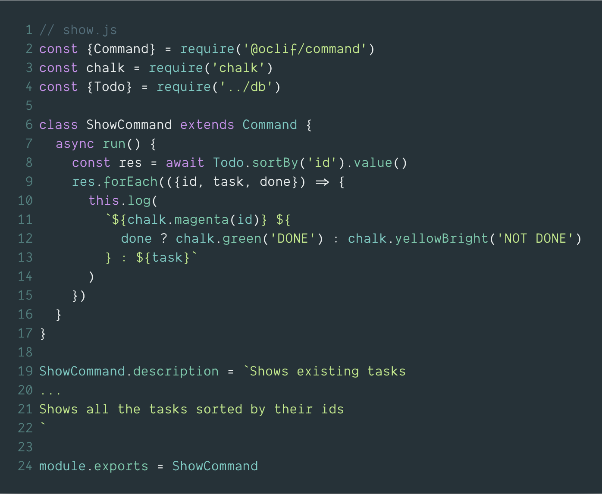
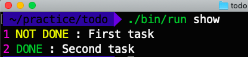
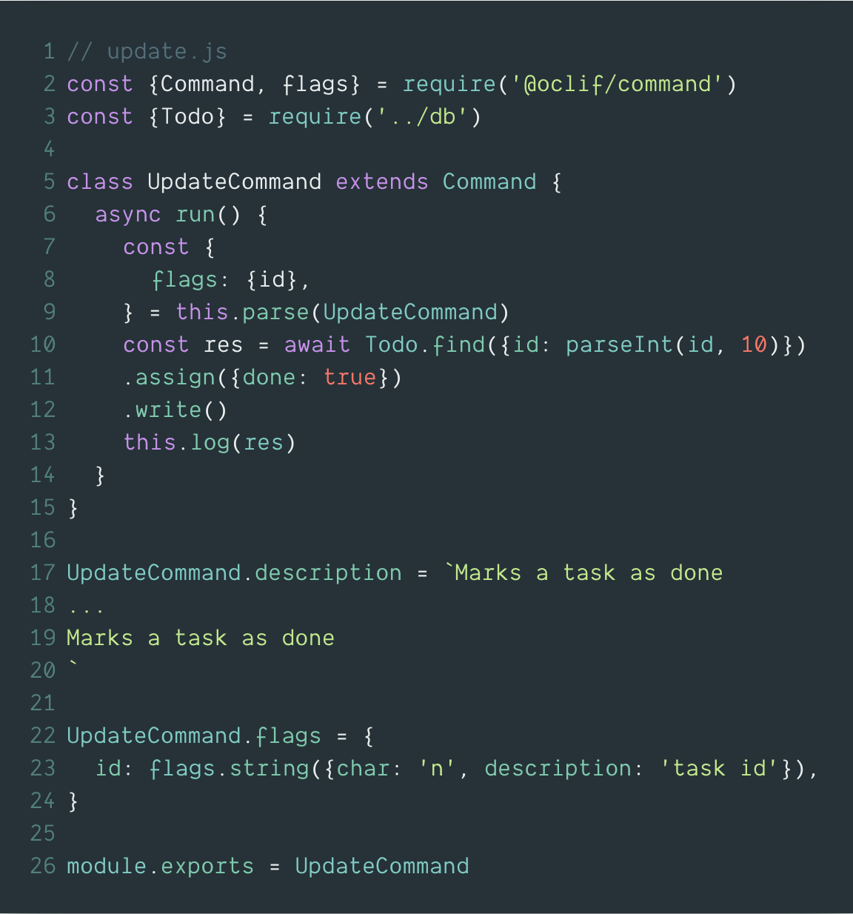
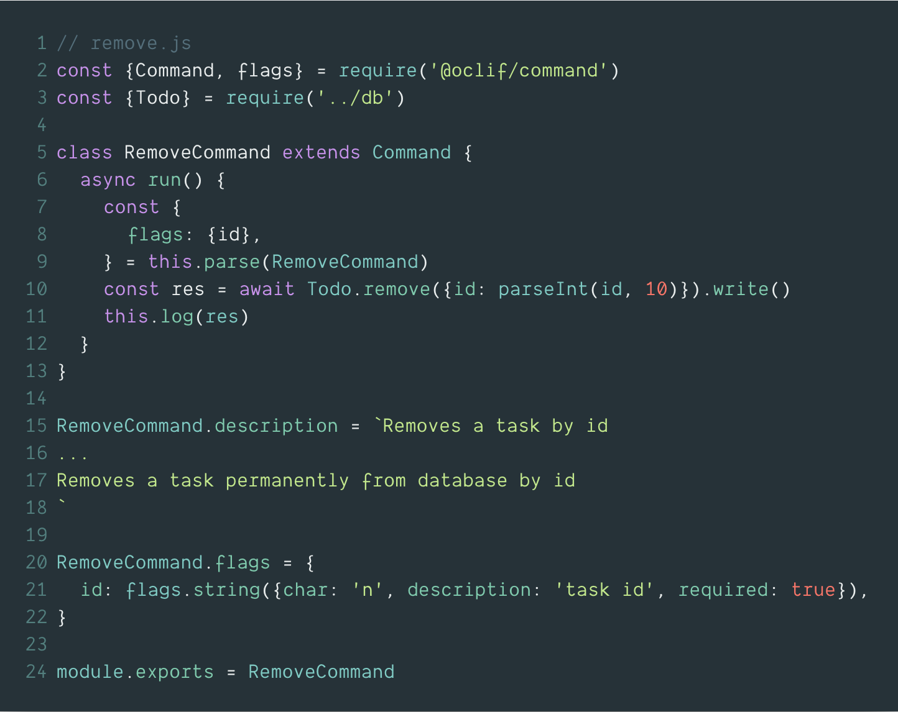

作为开发人员，我们使用CLI工具。 从git到cloud shells - 我们到处都在使用这些工具。 所以，现在是时候做自己的了。 我们将在此过程中使用Heroku的伟大oclif框架。

## 什么是oclif框架？

它是由著名的Heroku提供的一个快速构建CLI工具的开放框架。

## 我们要构建什么？

我们列了四项待办：
- 添加一个任务
- 预览所有任务
- 更新任务
- 移除任务


## 初始化工程

Oclif可以生成两种类型的项目——
1. 具有一个命令的项目。
2. 可能包含多个命令的项目，包括嵌套命令。

在本文中，我们需要一个多命令项目，所以让我们生成它：

```js
npx oclif multi todocli
```

运行此命令并按照说明将初始化当前目录中名为todocli的新项目。

现在，让我们进入目录并运行帮助：

```js
cd todocli && ./bin/run --help
```
打印结果如下：
```js
> USAGE   
    $ todocli [COMMAND]  
  COMMANDS
    hello   
    help   display help for todocli
```
这显示了可用的命令及其文档。



## 项目结构

在src目录中，我们可以找到一个名为commands的目录。 此目录包含所有命令及其相应文件名。例如，如果我们有一个命令hello，我们将在这个目录中有一个名为hello.js的文件，该命令将在没有任何设置的情况下工作。如果我们不需要它，就删除hello.js。

## 设置数据库

要存储我们的任务，我们需要一个存储系统。 为简单起见，我们将使用lowdb这是一个非常简单的json文件存储系统。 Sweet for this project。

我们先安装

```js
npm install lowdb --save
```
让我们在项目根目录中创建一个db.json文件。该文件将保存我们的数据。 然后我们需要安装lowdb。 现在，我们将在src目录中创建一个名为db.js的文件。 这个文件将保存我们的数据库。


在这里，我们首先简单地加载所需的库和文件，然后将一个空的todos数组定义为我们的基本集合（如果你联想一下SQL数据库，那它就类似一个表）。

## 添加任务
oclif为我们提供了平滑的命令生成功能。 让我们运行以下内容：

```js
oclif command add
```
这将在src / commands目录中创建一个名为add.js的文件。 让我们用下面的代码替换该文件的内容：

该文件有几个关键要素：
- 一个执行此命令主要功能的运行函数
- 一份命令的描述文档
- 描述传递给命令的标志
这里，我们有一个名为task的标志，它有一个字符串类型。 我们可以运行命令

```js
./bin/run add --task="welcome task"
```
此命令将向数据库添加任务并打印该操作的响应。

## 展示任务

在show.js中，我们以升序显示所有任务。 我们用chalkjs添加了一点颜色，使我们的命令结果更好看。



## 更新任务


为简单起见，我们现在只是为我们的更新部分设置任务。 我们只是将任务的id作为标志传递。

```js
./bin/run update --id=1
```

这将为id = 1的任务设置done = true。

## 删除任务


删除非常简单：我们将id作为标志传递，然后从数据库中删除相关任务。

## 接近完成了
就这样，我们制作了非常简单的todocli。 现在，如果我们想像使用其他普通的CLI工具一样使用它或让我们的朋友使用它，我们需要把它成为一个npm包，在npm上发布它即可。

## 编译并在npm发布
首先，确保你有一个npm帐户。 然后，您需要运行以下命令登录

```js
npm login
```

然后进入项目目录内运行

```js
npm run prepack
```

这将打包项目，并将通过描述和标志生成readme，然后一切准备就绪。

现在，在npm上发布：

```js
npm publish
```

如果一切顺利，那么该模块已成功发布在npm上。 如果失败，请检查项目名称和版本。
现在，我们可以像使用其他npm工具全局安装使用它。

```js
npm install -g todocli
```

然后任何人都可以随时随地使用这些命令。

```js
> todocli add --task="Great task!!!"
> todocli show
> todocli update --id=1
> todocli remove --id=1
```

感谢阅读我的文章，如果你喜欢请鼓掌，并阅读我的其他文章，如
 [V8 release v7.3](https://fenews.org/posts/V8-release-v7.3/).

原文地址：[https://medium.freecodecamp.org/how-to-build-a-cli-tool-in-nodejs-bc4f67d898ec](https://medium.freecodecamp.org/how-to-build-a-cli-tool-in-nodejs-bc4f67d898ec)

相关文章：
- oclif: https://oclif.io
- lowdb: https://github.com/typicode/lowdb
- chalk: https://github.com/chalk/chalk
- todocli: https://www.npmjs.com/package/todocli-frombd
