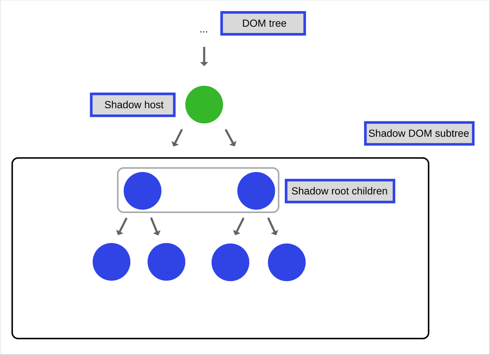
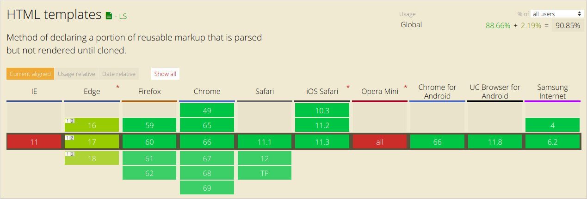
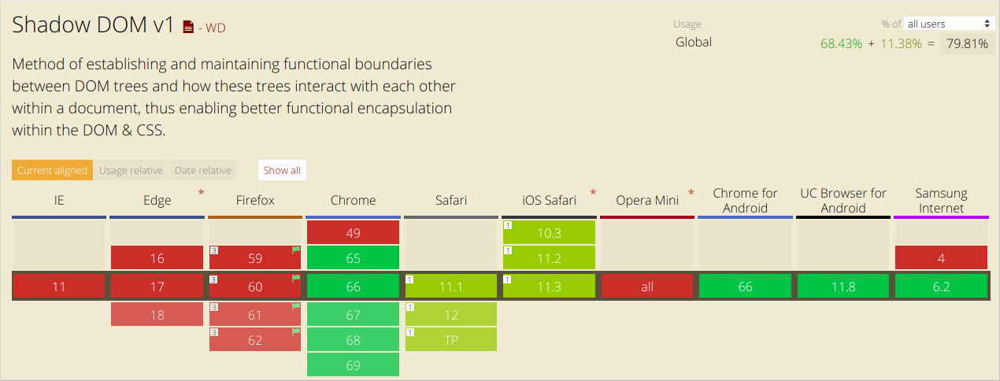

这是专门探索 JavaScript 及其构建组件的系列文章的第 17 篇。在识别和描述核心元素的过程中，我们还分享了构建 [SessionStack](https://www.sessionstack.com/?utm_source=medium&utm_medium=blog&utm_content=js-series-parsing-intro) 时使用的一些经验法则，这是一个 JavaScript 应用程序，需要强大且较高性能，以帮助用户实时查看和重现他们的 Web 应用程序的缺陷。

### 概述

Web Components 是一套不同的技术，允许创你建可重用的自定义元素。它们的功能是隔离其他代码，让你可以在 Web 应用程序中使用它们。

Web Components 有 4 个标准：

- Shadow DOM
- HTML Templates
- Custom elements
- HTML Imports

在本文中，我们将重点关注 **Shadow DOM**。

Shadow DOM 是被设计为用于构建基于组件的应用程序的工具，它为你能遇到的 Web 开发中的常见问题提供了解决方案：

- 隔离 DOM：组件的 DOM 是自包含的（例如，document.querySelector()，不会返回组件的 shadow DOM 中的节点）。这也简化了 Web 应用程序中的 CSS 选择器，因为 DOM 组件是隔离的，它使你能够使用更通用的 id 或者 class 而无需担心命名冲突。
- Scoped CSS：在 shadow DOM 中定义的 CSS 是具有作用域的，样式规则不会泄漏，页面样式不会干扰它。
- Composition：为你的组件设计一个基于标记的声明式 API。

### Shadow DOM

本文假设你已经熟悉 DOM 及其 API 的概念，如果你还不了解 DOM，你可以在这里阅读一篇关于它的详细文章——[https://developer.mozilla.org/en-US/docs/Web/API/Document_Object_Model/Introduction](https://developer.mozilla.org/en-US/docs/Web/API/Document_Object_Model/Introduction)。

除了以下两个不同之处外，Shadow DOM 只是一个普通的 DOM：

- 与你创建和使用 DOM 的方式相比，Shadow DOM 关注的是如何创建以及使用它与页面的其余部分的相关
- 以及 Shadow DOM 与页面其余部分的关系是如何表现的

通常，您创建 DOM 节点并将它们作为子节点添加到另一个元素上。在 shadow DOM 的情况下，你创建一个添加到元素范围的 DOM 树，但它与实际的子元素分开。这个作用域的子树称为 **shadow tree**，它添加的元素是它的 **shadow host**。你添加到 shadow tree 的任何内容都将成为托管元素的本地元素，包括 `<style>` 标签，这就是 shadow DOM 实现 CSS scope 样式的方式。

### 创建 Shadow DOM

**shadow root** 是一个添加到 "host" 元素的文档片段。添加 shadow root 的那一刻并是元素获得 shadow DOM 的时刻，要为元素创建 shadow DOM，请调用 `element.attachShadow()`：

```js
var header = document.createElement("header");
var shadowRoot = header.attachShadow({ mode: "open" });
var paragraphElement = document.createElement("p");

paragraphElement.innerText = "Shadow DOM";
shadowRoot.appendChild(paragraphElement);
```

[specification](http://w3c.github.io/webcomponents/spec/shadow/#h-methods) 文档定义了不能做为 **shadow root** 宿主元素的元素列表。

### Shadow DOM 中的 Composition

Composition 是 Shadow DOM 中最重要的特征之一。

编写 HTML 时，Composition 是构建 Web 应用程序的方式。你可以组合并嵌套不同的元素，例如`<div>`，`<header>`，`<form>` 等，以构建 Web 应用程序所需的 UI，其中一些标签甚至可以互相协作。

Composition 定义了为什么元素（如 `<select>`，`<form>`，`<video>`等）是灵活的，并接受特定的 HTML 元素作为子元素，以便对它们做一些特殊的事情。

例如，`<select>` 知道如何将 `<option>` 元素渲染到具有预定义项的下拉窗口选项中。

Shadow DOM 引入了以下可用于实现 Composition 的功能。

### Light DOM

这是组件用户写入的标记，这个 DOM 位于组件的 shadow DOM 之外，这是元素的实际的子元素。想象一下，你已经创建了一个名为 `<better-button>` 的自定义组件，它扩展了原生 HTML 按钮，你想要在其中添加图像和一些文本。代码如下：

```js
<extended-button>
  <!-- the image and span are extended-button's light DOM -->
  
  <span>Launch</span>
</extended-button>

```

"extended-button" 是你定义的自定义组件，而其中的 HTML 就称为 Light DOM，是由组件的用户添加的。

这里的 Shadow DOM 是你已经创建的组件（"extended-button"）。 Shadow DOM 是组件的基础，它定义了它的内部结构，作用域 CSS，并封装了你的实现细节。

### 扁平的 DOM 树

浏览器将 Light DOM（由用户创建的 DOM）分配到你的 shadow DOM 中，并定义了自定义组件的结果来呈现最终产品。扁平树是你最终在 DevTools 中看到的以及页面上呈现的内容。

```js
<extended-button>
  #shadow-root
  <style>…</style>
  <slot name="image">
    
  </slot>
  <span id="container">
    <slot>
      <span>Launch</span>
    </slot>
  </span>
</extended-button>
```

### 模板

当你必须在网页上重复使用相同的标记结构时，最好使用某种模板而不是一遍又一遍地重复相同的结构。在之前这是可能的，HTML 中的`<template>` 元素（在现代浏览器中得到了很好的支持）使它变得更加容易。此元素及其内容不会在 DOM 中呈现，但仍可使用 JavaScript 来引用它。

让我们看一个简单的例子：

```js
<template id="my-paragraph">
  <p> Paragraph content. </p>
</template>
```

在你使用 JavaScript 引用它之前，它不会出现在你的页面中，然后使用以下内容将其添加到 DOM：

```js
var template = document.getElementById("my-paragraph");
var templateContent = template.content;
document.body.appendChild(templateContent);
```

到目前为止，已经有其他技术可以实现类似的行为，但是，如前所述，将其本身包含在内是非常好的。并且 template 也有相当不错的浏览器支持：



template 本身很有用，但它们使用自定义元素可以更好地工作。我们将在本系列的另一篇文章中讲述自定义元素，暂时你应该知道浏览器中的`customElement` API 允许你使用自定义渲染定义自己的标记。

让我们定义一个 Web 组件，它使用我们的模板作为其 shadow DOM 的内容，我们称之为 `<my-paragraph>`：

```js
customElements.define(
  "my-paragraph",
  class extends HTMLElement {
    constructor() {
      super();

      let template = document.getElementById("my-paragraph");
      let templateContent = template.content;
      const shadowRoot = this.attachShadow({ mode: "open" }).appendChild(
        templateContent.cloneNode(true)
      );
    }
  }
);
```

这里要注意的关键点是我们将模板内容的克隆添加到 shadow root，它是使用 `Node.cloneNode()` 方法创建的。

因为我们将其内容添加到 shadow DOM 中，所以我们可以在模板中的 `<style>` 元素中包含一些样式信息，然后将其封装在自定义元素中。如果我们只是将它添加到标准 DOM 中，这将不起作用。

例如，我们可以将模板更改为以下内容：

```js
<template id="my-paragraph">
  <style>
    p {
      color: white;
      background-color: #666;
      padding: 5px;
    }
  </style>
  <p>Paragraph content. </p>
</template>

```

现在，我们可以像这样使用模板定义的自定义组件：

```js
<my-paragraph />
```

### Slots（插槽）

Template 有一些缺点：主要是静态内容，它不允许渲染我们的变量或者数据，以使其按照你习惯使用的标准 HTML 模板的方式工作。

这就是 `<slot>` 出现的原因。您可以将插槽视为占位符，允许你将自己的 HTML 放在模板中，这允许你创建通用的 HTML 模板，然后通过添加插槽使其可自定义。

让我们看看上面所说的模板与插槽结合的代码是如何的：

```js
<template id="my-paragraph">
  <p>
    <slot name="my-text">Default text</slot>
  </p>
</template>
```

如果在元素包含在标记中时未定义插槽的内容，或者如果浏览器不支持插槽，则 `<my-paragraph>` 将仅包含后备内容“默认文本”。

要定义插槽的内容，我们应该在 `<my-paragraph>` 元素中包含一个 HTML 结构，其中 [slot](https://developer.mozilla.org/en-US/docs/Web/HTML/Global_attributes#attr-slot) 属性的值等于我们希望它填充的插槽的名称。

和以前一样，你可以添加你喜欢的任何东西：

```js
<my-paragraph>
  <span slot="my-text">Let's have some different text!</span>
</my-paragraph>
```

可以插入插槽的元素称为 Slotable，当一个元素插入一个插槽时，它被称为 slotted。

请注意，在上面的示例中，我们插入了一个 `<span>` 元素，它是一个开槽元素。它有一个属性 `slot`，它的值为 "my-text"，它与模板槽定义中 `name` 属性的值相同。

在浏览器中呈现后，上面的代码将创建以下扁平 DOM 树：

```js
<my-paragraph>
  #shadow-root
  <p>
    <slot name="my-text">
      <span slot="my-text">Let's have some different text!</span>
    </slot>
  </p>
</my-paragraph>
```

注意 `＃shadow-root` 元素——它只是 Shadow DOM 存在的指示符。

### Styling

使用 shadow DOM 的组件可以由主页面设置样式，可以定义自己的样式，或者以 CSS 自定义属性的形式提供钩子，以便用户覆盖默认样式。

### 组件定义的样式

Scoped CSS 是 Shadow DOM 的最大特色之一：

- 外部页面中的 CSS 选择器不适用于组件内部。
- 组件内定义的样式不会影响页面的其余部分，它们的范围是主机（host）元素。

Shadow DOM 中使用的 CSS 选择器应用于组件。实际上，这意味着我们可以再次使用常见的 id 或者 class 名称，而不必担心页面上其他地方的冲突，简单的 CSS 选择器意味着更好的性能。

让我们看一下定义了一些样式的 `＃shadow-root`：

```js
#shadow-root
<style>
  #container {
    background: white;
  }
  #container-items {
    display: inline-flex;
  }
</style>

<div id="container"></div>
<div id="container-items"></div>
```

上面示例中的所有样式都是 `＃shadow-root` 的本地样式，你还可以使用 `<link>` 元素在 `＃shadow-root` 中包含样式表，这些样式表也是本地的。

### :host 伪类

:host 允许你选择并设置托管 shadow tree 的元素的样式：

```js
<style>
  :host {
    display: block; /* by default, custom elements are display: inline */
  }
</style>
```

在涉及到以下内容时，你应该注意 `:host` ——父页面中的规则具有比 :host 规则中定义的内容更高的优先级。这允许用户从外部覆盖你的顶级样式。此外，`:host` 仅在 shadow root 的上下文中工作，因此你不能在 Shadow DOM 之外使用它。

函数形式 `:host(<selector>)` 允许你在与 `<selector>` 匹配时定位 host。这是组件封装响应用户交互或状态的行为以及基于 host 设置内部节点样式的好方法：

```js
<style>
  :host {
    opacity: 0.4;
  }

  :host(:hover) {
    opacity: 1;
  }

  :host([disabled]) { /* style when host has disabled attribute. */
    background: grey;
    pointer-events: none;
    opacity: 0.4;
  }

  :host(.pink) > #tabs {
    color: pink; /* color internal #tabs node when host has class="pink". */
  }
</style>
```

### 主题和元素:host-context(<selector>) 伪类

`:host-context(<selector>)` 伪类与 host 元素匹配（如果后者或其任何祖先与 `<selector>` 匹配）。

对此的常见用途是主题，例如，许多人通过将类应用于 `<html>` 或 `<body>` 来进行主题化：

```js
<body class="lightheme">
  <custom-container>…</custom-container>
</body>
```

`:host-context(.lightheme)` 在它是 `.lightheme` 的后代时会设置 `<fancy-tabs>` 的样式：

```js
:host-context(.lightheme) {
  color: black;
  background: white;
}
```

`:host-context()` 可以用于主题，但更好的方法是使用 [CSS 自定义属性创建样式钩子](https://developers.google.com/web/fundamentals/web-components/shadowdom#stylehooks)。

### 从外部设置组件的 host 元素的样式

你可以通过使用它们的标记名称作为选择器从外部设置组件的宿主元素，如下所示：

```js
custom-container {
  color: red;
}
```

#### 外部样式的优先级高于 Shadow DOM 中定义的样式。

例如，如果用户编写选择器：

```js
custom-container {
  width: 500px;
}
```

它将覆盖组件的规则：

```css
:host {
  width: 300px;
}
```

样式化组件本身只会让你到现在这样，但是如果要为组件的内部构造样式会发生什么呢？为此，我们需要 CSS 自定义属性。

### 使用 CSS 自定义属性创建 style hooks

如果组件的作者使用 [CSS custom properties](https://developer.mozilla.org/en-US/docs/Web/CSS/Using_CSS_variables)提供的样式钩子，则用户可以调整内部样式。

这个想法与 `<slot>` 类似，但适用于样式。
我们来看看下面的例子：

```js
<!-- main page -->
<style>
  custom-container {
    margin-bottom: 60px;
     - custom-container-bg: black;
  }
</style>

<custom-container background>…</custom-container>
```

在 Shadow DOM 中：

```css
:host([background]) {
  background: var( - custom-container-bg, #cecece);
  border-radius: 10px;
  padding: 10px;
}
```

在这种情况下，组件将使用黑色作为背景值，因为用户提供了它。否则，它将默认为#CECECE。作为组件作者，你负责让开发人员了解他们可以使用的 CSS 自定义属性并将其视为组件公共接口的一部分。

### Slots JavaScript API

Shadow DOM API 提供了使用插槽的实用程序。

### slotchange 事件

当插槽的分布式节点发生更改时，会切换 slotchange 事件。例如，如果用户从 Light DOM 添加或删除子项。

```js
var slot = this.shadowRoot.querySelector("#some_slot");
slot.addEventListener("slotchange", function(e) {
  console.log("Light DOM change");
});
```

要监视 light DOM 的其他类型的更改，可以在元素的构造函数中使用 `MutationObserver`。我们之前已经讨论过 [MutationObserver 的内部以及如何使用它](https://blog.sessionstack.com/how-javascript-works-tracking-changes-in-the-dom-using-mutationobserver-86adc7446401)。

### assignedNodes() 方法

知道哪些元素与插槽相关联可能很有用，调用 `slot.assignedNodes()` 方法，可以为你提供插槽所呈现的元素。 `{flatten: true}` 选项还将返回插槽的后备内容（如果没有分发节点）。

我们来看下面的例子：

```html
<slot name='slot1'><p>Default content</p></slot>
```

我们假设这是一个名为 `<my-container>` 的组件，让我们来看看这个组件的不同用法以及调 `assignedNodes()` 的结果：

在第一种情况下，将我们自己的内容添加到插槽中：

```html
<my-container>
  <span slot="slot1"> container text </span>
</my-container>
```

调用 `assignedNodes()` 将返回 `[<span slot ="slot1"> container text </span>]`，请注意，结果是一个节点数组。

在第二种情况下，我们将内容留空：

```html
<my-container> </my-container>

```

调用 `assignedNodes()` 的结果将返回一个空数组[]。

但是，如果你为同一元素传递 `{flatten: true}` 参数，则会得到默认内容：`[<p>Default content</p>]`。

此外，要访问插槽内的元素，可以调用 `assignedNodes()` 以查看元素分配给了哪个组件的插槽。

### 事件模型

有趣的是要注意当 Shadow DOM 中发生事件冒泡时会发生什么。

调整事件的目标以维持 Shadow DOM 提供的封装。当事件被重新定位时，它看起来像是来自组件本身，而不是作为组件一部分的 Shadow DOM 中的内部元素。

以下是从 Shadow DOM 中包含的事件列表（有些事件没有）：

* **焦点 事件**：blur, focus, focusin, focusout
* **鼠标事件**：click, dblclick, mousedown, mouseenter, mousemove 等
* **Wheel 事件**：wheel
* **Input 事件**：beforeinput, input
* **键盘事件**：keydown,keyup
* **Composition 事件**：compositionstart, compositionupdate, compositionend
* **拖拽事件**： dragstart, drag, dragend, drop 等

### 自定义事件

默认情况下，自定义事件不会传递到 Shadow DOM 之外。如果想要 dispatch 自定义事件并希望它传递，则需要添加 `bubbles: true` 和 `composition: true` 作为选项。

让我们看看如何 dispatch 这样的事件：

```js
var container = this.shadowRoot.querySelector('#container');
container.dispatchEvent(new Event('containerchanged', {bubbles: true, composed: true}));
```

浏览器支持情况：

要检测 Shadow DOM 是否是受浏览器支持的，请检查是否存在 attachShadow：

```js
const supportsShadowDOMV1 = !!HTMLElement.prototype.attachShadow;
```



通常，Shadow DOM 的行为方式与 DOM 是完全不同的。我们从 SessionStack 库的经验中得到了第一手的例子。我们将库集成到 Web 应用程序中以收集用户事件，网络数据，异常，调试消息，DOM 更改等数据，并将此数据发送到我们的服务器。

之后，我们处理收集的数据，以便你使用 SessionStack 重现产品中发生的问题。

使用 Shadow DOM 产生的困难如下：我们必须监视每个 DOM 的更改，以便以后能够正确地重新放置它。我们通过使用 `MutationObserver` 来做到这一点。但是，Shadow DOM 不会在全局范围内触发 `MutationObserver` 事件，这意味着我们需要以不同方式处理这些组件。

如果你想试试 [SessionStack](https://www.sessionstack.com/solutions/developers/?utm_source=medium&utm_medium=blog&utm_content=shadow-dom)，有一个免费的平台。


参考：

* (https://developer.mozilla.org/en-US/docs/Web/Web_Components/Using_shadow_DOM)[https://developer.mozilla.org/en-US/docs/Web/Web_Components/Using_shadow_DOM]
* (https://developers.google.com/web/fundamentals/web-components/shadowdom)[https://developers.google.com/web/fundamentals/web-components/shadowdom]
* (https://developers.google.com/web/fundamentals/web-components/shadowdom)[https://developers.google.com/web/fundamentals/web-components/shadowdom]
* (https://www.html5rocks.com/en/tutorials/webcomponents/shadowdom-201/#toc-style-host)[https://www.html5rocks.com/en/tutorials/webcomponents/shadowdom-201/#toc-style-host]

原文链接：[https://blog.sessionstack.com/how-javascript-works-the-internals-of-shadow-dom-how-to-build-self-contained-components-244331c4de6e](https://blog.sessionstack.com/how-javascript-works-the-internals-of-shadow-dom-how-to-build-self-contained-components-244331c4de6e)
