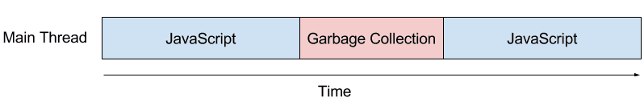
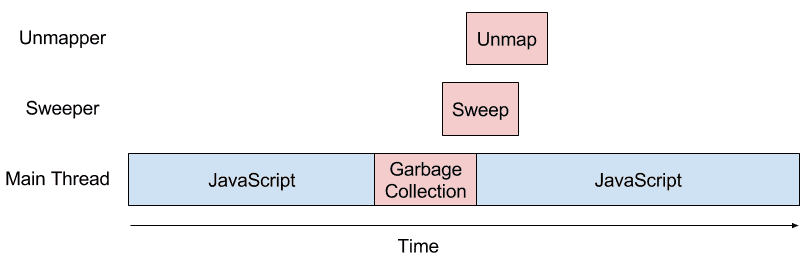

当 Chrome 无法在 16.66ms 内渲染完一帧（破坏了每一秒渲染60帧）时，就会发生页面抖动（Jank），换句话说就是肉眼可见的断断续续。截止现在（译者注：2015年12月30号）V8 垃圾回收的大部分工作是在渲染线程（主线程）执行的，请参看图一，通常有很多对象需要维护的时候就会发生页面抖动。消除页面抖动一直是 V8 团队的重中之重([1](https://blog.chromium.org/2011/11/game-changer-for-interactive.html),[2](https://www.youtube.com/watch?v=3vPOlGRH6zk),[3](https://v8.dev/blog/free-garbage-collection))。在本文中我们会讨论 M41 到 M46 之间所做的一些优化。这些优化显著的减少了垃圾回收导致的主线程挂起，从而带来了更好的用户体验。

> 图一：垃圾回收工作在主线程执行

垃圾收集过程中页面抖动的主要原因是处理各种簿记（bookkeeping）数据结构。许多这样的数据结构启用了和垃圾回收无关的优化。两个例子分别是所有 ArrayBuffer 的列表和每个 ArrayBuffer 的视图列表。这些列表高效的实现了 DetachArrayBuffer 这一操作，而不会对 ArrayBuffer 的视图层造成任何的性能损失。但是在有些情况下页面会创建数百万个 ArrayBuffer， 比如基于 WebGL 的游戏，在垃圾回收期间更新这些 ArrayBuffer 的列表会导致严重的抖动。在 M46 中，我们删除这些列表，并通过插入检查来检测分离缓冲区（detached buffers），在垃圾回收的时候，这种方式分摊了处理大量簿记（bookkeeping）数据结构列表的成本，在程序执行过程中分散处理可以减少抖动。虽然理论上来说每次访问检查会降低大量使用 ArrayBuffer 的程序的吞吐量，事实上 V8 的优化编译器通常可以删除多余的检查，并将剩余的检查从循环中提升出来，可以更加平滑的执行 profile， 只有一点或者没有整体上的性能损失。

抖动的另一个原因是追踪 Chrome 和 V8 之间的共享对象的生命周期相关联的簿记（bookkeeping）。虽然 Chrome 和 V8 的堆内存是不同的，但是 Chrome 和 V8 必须针对某些内存进行同步，比如 DOM 节点，虽然是在 Chrome 的 C++ 代码中实现，但是可以在 JavaScript 中访问。V8 创建了一个名为句柄的不透明数据类型，允许 Chrome 在不知道任何实现细节的情况下操作 V8 的堆对象。对象的生命周期和句柄绑定：只要 Chrome 保留了句柄，V8 的垃圾回收器就不会回收该对象。V8 为每一个通过 V8 的 API 传递回的 Chrome 句柄，创建了一个名为全局引用的内部数据结构，这些全局引用会告诉V8的垃圾回收器这个对象是一个活动对象。对于基于 WebGL 的游戏来说， Chrome 可能会创建数百万个此类句柄，而 V8 反过来需要创建相应的全局引用来管理其生命周期。在主垃圾回收暂停中处理这些数量巨大的全局引用可以看到很明显的抖动。幸运的是，传递给 WebGL 的对象通常只是传递并不会被实际的修改，从而实现简单的静态[逃逸分析](https://en.wikipedia.org/wiki/Escape_analysis)（static escape analysis）。本质上，对于 WebGL 的函数来说，通常接收小的数组作为参数，将基础数据复制到栈中，让全局引用过时。这种混合方式将重渲染（rendering-heavy）的 WebGL 游戏的暂停时间减少 50%，

V8 中大多数的垃圾收集工作都是在主线程上执行。将垃圾收集的工作移动到并发线程上，减少了垃圾收集器的等待时间并进一步减少了抖动。这本身就是一项复杂的工作，因为 JavaScript 应用和垃圾回收器可能在同一时间观察和修改同一个对象。到目前为止，并发垃圾回收只清理老生代 JavaScript 堆中的常规对象。最近，我们还实现了 V8 堆中对 code space 和 map space 的并发清理。此外，为了减少垃圾回收在主线程上的工作，我们还实现了对未使用内存页的并发取消映射（concurrent unmapping），参见图2。

> 图2：对并发垃垃圾回收线程执行的一些垃圾收集操作。

在基于 WebGL 的游戏中，以上所讨论的优化的效果是清晰可见的，比如 Turbolenz 的在线演示。下面的👇视频对比了在 Chrome 41 和 Chrome 46 中的效果。

  <iframe width="100%" height="360px" frameborder=0 src="https://v.qq.com/iframe/player.html?vid=f0844w6xtya&tiny=0&auto=0" allowfullscreen=""></iframe>

我们目前正在实现更多的垃圾回收组件：增量垃圾回收，并发垃圾回收，和并行垃圾回收，为了进一步减少主线程在垃圾回收时的暂停时间。敬请关注我们在工作流中的一些有趣的补丁。

原文地址：[https://v8.dev/blog/jank-busters](https://v8.dev/blog/jank-busters)