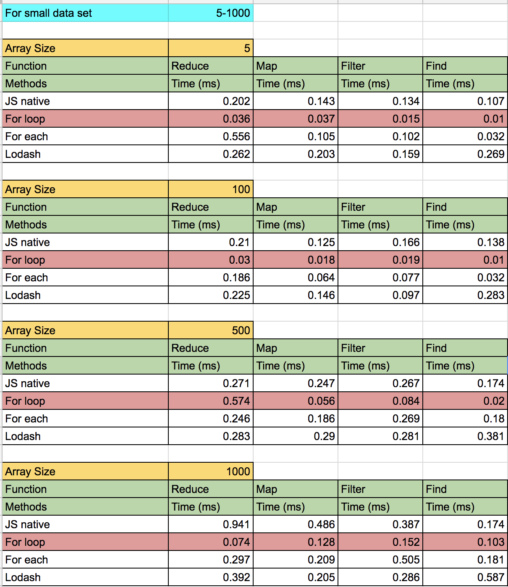
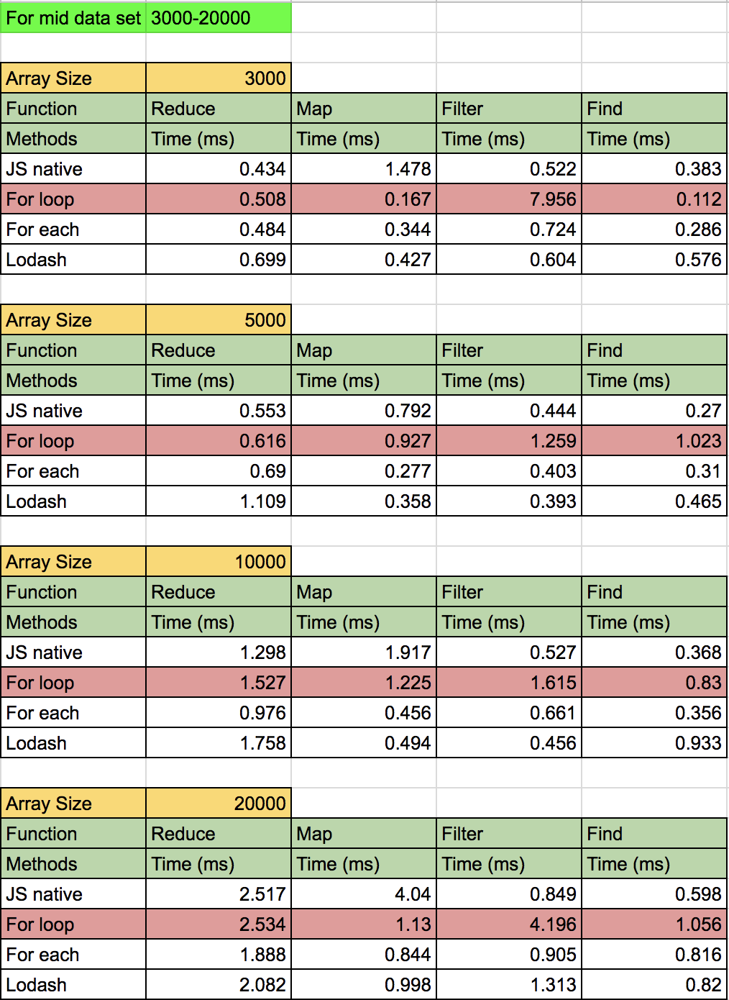
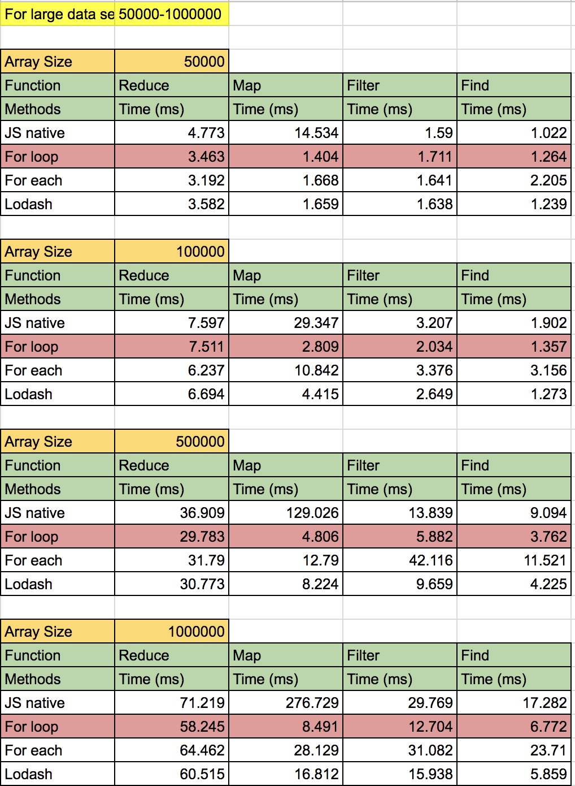

我们都知道 for 循环比 forEach 或者 JavaScript 函数都要快，因为在 js 函数里面可能会使用 for 循环或者其他我不确定的东西。 我用一个对象数组做了一个简单的测试，并通过 for 循环 / forEach / JavaScript 函数执行了一些操作，并观察了执行所需的时间。

> 这些结果来自一些小示例，并且可能根据所执行的操作、选择的执行环境和选择的 `VM` 而有所不同。

## 1. reduce 、for 循环、forEach 对比 
```js
// 计算upVotes的和
const posts = [ 
  {id: 1, upVotes: 2},
  {id: 2, upVotes: 18}, 
  {id: 3, upVotes: 1}, 
  {id: 4, upVotes: 30}, 
  {id: 5, upVotes: 50} 
];
let sum = 0;
console.time('reduce');
sum = posts.reduce((s, p)=> s+=p.upVotes,0);
console.timeEnd('reduce') 
sum = 0;
console.time('for 循环');
for(let i=0; i<posts.length; i++) {
    sum += posts[i].upVotes;
}
console.timeEnd('for 循环');
sum = 0;
console.time('for each');
posts.forEach(element => {
    sum += element.upVotes;
});
console.timeEnd('for each');
```

注意：以下是结果列表,代码可以在[这里](https://github.com/dg92/Performance-Analysis-JS)找到
```js
//以下为本机chrome结果
//reduce: 0.05322265625ms
//for 循环: 0.0390625ms
//for each: 0.048095703125ms
```

所有的结果都清楚地表明 for 循环比 `map / reduce / filter / find` 更加快。

`map / reduce / filter / find` 由于许多原因而变慢，其中一些原因是
1. 它们有一个回调要执行，因而作为一个开销
1. js函数会考虑很多角落情况，比如 `getter`、稀疏数组和检查传递的参数是否是数组，这些都会增加开销

> 我找到了一个依赖 [lib](https://github.com/codemix/fast.js/tree/master)，重新实现了几个常见的内置原生 JavaScript 函数

但是，使用的选择不仅仅取决于性能，还有更多的因素需要考虑，其中一些是:
1. 代码的可读性和可维护性
1. 简化代码
1. 快速编码
1. 实现与优化
1. 个人选择

就我个人而言，我喜欢 `map, reduce, filter, find` ，我使用它们很长时间了。 它们帮助我代码写的整洁、精确、快速，并且符合我的思路。 当我别无选择时，我会使用 for 循环。 就优化而言，使用 `map / reduce / filter / find` 应该最后考虑或者选择不使用，具体取决于所需的优化级别。

>  注意: 如果您使用 for 循环，总是以惯用方式使用它们，因为编译器现在足够智能，可以正确地优化惯用的循环

更新: 在[这里](https://github.com/dg92/Performance-Analysis-JS)你可以找到大数据集和海量计算的结果。

数组大小为 5-1000 的小数据集的结果


数组大小为 3000-20000 的中间数据集的结果


数组大小为 50000-1000000 的大数据集的结果


注意：
1. 这些结果是使用 Node V8 v5.8.283.41计算出来的
1. 这些结果没有考虑 JIT、内联缓存、隐藏类、失效、垃圾收集、伪装等等
1. 结果可能因环境不同而有所不同
1. 上面图片中的红色高光仅供参考，很快就会改变

如果你喜欢这篇文章，请推荐和分享，帮助别人找到它

原文地址：[https://hackernoon.com/javascript-performance-test-for-vs-for-each-vs-map-reduce-filter-find-32c1113f19d7](https://hackernoon.com/javascript-performance-test-for-vs-for-each-vs-map-reduce-filter-find-32c1113f19d7)