> Kubernetes 是用来编排容器化应用的。Docker 是比较优秀的容器。当你需要在多台机器上运行应用并且需要进行缩放扩展和分配负载等操作，你就需要 Kubernetes 。

因为这个主题比较大，所以这篇文章只是 Kubernetes 系列文章的第一部分。
- 第一部分 - 作为入门，我们将介绍基础概念、部署和 Minikube（这部分正是我们这篇文章要讲的）。
- 第二部分介绍服务（Services）和标签（Labeling），深入 Pods 和 Nodes 。
- 第三部分我们将介绍对应用进行缩放。
- 第四部分 - 自动缩放，这部分我们关注如何设置自动缩放用来处理突然增长的请求。

这本，我希望可以覆盖下面的内容：
- 为什么 Kubernetes 和容器编排如此广泛。
- 入门：Minikube 基础，讲解 Minikube，简单的部署例子
- Deployments 是什么和部署应用

# 为什么需要编排
一切都开始于容器。容器给予我们创建可复制环境的能力，所以可以让 dev、staging、和 prod 等不同环境都以同样的方式查看和运行。我们获得了可预测性，并且他们从主机操作系统中获取资源时也很轻量级。对于开发和运维来说这是一个绝大的突破性进展，但是容器的 API 只在同时管理少量容器时好用。大型系统可能由成百上千个容器组成，同样需要我们做调度、负载均衡、分配等。

# 资源
- [Kubernetes.io](https://kubernetes.io/) 最好的 Kubernetes 学习资源就是 Google 官方的 Kubernetes 网站
- [Kubernetes overview](https://azure.microsoft.com/en-gb/topic/what-is-kubernetes/?wt.mc_id=devto-blog-chnoring) Kubernetes 组成和如何工作的概览
- [Free Azure Account](https://azure.microsoft.com/en-gb/free/?wt.mc_id=devto-blog-chnoring) If you want to try out AKS, Azure Kubernetes Service, you will need a free Azure account
- [Kubernetes in the Cloud](https://azure.microsoft.com/en-gb/services/kubernetes-service/?wt.mc_id=devto-blog-chnoring) Do you feel you know everything about Kubernetes already and just want to learn how to use a managed service? Then this link is for you
- [Documentation on AKS, Azure Kubernetes Service](https://docs.microsoft.com/en-gb/azure/aks/?wt.mc_id=devto-blog-chnoring) Azure Kubernetes Service, a managed Kubernetes
- [Best practices on AKS](https://docs.microsoft.com/en-us/azure/aks/best-practices?wt.mc_id=devto-blog-chnoring) You already know AKS and want to learn how to use it better?

# Kubernetes 
那么我们对 Kubernetes 了解多少呢？
> 它是一个开源系统，用于自动化容器化应用程序的部署，扩展和管理

让我们从它的名字开始。这是赫尔曼(Helmsman)的希腊语：驾驶这艘船的人。这也是为什么它的 logo 是一个船的方向盘：

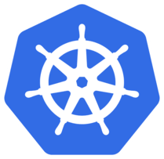

Kubernetes 也被叫做 K8s，***K ubernete s*** 中间8个字母省略。现在你可以和你的朋友吹你知道为什么它被叫做 K8 了。

这里有关于它起源的知识。K8s 诞生于叫做 Borg 和 Omega 的系统。2014 年它被捐献给 CNCF (Cloud Native Computing Foundation)，云原生计算基金。它使用 Go/Golang 写的。

如果我们看到所有这些琐碎的知识，由 Google 通过他们处理大量容器的经验所建立。而且它是开源和经过实战测试的，可以处理真正的大型系统，如行星级大型系统。

所以它的销售宣传是：
> 运行数十亿容器一个礼拜，Kubernetes 可以缩放而不需要增加运维团队人数。

听起来很棒，我们都能达到 Google 数十亿容器的大小？不，即使你只有 10 到 100 个容器，它也适合你。

# 开始实践

ok，让我们说下如何开始？
> 已经急不可耐了，当然我们将从 Minikube 开始做一些实用的事情
听起来不错，我是一个码农，我喜欢实用的好东西。什么是 Minikube 呢？
> Minikube 是一个工具可以让我们在本地运行 K8s
噢，数十亿容器在我的小机器上？
> 当然不是，让我们从少量容器开始学习 Kubernetes 基础。

## 安装

To install Minikube lets go to this [installation page](https://kubernetes.io/docs/tasks/tools/install-minikube/)

It's just a few short steps that means we install

- a Hypervisor
- Kubectl (Kube control tool)
- Minikube

通过[安装页面](https://kubernetes.io/docs/tasks/tools/install-minikube/) 安装 Minikube。

只需要几个简单的安装步骤：
- Hypervisor
- Kubectrl
- Minikube

## 运行

我们从下面的命令开始:

```bash
minikube start
```

运行的结果看起来像这样:

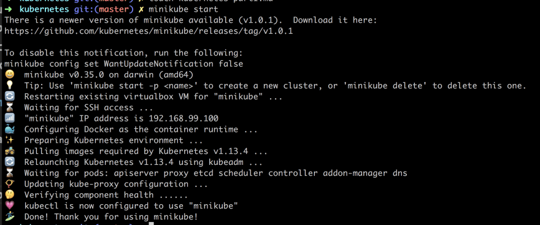

你可以通过下面的命令确保 kubectl 已经正确安装：

```bash
kubectl version
```

运行结果如下:

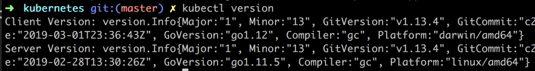

Ok, 我们可以开始学习 Kubernetes 了。

##  学习 kubectl 和基础概念

In learning Kubernetes lets do so by learning more about kubectl a command line program that lets us interact with our Cluster and lets us deploy and manage applications on said Cluster.

在开始学习 Kubernetes 之前，我们先学习如果使用它的命令行工具 `kubectl` 来操作集群，下面我将开始在集群上部署和管理应用程序。

集群指的是在 Kubernetes 上下文中一组相似的东西，它由一个主服务器（Master）和若干称作节点（Nodes）的工作机器组成。节点也曾被称作小黄人（Minions）。


主服务器决定在节点上运行什么，包括预定工作负载或容器化应用程序等。 这将我们带到下一个命令：

```bash
kubectl get nodes
```

结果如下:

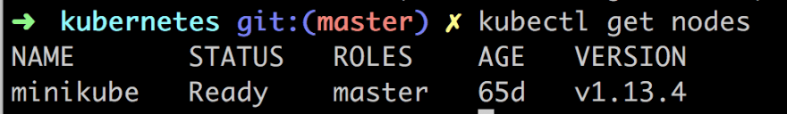

这告诉了我们那些节点可以工作。

接下来让我们在 Kubernetes 上运行第一个应用：

```bash
kubectl run kubernetes-first-app --image=gcr.io/google-samples/kubernetes-bootcamp:v1 --port=8080
```

它将得到如下结果:


然后我们可以通过下面的命令查看运行结果:

```bash
kubectl get deployments
```

我们将得到下面的结果: 

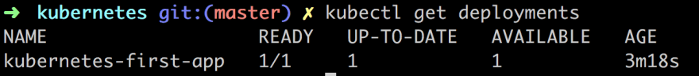
  
在将我们的应用通过命令部署到集群上的过程，Kubernetes 在幕后执行了一些我们看不到的操作：
- **查找**适合应用实例运行的节点，因为这里只有一个节点所以直接会被选中
- **安排**应用实例在节点上运行
- **配置**集群在需要的重新安排实例到新的节点
  
Next up we are going to introduce the concept Pod, so what is a Pod?

A Pod is the smallest deployable unit and consists of one or many containers, for example, Docker containers. That's all we are going to say about Pods at the moment but if you really really want to know more have a read [here](https://kubernetes.io/docs/concepts/workloads/pods/pod/)

The reason for mentioning Pods at this point is that our container and app is placed inside of a Pod. Furthermore, Pods runs in a private isolated network that, although visible from other Pods and services, it cannot be accessed outside the network. Which means we can't reach our app with say a curl command.

We can change that though. There is more than one way to expose our application to the outside world for now however we will use a proxy.

Now open up a 2nd terminal window and type:

```bash
kubectl proxy
```

This will expose the kubectl as an API that we can query with HTTP request. The result should look like:


Instead of typing `kubectl version` we can now type `curl http://localhost:8001/version` and get the same results:

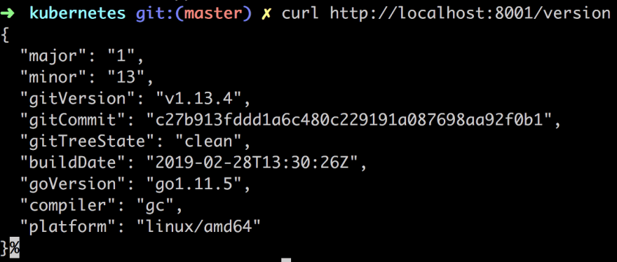

The API Server inside of Kubernetes have created an endpoint for each pod by its pod name. So the next step is to find out the pod name:

```bash
kubectl get pods
```

This will list all the pods you have, it should just be one pod at this point and look something like this:

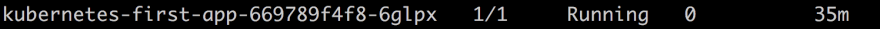

Then you can just save that down to a variable like so:

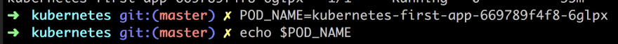

Lastly, we can now do an HTTP call to learn more about our pod:

```bash
curl http://localhost:8001/api/v1/namespaces/default/pods/$POD_NAME
```

This will give us a long JSON response back (I trimmed it a bit but it goes on and on...)

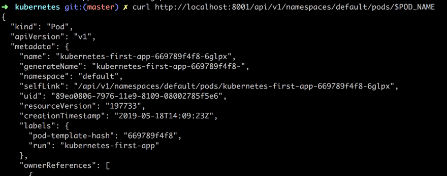

Maybe that's not super interesting for us as app developers. We want to know how our app is doing. Best way to know that is looking at the logs. Let's do that with this command:

```bash
kubectl logs $POD_NAME
```

As you can see below we know get logs from our app:

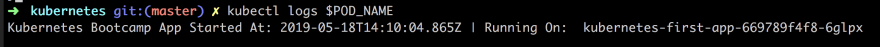

Now that we know the Pods name we can do all sorts of things like checking its environment variables or even step inside the container and look at the content.

```bash
kubectl exec $POD_NAME env
```

This yields the following result:


Now lets step inside the container:

```bash
kubectl exec -ti $POD_NAME bash
```

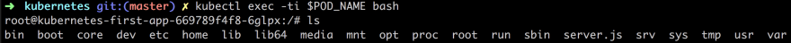

We are inside! This means we can see what the source code looks like even:

```bash
cat server.js
```

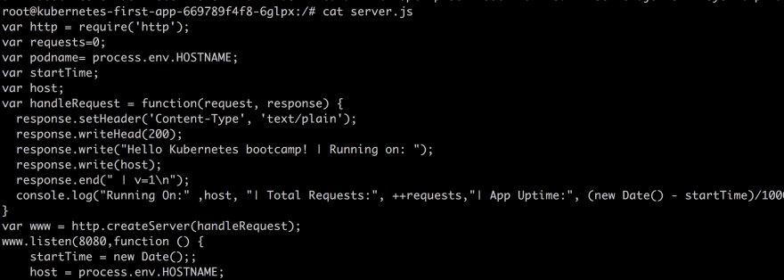

Inside of our container, we can now reach the running app by typing:

```bash
curl http://localhost:8080
```

# Summary

This is where we will stop for now.
What did we actually learn?

- Kubernetes, its origin what it is
- Orchestration why you will soon need it
- Concepts like Master, Nodes and Pods
- Minikube, kubectl and how to deploy an image onto our Cluster

Feel like you have a ton more to learn? You're right this is a big topic.

I hope you follow along on the next upcoming parts where we will learn more about Nodes, Pods, Services, Scaling, Updating and eventually how to use a managed service in the Cloud.


原文链接: https://dev.to/azure/kubernetes-from-the-beginning-part-i-4ifd