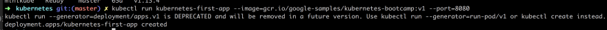

> Kubernetes is about orchestrating containerized apps. Docker is great for your first few containers. As soon as you need to run on multiple machines and need to scale/up down and distribute the load and so on, you need an orchestrator - you need Kubernetes

This is the first part of a series of articles on Kubernetes, cause this topic is BIG!.

- Part I - from the beginning, Part I, Basics, Deployment and Minikube we are here
- Part II introducing Services and Labeling In this part, we deepen our knowledge of Pods and Nodes. We also introduce Services and labeling using labels to query our artifacts.
- Part III Scaling Here we cover how to scale our app
- Part IV - Auto scaling In this part we look at how to set up auto-scaling so we can handle sudden large increases of incoming requests

In this part I hope to cover the following:

- Why Kubernetes and Orchestration in General
- Hello world: Minikube basics, talking through Minikube, simple deploy example
- Cluster and basic commands, Nodes, 
- Deployments, what it is and deploying an app
- Pods and Nodes, explain concepts and troubleshooting

#  Why Orchestration
Well, it all started with containers. Containers gave us the ability to create repeatable environments so dev, staging, and prod all looked and functioned the same way. We got predictability and they were also light-weight as they drew resources from the host operating system. Such a great breakthrough for Developers and Ops but the Container API is really only good for managing a few containers at a time. Larger systems might consist of 100s or 1000+ containers and needs to be managed as well so we can do things like scheduling, load balancing, distribution and more.

At this point, we need orchestration the ability for a system to handle all these container instances. This is where Kubernetes comes in.

# Resources
- [Kubernetes.io](https://kubernetes.io/) One of the best resources to learn about Kubernetes is at this official Kubernetes site by Google.
- [Kubernetes overview](https://azure.microsoft.com/en-gb/topic/what-is-kubernetes/?wt.mc_id=devto-blog-chnoring) An overview on Kubernetes, all its parts and how it works
- [Free Azure Account](https://azure.microsoft.com/en-gb/free/?wt.mc_id=devto-blog-chnoring) If you want to try out AKS, Azure Kubernetes Service, you will need a free Azure account
- [Kubernetes in the Cloud](https://azure.microsoft.com/en-gb/services/kubernetes-service/?wt.mc_id=devto-blog-chnoring) Do you feel you know everything about Kubernetes already and just want to learn how to use a managed service? Then this link is for you
- [Documentation on AKS, Azure Kubernetes Service](https://docs.microsoft.com/en-gb/azure/aks/?wt.mc_id=devto-blog-chnoring) Azure Kubernetes Service, a managed Kubernetes
- [Best practices on AKS](https://docs.microsoft.com/en-us/azure/aks/best-practices?wt.mc_id=devto-blog-chnoring) You already know AKS and want to learn how to use it better?

# Kubernetes 
So what do we know about Kubernetes?

> It's an open-source system for automating deployment, scaling, and management of containerized applications

Let'start with the name. It's Greek for Helmsman, the person who steers the ship. Which is why the logo looks like this, a steering wheel on a boat:


It's Also called K8s so K ubernete s, 8 characters in the middle are removed. Now you can impress your friends that you know why it's referred to as K8.

Here is some more Jeopardy knowledge on its origin. Kubernetes was born out of systems called Borg and Omega. It was donated to CNCF, Cloud Native Computing Foundation in 2014. It's written in Go/Golang.

If we see past all this trivia knowledge, it was built by Google as a response to their own experience handling a ton of containers. It's also Open Source and battle-tested to handle really large systems, like planet-scale large systems.

So the sales pitch is:

> Run billions of containers a week, Kubernetes can scale without increasing your ops team

Sounds amazing right, billions of containers cause we are all Google size. No? :) Well even if you have something like 10-100 containers, it's for you.

#  Getting started

Ok ok, let's say I buy into all of this, how do I get started?

> Impatient ey, sure let's start to do something practical with Minikube

Ok, sounds good I'm a coder, I like practical stuff. What is Minikube?

> Minikube is a tool that lets us run Kubernetes locally

Oh, sweet, millions of containers on my little machine?

> Well, no, let's start with a few and learn Kubernetes basics while at it.

## Installation

To install Minikube lets go to this [installation page](https://kubernetes.io/docs/tasks/tools/install-minikube/)

It's just a few short steps that means we install

- a Hypervisor
- Kubectl (Kube control tool)
- Minikube

## Run

Get that thing up and running by typing:

```bash
minikube start
```

It should look something like this:


You can also ensure that kubectl have been correctly installed and running:

```bash
kubectl version
```

Should give you something like this in response:


Ok, now we are ready to learn Kubernetes.

##  Learning kubectl and basic concepts

In learning Kubernetes lets do so by learning more about kubectl a command line program that lets us interact with our Cluster and lets us deploy and manage applications on said Cluster.

The word Cluster just means a group of similar things but in the context of Kubernetes, it means a Master and multiple worker machines called Nodes. Nodes were historically called Minions 


, but not so anymore.

The master decides what will run on the Nodes, which includes things like scheduled workloads or containerized apps. Which brings us to our next command:

```bash
kubectl get nodes
```

This should give us a result like this:


What this tells us what Nodes we have available to do work.

Next up let's try to run our first app on Kubernetes with the run command like so:

```bash
kubectl run kubernetes-first-app --image=gcr.io/google-samples/kubernetes-bootcamp:v1 --port=8080
```

This should give us a response like so:



Next up lets check that everything is up and running with the command:

```bash
kubectl get deployments
```

This shows the following in the terminal: 


In putting our app on the Kluster, by invoking the run command, Kubernetes performed a few things behind the scenes, it:

- **searched** for a suitable node where an instance of the application could be run, there was only one node so it got chosen
- **scheduled** the application to run on that Node
- **configured** the cluster to reschedule the instance on a new Node when needed
Next up we are going to introduce the concept Pod, so what is a Pod?

A Pod is the smallest deployable unit and consists of one or many containers, for example, Docker containers. That's all we are going to say about Pods at the moment but if you really really want to know more have a read [here](https://kubernetes.io/docs/concepts/workloads/pods/pod/)

The reason for mentioning Pods at this point is that our container and app is placed inside of a Pod. Furthermore, Pods runs in a private isolated network that, although visible from other Pods and services, it cannot be accessed outside the network. Which means we can't reach our app with say a curl command.

We can change that though. There is more than one way to expose our application to the outside world for now however we will use a proxy.

Now open up a 2nd terminal window and type:

```bash
kubectl proxy
```

This will expose the kubectl as an API that we can query with HTTP request. The result should look like:


Instead of typing `kubectl version` we can now type `curl http://localhost:8001/version` and get the same results:


The API Server inside of Kubernetes have created an endpoint for each pod by its pod name. So the next step is to find out the pod name:

```bash
kubectl get pods
```

This will list all the pods you have, it should just be one pod at this point and look something like this:


Then you can just save that down to a variable like so:


Lastly, we can now do an HTTP call to learn more about our pod:

```bash
curl http://localhost:8001/api/v1/namespaces/default/pods/$POD_NAME
```

This will give us a long JSON response back (I trimmed it a bit but it goes on and on...)


Maybe that's not super interesting for us as app developers. We want to know how our app is doing. Best way to know that is looking at the logs. Let's do that with this command:

```bash
kubectl logs $POD_NAME
```

As you can see below we know get logs from our app:


Now that we know the Pods name we can do all sorts of things like checking its environment variables or even step inside the container and look at the content.

```bash
kubectl exec $POD_NAME env
```

This yields the following result:


Now lets step inside the container:

```bash
kubectl exec -ti $POD_NAME bash
```


We are inside! This means we can see what the source code looks like even:

```bash
cat server.js
```


Inside of our container, we can now reach the running app by typing:

```bash
curl http://localhost:8080
```

# Summary

This is where we will stop for now.
What did we actually learn?

- Kubernetes, its origin what it is
- Orchestration why you will soon need it
- Concepts like Master, Nodes and Pods
- Minikube, kubectl and how to deploy an image onto our Cluster

Feel like you have a ton more to learn? You're right this is a big topic.

I hope you follow along on the next upcoming parts where we will learn more about Nodes, Pods, Services, Scaling, Updating and eventually how to use a managed service in the Cloud.


原文链接: https://dev.to/azure/kubernetes-from-the-beginning-part-i-4ifd