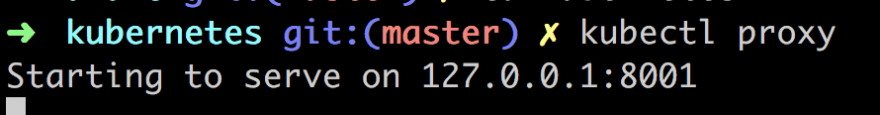

> Kubernetes 是用来编排容器化应用的。Docker 是比较优秀的容器。当你需要在多台机器上运行应用并且需要进行缩放扩展和分配负载等操作，你就需要 Kubernetes 。

因为这个主题比较大，所以这篇文章只是 Kubernetes 系列文章的第一部分。
- 第一部分 - 作为入门，我们将介绍基础概念、部署和 Minikube（这部分正是我们这篇文章要讲的）。
- 第二部分介绍服务（Services）和标签（Labeling），深入 Pods 和 Nodes 。
- 第三部分我们将介绍对应用进行缩放。
- 第四部分 - 自动缩放，这部分我们关注如何设置自动缩放用来处理突然增长的请求。

这本，我希望可以覆盖下面的内容：
- 为什么 Kubernetes 和容器编排如此广泛。
- 入门：Minikube 基础，讲解 Minikube，简单的部署例子
- Deployments 是什么和部署应用

# 为什么需要编排
一切都开始于容器。容器给予我们创建可复制环境的能力，所以可以让 dev、staging、和 prod 等不同环境都以同样的方式查看和运行。我们获得了可预测性，并且他们从主机操作系统中获取资源时也很轻量级。对于开发和运维来说这是一个绝大的突破性进展，但是容器的 API 只在同时管理少量容器时好用。大型系统可能由成百上千个容器组成，同样需要我们做调度、负载均衡、分配等。

# Kubernetes 
那么我们对 Kubernetes 了解多少呢？
> 它是一个开源系统，用于自动化容器化应用程序的部署，扩展和管理

让我们从它的名字开始。这是赫尔曼(Helmsman)的希腊语：驾驶这艘船的人。这也是为什么它的 logo 是一个船的方向盘：


Kubernetes 也被叫做 K8s，***K ubernete s*** 中间8个字母省略。现在你可以和你的朋友吹你知道为什么它被叫做 K8 了。

这里有关于它起源的知识。K8s 诞生于叫做 Borg 和 Omega 的系统。2014 年它被捐献给 CNCF (Cloud Native Computing Foundation)，云原生计算基金。它使用 Go/Golang 写的。

如果我们看到所有这些琐碎的知识，由 Google 通过他们处理大量容器的经验所建立。而且它是开源和经过实战测试的，可以处理真正的大型系统，如行星级大型系统。

所以它的销售宣传是：
> 运行数十亿容器一个礼拜，Kubernetes 可以缩放而不需要增加运维团队人数。

听起来很棒，我们都能达到 Google 数十亿容器的大小？不，即使你只有 10 到 100 个容器，它也适合你。

# 开始实践

ok，让我们说下如何开始？
> 已经急不可耐了，当然我们将从 Minikube 开始做一些实用的事情
听起来不错，我是一个码农，我喜欢实用的好东西。什么是 Minikube 呢？
> Minikube 是一个工具可以让我们在本地运行 K8s
噢，数十亿容器在我的小机器上？
> 当然不是，让我们从少量容器开始学习 Kubernetes 基础。

## 安装

To install Minikube lets go to this [installation page](https://kubernetes.io/docs/tasks/tools/install-minikube/)

It's just a few short steps that means we install

- a Hypervisor
- Kubectl (Kube control tool)
- Minikube

通过[安装页面](https://kubernetes.io/docs/tasks/tools/install-minikube/) 安装 Minikube。

只需要几个简单的安装步骤：
- Hypervisor
- Kubectrl
- Minikube

## 运行

我们从下面的命令开始:

```bash
minikube start
```

运行的结果看起来像这样:


你可以通过下面的命令确保 kubectl 已经正确安装：

```bash
kubectl version
```

运行结果如下:


Ok, 我们可以开始学习 Kubernetes 了。

##  学习 kubectl 和基础概念

在开始学习 Kubernetes 之前，我们先学习如果使用它的命令行工具 `kubectl` 来操作集群，下面我将开始在集群上部署和管理应用程序。

集群指的是在 Kubernetes 上下文中一组相似的东西，它由一个 Master 和若干称作 Nodes 的工作机器组成。节点也曾被称作小黄人（Minions）。


Master 决定在节点上运行什么，包括预定工作负载或容器化应用程序等。 这将我们带到下一个命令：

```bash
kubectl get nodes
```

结果如下:


这告诉了我们那些节点可以工作。

接下来让我们在 Kubernetes 上运行第一个应用：

```bash
kubectl run kubernetes-first-app --image=gcr.io/google-samples/kubernetes-bootcamp:v1 --port=8080
```

它将得到如下结果:


然后我们可以通过下面的命令查看运行结果:

```bash
kubectl get deployments
```

我们将得到下面的结果: 


  
在将我们的应用通过命令部署到集群上的过程，Kubernetes 在幕后执行了一些我们看不到的操作：
- **查找**适合应用实例运行的节点，因为这里只有一个节点所以直接会被选中
- **安排**应用实例在节点上运行
- **配置**集群在需要的重新安排实例到新的节点
  
接下来我们将介绍 Pod 的概念，那么什么是 Pod ？

一个 Pod 是最小的可部署单元，由一个或多个容器组成，例如：Docker 容器。我们在这里只介绍这么多，如果你真的想了解更多可以阅读[这里](https://kubernetes.io/docs/concepts/workloads/pods/pod/)。

之所以在这里提到 Pod 是因为我们的容器和app就是放在一个 Pod 里面。此外，Pods在一个私有的隔离网络中运行，虽然从其他Pod和服务中可以看到，但它无法在网络外部访问。这意味着我们无法通过 `curl` 命令访问我们的应用。

但是有很多方法可以将我们的应用暴露出来，这里我们将使用代理。

现在打开第二个命令行窗口并输入：
```bash
kubectl proxy
```

这将 `kubectl` 做为一个 API 暴露出来，因此我们可以通过 HTTP 请求查询。结果如下：



现在我们可以使用 `curl http://localhost:8001/version` 来代替 `kubectl version`，得到同样的结果：


Kubernetes 里的 API 服务器已经为每一个 Pod 通过 Pod 名称创建一个 endpoint 。下一步就是查看 pod 名称: 

```bash
kubectl get pods
```

上面的命令将列出全部的 pod ，现在只有一个 pod ，如下：


然后你可以用一个变量保存它：


最后，你可以发起一个 HTTP 调用，查看 pod 的详细信息

```bash
curl http://localhost:8001/api/v1/namespaces/default/pods/$POD_NAME
```

这将返回一个很长的 JSON 信息（我已经截掉一部分，但是它仍然很长很长...）


也许这不是我们开发人员所感兴趣的信息。我们想知道我们的应用的运行情况。最好的方法就是看日志。我们可以通过下面的命令查看日志：

```bash
kubectl logs $POD_NAME
```

正如你看到的，我们拿到了应用的日志：


现在我们知道了 Pods 的名字，我们可以做各种各样的事情，比如查看它的环境变量，甚至可以进入到容器内部查看内容。

```bash
kubectl exec $POD_NAME env
```

结果如下:


现在我们进入容器内:

```bash
kubectl exec -ti $POD_NAME bash
```


我们已经先容器内了。我们可以查看源代码：

```bash
cat server.js
```


在容器内我们可以使用下面的命令访问应用：

```bash
curl http://localhost:8080
```

# 总结

我们本篇的内容就到这里。回顾下我们学到的内容：
- Kubernetes 的起源
- 你为什么需要编排
- Master、Nodes、Pods 的概念
- Minikube、kubectl 和如何部署镜像到集群

感觉你还有很多东西要学？你是对的，这个主题很大。这只是个开始。

我希望你能坚持学习接下来的部分，我们将介绍更多关于 Nodes、Pods、Services、Scaling、Updating 的知识，最终知道如何管理云服务。

# 资源
- [Kubernetes.io](https://kubernetes.io/) 最好的 Kubernetes 学习资源就是 Google 官方的 Kubernetes 网站
- [Kubernetes overview](https://azure.microsoft.com/en-gb/topic/what-is-kubernetes/?wt.mc_id=devto-blog-chnoring) Kubernetes 组成和如何工作的概览
- [Free Azure Account](https://azure.microsoft.com/en-gb/free/?wt.mc_id=devto-blog-chnoring) 如果你想尝试 AKS (Azure Kubernetes Service) ，你需要一个 Azure 免费账号。
- [Kubernetes in the Cloud](https://azure.microsoft.com/en-gb/services/kubernetes-service/?wt.mc_id=devto-blog-chnoring) 你觉得自己已经知道 Kubernetes 所有的知识，你像学习如果管理服务？这个链接正适合你
- [Documentation on AKS, Azure Kubernetes Service](https://docs.microsoft.com/en-gb/azure/aks/?wt.mc_id=devto-blog-chnoring) Azure Kubernetes Service
- [Best practices on AKS](https://docs.microsoft.com/en-us/azure/aks/best-practices?wt.mc_id=devto-blog-chnoring) 你已经了解 AKS 想知道如何更好的使用？

原文链接: https://dev.to/azure/kubernetes-from-the-beginning-part-i-4ifd