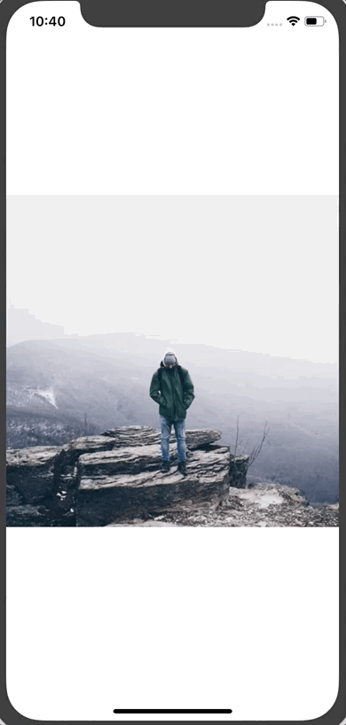
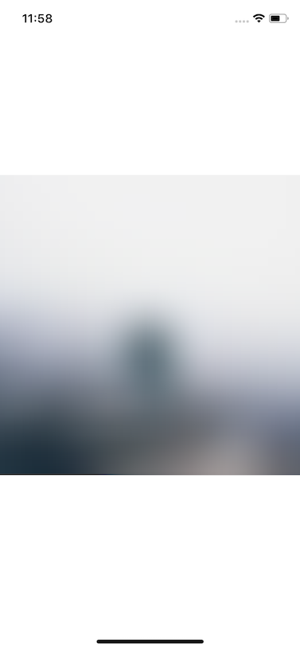

网速是可变的，尤其是当你使用移动设备时。作为开发人员，我们经常忘记，许多用户正在功能较差的设备上以很慢的网速运行我们的应用程序。到山里去，试着访问你的应用程序，看看它表现如何。

应用程序中最耗费的东西之一就是要加载远程图像。 它们需要时间来加载，尤其是大图片。

今天我们将构建一个组件，它允许我们:
- 传递要显示的全尺寸图像(就像普通图像组件一样)
- 在加载完整大小的图像时，传递一个缩略图以显示
- 自动在即将下载的图像的位置显示一个占位符，以指示将有内容存在
- 每个状态之间的动画

### 开始

要开始创建一个新的 React Native 应用程序(通过 `React-Native init`、 `create-React-Native-app` 或 `expo` cli) ，并将以下内容添加到 App.js。

```js
import React from 'react';
import { StyleSheet, View, Dimensions, Image } from 'react-native';

const w = Dimensions.get('window');

const styles = StyleSheet.create({
  container: {
    flex: 1,
    alignItems: 'center',
    justifyContent: 'center',
  },
});

export default class App extends React.Component {
  render() {
    return (
      <View style={styles.container}>
        <Image
          source={{ uri: `https://images.pexels.com/photos/671557/pexels-photo-671557.jpeg?w=${w.width * 2}&buster=${Math.random()}` }}
          style={{ width: w.width, height: w.width }}
          resizeMode="cover"
        />
      </View>
    );
  }
}
```

该代码块只显示一个图像。 它从 [Pexels](https://www.pexels.com/) 请求2倍屏幕大小的图像(我们想要大的图像，因此图片加载缓慢) ，`buster` 查询参数将帮助我们不缓存图像，以便我们能够充分看到发生了什么。 你不会想在你的实际应用程序中这么做的。

### 感受痛苦

正如我之前所说，作为一名开发人员，你可能拥有相当不错的网速。

让我们改变这一点。

如果你是 Mac 电脑，你可以安装一个叫做 Network Link Conditioner 的工具([这里是如何安装它](https://nshipster.com/network-link-conditioner/))。 我确信Windows 和 Linux 上也有类似的东西(如果你有建议的工具，请在下面附上)。

它将允许您模拟几乎任何您需要的网络条件。 记得在打开流媒体视频之前把它关掉。

启用它并将其设置为"3G"。


这里对比了 Network Link Conditioner 关闭和打开3g时的状态。




### ProgressiveImage 组件

为了替换 `Image` 组件，我们将创建一个名为 `ProgressiveImage` 的新组件。 这个组件的目标是让它能够像正常的 `Image` 组件一样工作，只是增加了一些额外的特性:
- 在图像所在的位置填充彩色背景
- 传递缩略图的能力

首先，让我们打好基础:
```js
// ProgressiveImage.js
import React from 'react';
import { View, StyleSheet, Image } from 'react-native';
const styles = StyleSheet.create({
});
class ProgressiveImage extends React.Component {
  render() {
    return <Image {...this.props} />
  }
}
export default ProgressiveImage;
```

我们使用扩展运算符来传递所有 `this.props` 到 `Image` 组件，这样一切都能按照预期工作，而不需要我们手动定义每个 prop。

然后用新的 `ProgressiveImage` 组件替换 `App.js` 中的 `Image`。
```js
// App.js
import React from 'react';
import { StyleSheet, View, Dimensions } from 'react-native';
import ProgressiveImage from './ProgressiveImage';
// ...
export default class App extends React.Component {
  render() {
    return (
      <View style={styles.container}>
        <ProgressiveImage
          source={{ uri: `https://images.pexels.com/photos/671557/pexels-photo-671557.jpeg?w=${w.width * 2}&buster=${Math.random()}` }}
          style={{ width: w.width, height: w.width }}
          resizeMode="cover"
        />
      </View>
    );
  }
}
```

一切都应该和以前一模一样。

### 设置背景色

加载远程图像时，需要指定要呈现的图像的宽度和高度。 我们将利用这个要求来方便的设置一个默认的背景颜色。
```js
import React from 'react';
import { View, StyleSheet, Image } from 'react-native';
const styles = StyleSheet.create({
  imageOverlay: {
    position: 'absolute',
    left: 0,
    right: 0,
    bottom: 0,
    top: 0,
  },
  container: {
    backgroundColor: '#e1e4e8',
  },
});
class ProgressiveImage extends React.Component {
  render() {
    return (
      <View style={styles.container}>
        <Image {...this.props} />
      </View>
    );
  }
}
export default ProgressiveImage;
```

首先，我们为背景颜色创建一个名为 `container` 样式，然后将 `Image` 组件包装到视图中(使用分配给它的新样式)。

这是渐进式图像加载的第一阶段。


### 显示缩略图

接下来，我们将着手显示图像的缩略版。 生成此图像超出了本教程的范围，因此我们假设您已经获得了全尺寸图像和缩略图版本。

首先，对于 `ProgressiveImage` 实例，我们将添加一个 `thumbnailSource` prop，它将获取与典型  `Image` 源prop完全相同的信息。在其中，我们将传递一个较小版本的图像(本例中w为50，使用任何您想要的)和用来清除缓存的变量 `buster` (仅用于演示目的)。
```js
// App.js
// ...
export default class App extends React.Component {
  render() {
    return (
      <View style={styles.container}>
        <ProgressiveImage
          thumbnailSource={{ uri: `https://images.pexels.com/photos/671557/pexels-photo-671557.jpeg?w=50&buster=${Math.random()}` }}
          source={{ uri: `https://images.pexels.com/photos/671557/pexels-photo-671557.jpeg?w=${w.width * 2}&buster=${Math.random()}` }}
          style={{ width: w.width, height: w.width }}
          resizeMode="cover"
        />
      </View>
    );
  }
}
```
然后我们将修改 `ProgressiveImage` 组件。 首先在样式对象中添加 `imageOverlay` 样式。
```js
// ProgressiveImage.js
// ...
const styles = StyleSheet.create({
  imageOverlay: {
    position: 'absolute',
    left: 0,
    right: 0,
    bottom: 0,
    top: 0,
  },
  container: {
    backgroundColor: '#e1e4e8',
  },
});
// ...
```

然后我们将渲染两个 `Image` 组件。 在此之前，我们将使用对象解构来从 `this.props` 中取出一些prop ，因为我们将覆盖 / 组合它们。
```js
// ProgressiveImage.js
// ...
class ProgressiveImage extends React.Component {
  render() {
    const {
      thumbnailSource,
      source,
      style,
      ...props
    } = this.props;
    return (
      <View style={styles.container}>
        <Image
          {...props}
          source={thumbnailSource}
          style={style}
        />
        <Image
          {...props}
          source={source}
          style={[styles.imageOverlay, style]}
        />
      </View>
    );
  }
}
export default ProgressiveImage;
```

你可以看到我们得到了 `thumbnailSource`，`source` 和 `style`的 prop。 然后我们使用 "rest" 语法来捕捉其余的 props。 这使得我们可以将所有通用 prop 转发到两个图像中，而只将所需的 prop 转发到正确的组件中(比如合适的源)。

你会注意到我们在全尺寸图像中结合了传入的样式和 `styles.imageOverlay` 样式。 这样，通过绝对定位，图像会掩盖缩略版。

结果如下:


Note: You’ll noticed that the thumbnail image is quite pixelated. You can pass a blurRadius prop to the thumbnail image to blur it. I took a screenshot so you can see the difference (I'm using a blurRadius of 2 for the example).

注意: 你会注意到缩略图是相当像素化。 你可以把 `blurRadius` 属性传递给缩略图来模糊它。我做了一个屏幕截图，这样你就可以看到区别了(例如，我使用的是 blurRadius 为2的模型)。




你还会注意到，如果我们不将 `thumbnailSource` 传递给 `ProgressiveImage` 组件，则一切正常，这意味着即使没有缩略图，我们也可以对所有远程图像使用此组件。

### 动画过渡

最后我们要做的是平滑过渡到背景颜色，缩略图和全尺寸图像。 要做到这一点，我们将使用 React Native 中的 `Animated` 依赖。

一旦你导入了 `Animated`，你就需要用 `Animated.image` 替换 `ProgressiveImage` 中的 `Image` 组件。

您还需要在组件上创建两个新的动画变量，将它们默认设置为0。
```js
// ProgressiveImage.js
import React from 'react';
import { View, StyleSheet, Animated } from 'react-native';
// ...
class ProgressiveImage extends React.Component {
  thumbnailAnimated = new Animated.Value(0);
  imageAnimated = new Animated.Value(0);
  render() {
    const {
      thumbnailSource,
      source,
      style,
      ...props
    } = this.props;
    return (
      <View style={styles.container}>
        <Animated.Image
          {...props}
          source={thumbnailSource}
          style={style}
          blurRadius={2}
        />
        <Animated.Image
          {...props}
          source={source}
          style={[styles.imageOverlay, style]}
        />
      </View>
    );
  }
}
```

这些 `Animated.Value` 将用于驱动图像的不透明度。 当缩略图加载时，我们将设置 `thumbnailAnimated` 为1。 当加载完整大小的图像时，我们将 `imageAnimated` 设置为1。
```js
// ProgressiveImage.js
// ...
class ProgressiveImage extends React.Component {
  thumbnailAnimated = new Animated.Value(0);
  imageAnimated = new Animated.Value(0);
  handleThumbnailLoad = () => {
    Animated.timing(this.thumbnailAnimated, {
      toValue: 1,
    }).start();
  }
  onImageLoad = () => {
    Animated.timing(this.imageAnimated, {
      toValue: 1,
    }).start();
  }
  // ...
}
```
这些函数将通过 `Animated.Image` 组件的 `onLoad` prop调用。
```js
// ProgressiveImage.js
// ...
class ProgressiveImage extends React.Component {
  // ...
  render() {
    const {
      thumbnailSource,
      source,
      style,
      ...props
    } = this.props;
    return (
      <View style={styles.container}>
        <Animated.Image
          {...props}
          source={thumbnailSource}
          style={[style, { opacity: this.thumbnailAnimated }]}
          onLoad={this.handleThumbnailLoad}
          blurRadius={1}
        />
        <Animated.Image
          {...props}
          source={source}
          style={[styles.imageOverlay, { opacity: this.imageAnimated }, style]}
          onLoad={this.onImageLoad}
        />
      </View>
    );
  }
}
export default ProgressiveImage;
```

最终的渐进式图像加载的结果。


代码可以在 [Github](https://github.com/HandlebarLabs/react-native-examples-and-tutorials/tree/master/tutorials/progressive-image-loading) 上找到。


原文地址：[https://medium.com/react-native-training/progressive-image-loading-in-react-native-e7a01827feb7](https://medium.com/react-native-training/progressive-image-loading-in-react-native-e7a01827feb7）