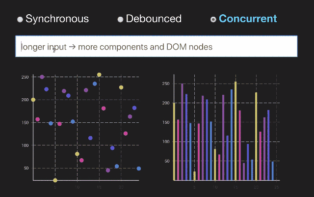
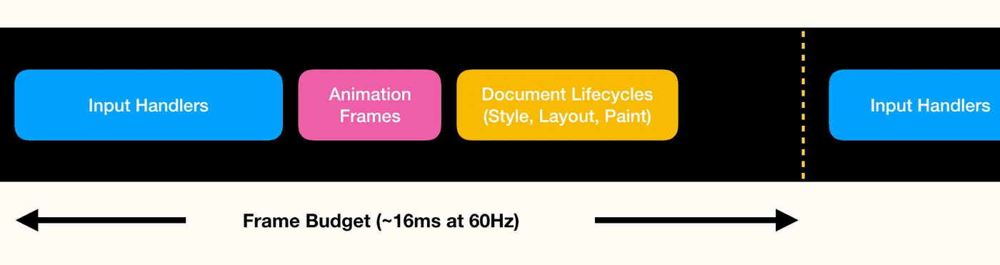
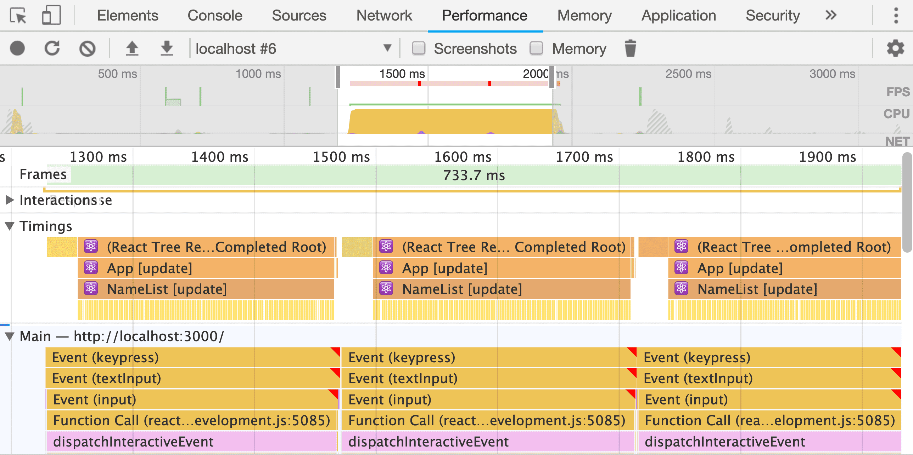
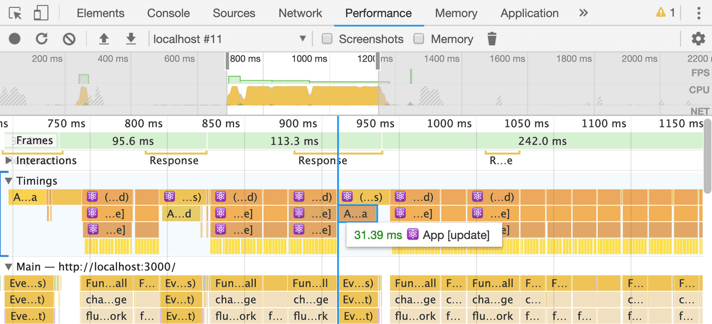
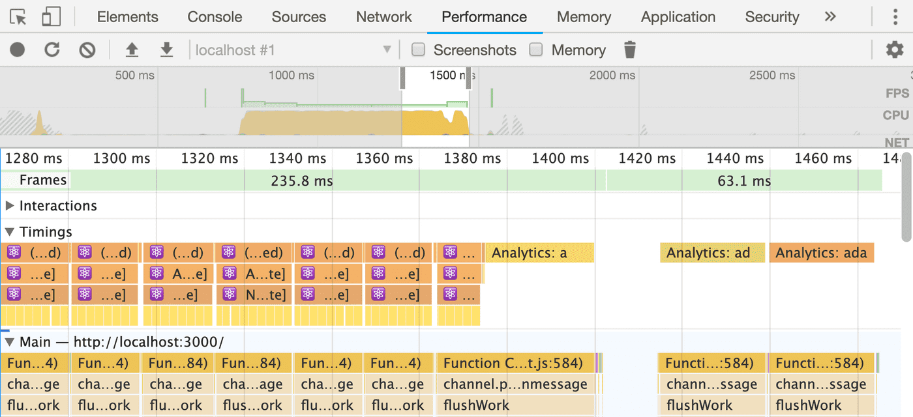

# React 新特性：调用系统

在现代应用中，用户界面通常必须同时处理多个任务。例如，搜索组件可能需要在提供自动完成结果时响应用户输入，并且 dashboard 可能需要在从服务器加载数据更新图表的同时并将分析数据发送到后端。

所有这些并行步骤可能导致缓慢且无响应的界面和用户的抱怨，所以让我们学习如何解决这个问题。

## 用户界面中的调度

我们的用户期望立即反馈。不管是他们点击按钮打开一个弹窗或者在输入框中输入文字，他们都不喜欢在看到某些确认信息之前等待。例如说，按钮可以展示一个模态窗口，输入框可以展示用户输入的 key。

想像一下不是这种情况时会发生什么？让我们来看一眼 Dan Abramov 在 JSConf Iceland 2018 的一个 demo 的例子 [Beyond React 16](https://reactjs.org/blog/2018/03/01/sneak-peek-beyond-react-16.html) [1]。

这个应用程序是这样工作的：你在输入框输入的越多，chart 中得到详细的信息就越多。因为两种更新（输入框和 chart ）同时运行，浏览器需要做非常的计算，所以浏览器会导致丢掉一些帧。这样会导致明显的延迟卡顿，影响用户体验：


但是：最后用户会看到一个优先使用新击键更新输入的版本，好像它的运行速度要快很多。这是因为即使使用相同的计算时间，用户也会收到即时反馈：



不幸的是，当前用户界面的体系结构使得实现优先级特别重要。解决次问题的一种方法是对 chart 的更新做 debounce 优化。这种方法的问题在于，当去抖动的回调触发时，chart 依然会同步呈现，这将再次导致用户界面在一段时间内无响应。我们可以做的更好！

## 浏览器事件循环

在我们进一步了解如何实现更新的正确的优先级之前，让我们来深入挖掘并理解为什么浏览器会遇到这类用户交互的问题。

JavaScript 是跑在单线程中的，这也就是说在任何给定时间点只运行一行 JavaScript 代码。这个指定的线程同样也负责其他文档的声明周期，比如 paint 还有 layout 。这样的话也就是在 JavaScript 代码运行的时候，浏览器都无法做任何事情。

为了保证用户界面的响应，在接受下一个输入事件，我们仅仅拥有一个很短的时间区间。在 Chrome Dev Summit 2018 上，Shubhie Panicker 和Jason Miller 有一个演讲 [寻求保证响应能力](https://developer.chrome.com/devsummit/schedule/scheduling-on-off-main-thread)[2]。在这个演讲中，他们展示了一个可视化的浏览器运行过程，在这个图中我们可以看到在下一帧绘制完成和下一帧事件处理完成之前我们仅仅有 **16ms**（60Hz） 的时间。



大多数的 JavaScript 框架（包括当前版本的 React）将会同步的更新。我们可以视这种行为为一个 `render()` 函数，它只会在 DOM 更新后返回。在这个期间，主线程处理阻塞状态。

## 当前解决方案的问题

基于以上的信息，我们可以制定两个我们必须解决的问题以便获取更具响应式的用户体验。

  1. **长时间运行的任务会导致丢帧** 我们需要确保所有的任务足够的小可以在毫秒内完成，这样的话他们就可以让他们运行在一个 frame 中。
  2. **不用的任务拥有不同的优先级** 在上面的例子中，我们看到优先考虑用户的输入可以带来更好的整体体验。为了做到这个，我们需要一种方法来定义这个任务然后相应的安排这个任务。

## Concurrent React and the Scheduler

⚠️警告：下面的 API 是不稳定的随时可能更改！

要用 React 实现正确的调度安排，我们必须来看下即将发布的 React 两个新特性：

- **Concurrent React (我们众所周知的 时间切片)** 在 React 16 重构的 fiber 架构的帮助下，React 现在可以在渲染期间暂停，并且返回到主线程。我们将在未来听到更多有关 Concurrent React 的信息。现在了解启用这个模式很重要，React 会将 React 组件的同步呈现拆分为在多个帧上运行的片段。
➡️ 利用这个功能，我们能够将长时间运行的渲染任务分成小块。

- **Scheduler（调度）** 通用协作主线程调度程序由 React Core 团队开发，可以在浏览器中注册具有不同优先级的回调。
  在写这篇文章的时候，优先级为：
  - `Immediate`  用于需要同步运行的任务
  - `UserBlocking` （250ms 超时）用于应作为用户交互结果运行的任务（按钮点击）
  - `Normal` （5s超时）用于不必立即感受到的更新
  - `Low`（10s超时）可以延迟但最终必须完成的任务
  - `Idle` （没有超时）对于根本不需要运行的任务（例如隐藏的屏幕外内容）

每个优先级的超时设置对于确保优先级较低的工作仍然运行是必要的，即使我们有更高优先级的工作要做。在调度算法中，这种做法被称为 饥饿。 这个超时（timeout）给了我们一种保证，确保所有的任务都可以运行到。例如，即使我们的应用中有正在进行的动画，我们也不会错过任何分析通知。

## Scheduling in Action

让我们看看我们如何使用这些功能让应用程序感觉更具响应性。为了实现这个，让我们来看下这个[应用](https://github.com/philipp-spiess/scheduletron3000)[3]，允许用户在名称列表中突出显示搜索词。让我们来看下这个初始实现：

```javascript
// The app shows a search box and a list of names. The list is
// controlled by the searchValue state variable, which is updated
// by the search box.
function App() {
  const [searchValue, setSearchValue] = React.useState();

  function handleChange(value) {
    setSearchValue(value);
  }

  return (
    <div>
      <SearchBox onChange={handleChange} />
      <NameList searchValue={searchValue} />
    </div>
  );
}

// The search box renders a native HTML input element and keeps
// it controlled using the inputValue variable. When a new key
// is pressed, it will first update the local inputValue, then it
// will update the App component’s searchValue, and then it will
// simulate an analytics notification to our servers.

function SearchBox(props) {
  const [inputValue, setInputValue] = React.useState();

  function handleChange(event) {
    const value = event.target.value;

    setInputValue(value);
    props.onChange(value);
    sendAnalyticsNotification(value);
  };

  return (
    <input
      type="text"
      value={inputValue}
      onChange={handleChange}
    />
  );
}

ReactDOM.render(<App />, container);

```

你可以试一下，在输入框输入 “Ada Stewart” [4]
你可能注意到了这个界面不是那么的实时反馈的。为了放大这个问题，我人为地减慢了名单的渲染时间。由于此列表很大，因此它对应用程序的性能有重大影响。

我们的用户期望立即反馈，但是在按键后相当长一段时间内应用程序没有响应。为了搞清楚发生了什么，让我们一起来看下 chrome DevTools 中的 Performance tab。这是我在搜索框中输入名称“Ada”时录制的屏幕截图：



我们看到这里有很多红色的三角形，这通常不是一个好的信号。每一次的按键，我们都可以看到 `keypress` 事件执行了。所有三个事件都在一帧中执行，这导致了一帧的时间延长到 733ms。这远高于我们16毫秒的平均帧预算。

在此按键事件中，将调用我们的 React 代码，这会导致输入值和搜索值更新，然后发送分析通知。反过来，更新的状态值将导致应用程序为每个特定的名称重新渲染状态。这样的话，我们必须做更多的工作，它会阻止我们的主线程。

改善现状的第一步是启用 Concurrent Mode。你需要在 React Tree 的一部分上包装一层 `<React.unstable_ConcurrentMode>` 像是这样：

```javascript
- ReactDOM.render(<App />, container);
+ ReactDOM.render(
+  <React.unstable_ConcurrentMode>
+    <App />
+  </React.unstable_ConcurrentMode>,
+  rootElement
+ );
```

但是，单独启用“并发模式”不会改变我们的案例体验。React 依然在同一时间收到 state 的更新，所以没有办法知道哪个是不那么重要的。我们想首先设置输入值，那么我们只需要在开始的时候只渲染输入框信息。更新搜索结果和发送数据分析后面再更新。为了做到这个，我们从 Scheduler package（可以通过 `npm i scheduler` ）中导出一个 API，然后用它排入较低优先级的回调。

```javascript
import { unstable_next } from "scheduler";

function SearchBox(props) {
  const [inputValue, setInputValue] = React.useState();

  function handleChange(event) {
    const value = event.target.value;

    setInputValue(value);
    unstable_next(function() {
      props.onChange(value);
      sendAnalyticsNotification(value);
    });
  }

  return <input type="text" value={inputValue} onChange={handleChange} />;
}
```

我们上面用到的 `unstable_next` API， 所有 React 更新都将使用 `Normal` 优先级进行调度，该优先级低于 `onChange` 侦听器内的默认优先级。

确实，通过我们这个修改，我们的输入框反应更加迅速了，还有当我们输入的时候也不在丢帧了。让我们再来看一眼 chrome DevTools 中的 Performance tab。



我们看到长时间运行的任务被分割为可以跑在一个侦中的多个小的任务。那个表示掉帧的红色三角形已经不见了。

但是，仍然不理想的一件事是分析通知（在上面的屏幕截图中突出显示）仍然在渲染工作中执行。由于我们的应用程序的用户看不到此任务，我们可以安排一个具有更低优先级的回调：

```javascript
import {
  unstable_LowPriority,
  unstable_scheduleCallback
} from "scheduler";

function sendDeferredAnalyticsNotification(value) {
  unstable_scheduleCallback(unstable_LowPriority, function() {
    sendAnalyticsNotification(value);
  });
}
```

如果你现在在输入框中使用 `sendDeferredAnalyticsNotification()`， 让我们来再看一眼 DevTools 中 Performance tab 的改变，接着拉倒最后，我们将看到我们的分析现在在所有渲染工作完成后发送，因此我们的应用程序中的所有任务都被完美调度：



## 调度系统的限制

使用 Scheduler，可以控制回调执行的顺序，它内置于最新的 React 实现中，并且具有并发模式的开箱即用功能。

也就是说，调度程序有两个限制：

1. 资源战斗：调度程序尝试使用所有可用资源，如果调度程序的多个实例在同一个线程上运行并争夺资源，则会导致问题。我们需要确保应用程序的所有部分都使用相同的实例。
2. 使用浏览器工作平衡用户定义的任务：由于调度程序在浏览器中运行，因此它只能访问浏览器公开的API。文档生命周期（如渲染或垃圾回收）可能会以无法控制的方式干扰工作。

为了消除这些限制，Google Chrome 团队正在与 React，Polymer，Ember，Google Maps 和 Web Standards 社区合作，在浏览器中创建[Scheduling API](https://github.com/spanicker/main-thread-scheduling) [4]。多么令人兴奋！

原文地址: https://philippspiess.com/scheduling-in-react/
