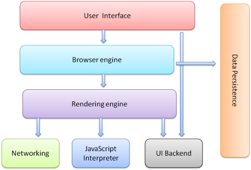
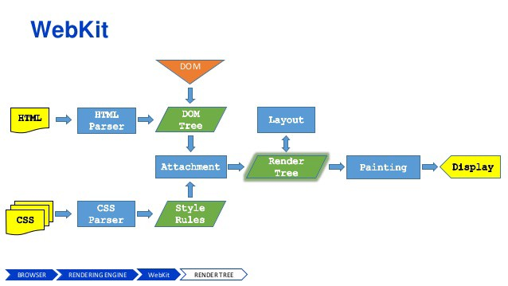

## 了解JavaScript中的重绘和回流

最近,在研究React的Virtual DOM能大幅提高页面渲染效率的原因时，发现自己对JavaScript的性能了解甚少。为了提高对重绘、回流以及JavaScript性能的认识，因此写下这篇文章。

## 在深入研究之前，需要知道浏览器的工作原理

一张图胜过千言万语。因此，让我们细看一下浏览器是如何工作的！

**嗯...那么什么是浏览器引擎(Browser engine)和渲染引擎(Rendering engine)呢？**

浏览器引擎的主要工作是处理HTML文档和其他资源，把它们转换成一个可视化交互式的web页面呈现在用户的设备上。
除了浏览器引擎之外，和它相关的另外两个常用的概念术语是：布局引擎(Layout engine)和渲染引擎。理论上，浏览器的布局和渲染(绘制)工作，可以由单独的引擎处理。然而，在实践中，它们是紧密耦合的，很少单独考虑。

## 让我们了解浏览器如何在屏幕上绘制用户界面

当你在浏览器上敲回车去请求一些链接时，向该页面发出HTTP请求，然后服务器通常提供HTML文档作为响应。（在这个过程中发生了很多[事情](https://cheapsslsecurity.com/blog/what-is-ssl-tls-handshake-understand-the-process-in-just-3-minutes/)）

* 浏览器在解析出HTML源代码后，会构造出一颗DOM树形式的数据，每个HTML标签在这个树中都有一个对应的节点，标签之间的文本块会用一个文本节点表示。而这个DOM树的根结点是documentElement`(<html>标签)`。

* 浏览器解析CSS代码，使其有意义。样式信息级联的基本规则：首先解析用户代理样式表（浏览器默认）。然后是用户样式表，它指的是网页作者的样式表，主要包括外部（引入的css文件）、导入(@import)、内联（style标签内的）的样式，最后是HTML标签style属性的样式。

* 接下来有趣的部分是构建一颗渲染树(render tree)。渲染树有点像DOM树,但不完全一样。渲染树能够识别出样式，因此用`display:none`隐藏的div，它不会在渲染树中表示。其他的不可见元素也是如此，例如`<head>`里的所有元素。另一方面，可能有一些DOM元素在渲染树中需要用多个节点表示，例如文本节点`
`中的每一行都需要一个渲染节点。渲染树中的每个节点可以称为框或者盒子（CSS中的[盒子模型](http://www.w3.org/TR/CSS2/box.html#box-dimensions)）,每个节点都有CSS盒子属性包括`width, height, border, margin`等。

* 渲染树被构建之后，浏览器可以在屏幕上绘制出它的每个节点。

下面是浏览器在屏幕上绘制用户界面的快照：

  <iframe width="100%" height="360px" frameborder=0 src="http://v.qq.com/iframe/player.html?vid=t08496z1rku&tiny=0&auto=0" allowfullscreen=""></iframe>

它发生在几秒内，我们甚至没有注意到这一切的发生。
**仔细看看**浏览器是如何绘制布局，它尝试检测出根元素、兄弟元素、以及子元素作为节点来重新安排它们的布局。

举个例子

    <html>
    <head>
      <title>Repaint And Reflow</title>
    </head>
    <body>
        
      

        <strong>How's The Josh?</strong>
        <strong><b> High Sir...</b></strong>
      

      
      

        Nothing to display
      

      
      

      ...
     
    </body>
    </html>
    
用DOM树表示HTML文档,文档的每个标签都有对应的节点,节点间的每段文本对应一个文本节点。（简单的来说，我们忽略的空白也是文本节点）

    documentElement (html)
        head
            title
        body
            p

                strong
                    [text node]

            p
                strong
                    b
                        [text node]    		
            div 
                [text node]
    		
            div
                img
    		
            ...

渲染树将是DOM树的可视部分，但是它缺少了一些东西--头部和隐藏的div，但是它为文本行提供额外的节点（称为框或盒子）。

    root (RenderView)
        body
            p
                line 1
    	    line 2
    	    line 3
    	    ...
    	    
    	div
    	    img
    	    
    	...

渲染树的根节点是包含所有其他元素的框（盒子）。你可以将其视为浏览器窗口的内部部分，这也是页面可以展开的限制区域。从技术上讲，`WebKit`调用根节点`RenderView`时，它对应于CSS初始[包含块](http://www.w3.org/TR/CSS21/visudet.html#containing-block-details)（initial containing block）。初始包含块是从页面顶部（0，0）到底部（window.innerWidth，window.innerHeight）的视口矩形。

浏览器要想弄清楚在屏幕上准确显示什么以及如何显示，需要向下递归遍历渲染树。

## 回流和重绘

在渲染时至少有一个初始页面的布局和绘制（ 除非你比较喜欢空白页:））。之后，当改变构建渲染树的输入信息时，可能会导致以下一两种情况：

 1. 部分渲染树（或整个树）需要重新核验计算节点的大小和位置。我们把这称为**回流**（布局）。这里需要注意下，页面至少有一个回流那就是页面的初始布局。
 2. 屏幕页面的部分更新，由于节点的几何属性或者样式发生了变化，比如更改背景色，我们将此称之为**重绘**。

重绘和回流的代价是很大的，它们可能会影响用户体验，让UI界面迟缓。

**重绘**

顾名思义，重绘只是在屏幕上重绘元素，元素的外观会发生变化，会影响到元素的可见性，但不会影响布局。

有些操作会触发页面重绘例如：

- 改变元素的可见性（visibility）
- 改变元素的外形轮廓 (outline)
- 改变元素背景（background,background-color）

Opera浏览器认为，重绘是一个昂贵的操作，因为它强制浏览器去验证、检查所有其他dom节点的可见性。

**回流**

回流意味着需要重新计算文档的元素位置和几何图形，以便重新渲染部分或全部文档。由于回流是浏览器中的用户阻塞操作，因此对于开发人员来说，了解如何缩短回流时间，以及了解各种文档属性（DOM深度、CSS规则效率、不同类型的样式更改）对回流时间的影响就显得非常有必要了。有时，文档中单个元素的回流，可能会引起它父元素和之后任何的元素回流。

有些操作会触发页面回流例如：

- 页面初始渲染
- 浏览器窗口大小更改
- 添加、删除可见的DOM元素
- 元素字体大小变化
- 元素尺寸或位置更改
- 元素内容，文字数量，图片宽高
- CSS伪类的激活(:hover)
- 查询属性或调用方法

常用导致回流的js方法：

- offsetWidth、offsetTop
- clientWidth、clientTop
- scrollWidth、scrollTop
- getBoundingClientRect
- scrollTo
- getComputedStyle 等

## Virtual DOM VS Real DOM

每次DOM更改，浏览器重新计算CSS时，都要进行布局并重绘网页。这就是real dom所花费的时间的地方。

为了最小化这个时间，`Ember`使用键值队观察技术，而Angular使用脏检查。`Ember`的处理和Angular把节点标记为`dirty`都是为了只更新改变的dom节点。

同时，浏览器正在变的越来越聪明，它们尝试缩短屏幕的绘制时间。当绘制时，最大的事情是最小化和批处理dom的更改。

React的`Virtual DOM`背后思想，是把减少和处理DOM变化的策略，转到另一个抽象层次上。

## 是什么让React的虚拟DOM如此的块？

React并没有真正做一些新的事情。这只是一个战略举措。它的作用是将真实dom的副本存储到内存中。当你修改dom时，首先将这些更改应用到内存中dom。然后使用`diff`算法，找出真正的改变。

最后，它把批量更改应用到真实dom中。因此可以最大化减少回流和重绘。

原文链接：https://blog.usejournal.com/what-the-heck-is-repaint-and-reflow-in-the-browser-b2d0fb980c08
